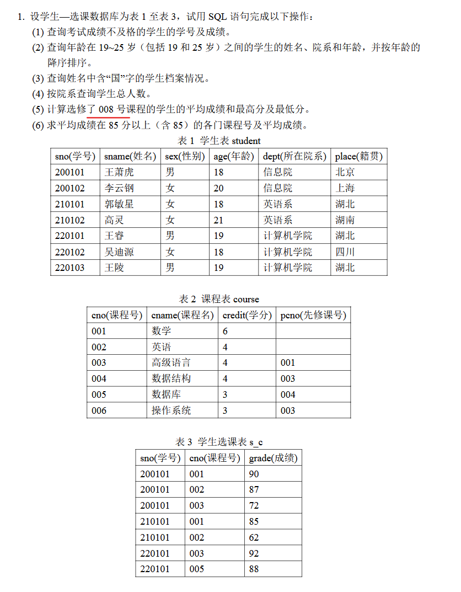
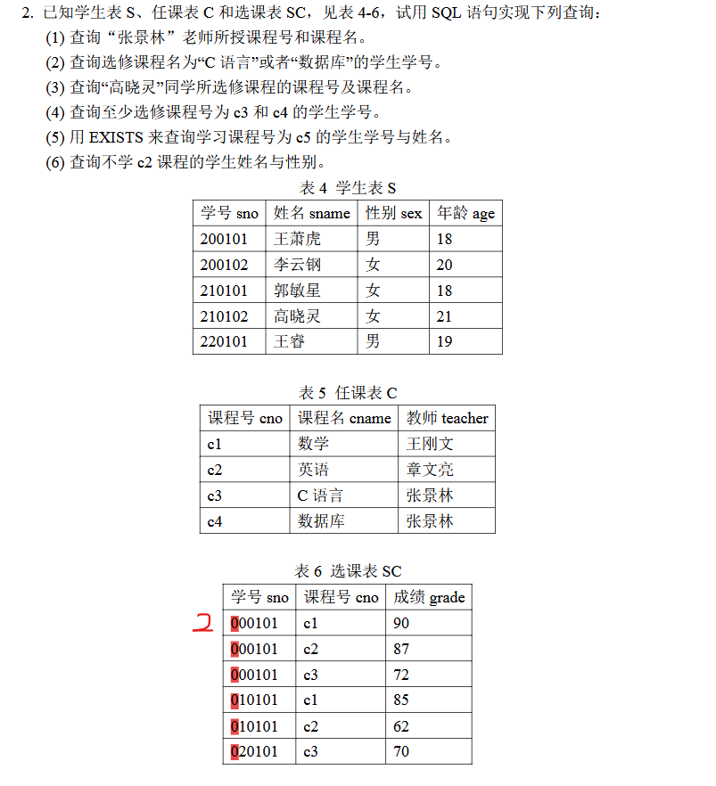
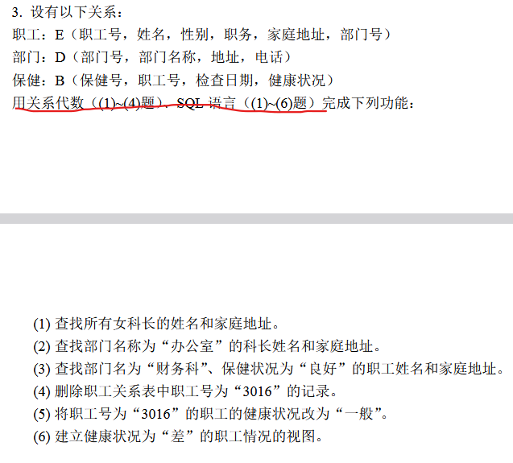
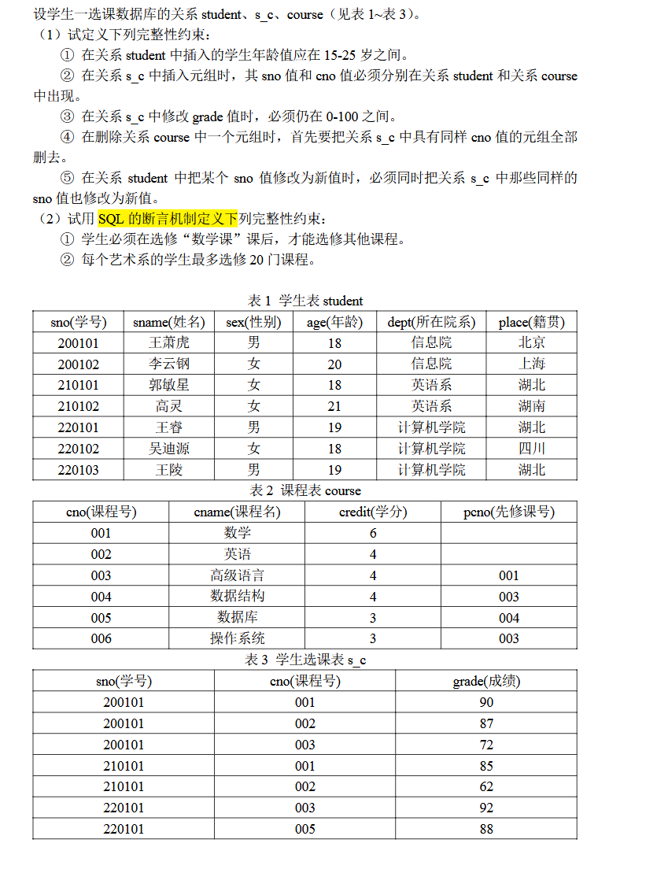

# 作业


## 第一次作业


（1）题目只说明了k1不为空，若k1与关系R中某个已有主键值重复，就会触发主键冲突，于是 **实体完整性被破坏**；此外，若x1在它所参照的关系中找不到对应主键值，就会触发外键失配，导致 **参照完整性被破坏**

（2）删除操作将导致元组直接消失，自身的主键约束也退出讨论范围，所以实体完整性问题无法讨论；对于参照完整性，只有在别的元组或别的关系把k1当作被参照键时，删除它才可能造成悬空引用

（3）把 $(k2, x2, a2)$ 改成 $(k2, x2, a1)$，改动发生在普通属性 $A$ 上，主键 $K$ 和外键 $X$ 都保持原值，因此这两类完整性约束都处于原来的状态。

（4）把 $(k2, x2, a2)$改成 $(k2, x3, a2)$，主键 $K$ 维持为 $k2$，实体完整性这一侧保持原状；外键从 $x2$ 改成了 $x3$，若 $x3$ 在被参照关系中找不到对应主键值，就会破坏参照完整性。

**综上**，发生改变的只有（1）

---


将图中关系写为标准形式：

$$
\begin{align}
R(X,Y) &= {(a,d),(b,a),(c,c)}\
S(X,Y)&={(d,a),(b,a),(d,c)}\
T(Y,Z)&={(b,b),(b,e),(c,d)}\
U(X,Y,Z,W)&={(a,b,c,d),(a,b,e,f),(c,a,c,d)}\
V(Z,W)&={(e,f),(c,d)}
\end{align}
$$

(1)

$$
R∪S={(a,d),(b,a),(c,c),(d,a),(d,c)}
$$

(2)

$$
R∩S={(b,a)}
$$

(3)将属性结果写为 $(R.X,R.Y,S.X,S.Y)$

$$
R×S=\left {
\begin{align}
&(a,d,d,a),(a,d,b,a),(a,d,d,c),(b,a,d,a),(b,a,b,a)\
&(b,a,d,c),(c,c,d,a),(c,c,b,a),(c,c,d,c)
\end{align}
\right }
$$

(4)在 $U$ 里，$(a,b)$ 同时对应了 $V$ 中的两组 $(Z,W)$，也就是 $(c,d)$ 和 $(e,f)$。于是

$$
U÷V={(a,b)}
$$

(5)外部并后按属性 $(X,Y,Z)$ 书写，空缺位置记为 $\text{NULL}$：

$$
R外部并T={(a,d,NULL),(b,a,NULL),(c,c,NULL),(NULL,b,b),(NULL,b,e),(NULL,c,d)}
$$

(6)先写全连接，结果属性记为 $(X,Y,Z,W)$

$$
U⟗T={(a,b,e,f),(a,b,c,d),(c,a,c,d),(NULL,b,b,NULL),(NULL,c,d,NULL)}
$$

再写左外连接：

$$
U⟕T={(a,b,c,d),(a,b,e,f),(c,a,c,d)}
$$

然后是右外连接：

$$
U⟖T={(a,b,e,f),(NULL,b,b,NULL),(NULL,c,d,NULL)}
$$

(7)

$$
T⋈S={(d,c,d)}
$$

$$
S×T=\left\{
\begin{align}
&(d,a,b,b),(d,a,b,e),(d,a,c,d),(b,a,b,b),(b,a,b,e)\\
&(b,a,c,d),(d,c,b,b),(d,c,b,e),(d,c,c,d)
\end{align}
\right\}
$$

---


取

$$
S(sno,sname,sex,age),C(cno,cname,teacher),SC(sno,cno,grade)
$$

分别表示学生表、任课表和选课表

（1）直接从课程表中筛出教师为“张景林”的元组，再投影出课程号和课程名

$$
π\_{cno,cname}(σ\_{teacher=′张景林′}(C))
$$

(2)先在课程表中选出课程名为“C语言”或“数据库”的课程，再和选课表按 $cno$ 连接，最后投影出学生学号。

$$
π\_{sno}(SC⋈σ\_{cname=′C语言′∨cname=′数据库′}(C))
$$

(3)先从学生表里找出“高晓灵”，再接到她的选课记录，最后和课程表连接，于是能得到她所选课程的课程号和课程名。

$$
π\_{cno,cname}((σ\_{sname=′高晓灵′}(S)⋈SC)⋈C)
$$

(4)设

$$
A=ρ\_A​(SC),B=ρ\_B​(SC)
$$

其中，$\rho$ 表示重命名，则

$$
π\_{A.sno}(σ\_{A.sno=B.sno∧A.cno\ne B.cno}(A×B))
$$

(5)先把“全部学生的学号集合”取出来，再让选课关系对它做除法：

$$
π\_{cno,cname}(C⋈(π\_{cno,sno}(SC)÷π\_{sno}(S)))
$$

(6)先取出“张景林”授课的课程号集合，再用选课表去除：

$$
π\_{sname}(S⋈(π\_{sno,cno}(SC)÷π\_{cno}(σ\_{teacher=′张景林′}(C))))
$$


## 第二次作业


（1）关系代数式

$$
π\_{S.sno,S.sname}(σ\_{S.sno=SC.sno∧SC.cno=′c6′}(S×SC))
$$

## 作业三



**（1）查询考试成绩不及格的学生的学号及成绩时，只需要在成绩表中筛选出低于及格线的记录。及格线按常规取 60，因此直接对 `grade` 加条件：**

```sql
SELECT sno, grade
FROM s_c
WHERE grade < 60;
```

**（2）查询年龄在 19 到 25 岁之间的学生，需要先在学生表中限定年龄区间。区间是闭区间，可以用 `BETWEEN` 表达，同时结果需要按照年龄递增排列，因此增加排序条件：**

```sql
SELECT sname, dept, age
FROM student
WHERE age BETWEEN 19 AND 25
ORDER BY age ASC;
```

**（3）查询姓名中包含“国”字的学生，本质是字符串的子串匹配。SQL 中通过 `LIKE` 配合通配符 `%` 实现：**

```sql
SELECT *
FROM student
WHERE sname LIKE '%国%';
```

**（4）按院系统计学生人数，需要先把学生按照 `dept` 分组，然后在每个分组内统计记录数。这里使用 `COUNT(*)` 表示该院系的总人数：**

```sql
SELECT dept, COUNT(*) AS total
FROM student
GROUP BY dept;
```

**（5）计算选修某一课程的学生成绩统计量时，逻辑是先筛选出该课程的所有成绩，再在这一集合上做聚合计算。平均值、最大值、最小值分别由 `AVG`、`MAX`、`MIN` 完成：**

```sql
SELECT 
    AVG(grade) AS avg_grade,
    MAX(grade) AS max_grade,
    MIN(grade) AS min_grade
FROM s_c
WHERE cno = '008';
```

**（6）要求得到平均成绩达到 85 分及以上的课程，需要先按课程编号分组，再对每组计算平均成绩。由于筛选条件作用在聚合结果上，因此使用 `HAVING`：**

```sql
SELECT cno, AVG(grade) AS avg_grade
FROM s_c
GROUP BY cno
HAVING AVG(grade) >= 85;
```



------

**（1）查询“张景林”老师所授课程号和课程名。**

```sql
SELECT cno, cname
FROM C
WHERE teacher = '张景林';
```

------

**（2）查询选修课程名为“C语言”或者“数据库”的学生学号。**

```sql
SELECT SC.sno
FROM SC
JOIN C ON SC.cno = C.cno
WHERE C.cname IN ('C语言', '数据库');
```

------

**（3）查询“高晓灵”同学所选修课程的课程号及课程名。**

```sql
SELECT C.cno, C.cname
FROM S
JOIN SC ON S.sno = SC.sno
JOIN C ON SC.cno = C.cno
WHERE S.sname = '高晓灵';
```

------

**（4）查询至少选修课程号为 `c3` 和 `c4` 的学生学号。**

```sql
SELECT sno
FROM SC
WHERE cno IN ('c3', 'c4')
GROUP BY sno
HAVING COUNT(DISTINCT cno) = 2;
```

------

**（5）用 `EXISTS` 子查询查询课程号为 `c5` 的学生学号与姓名。**

```sql
SELECT S.sno, S.sname
FROM S
WHERE EXISTS (
    SELECT *
    FROM SC
    WHERE SC.sno = S.sno
      AND SC.cno = 'c5'
);
```

------

**（6）查询不学 `c2` 课程的学生姓名与性别。**

```sql
SELECT S.sname, S.sex
FROM S
WHERE NOT EXISTS (
    SELECT *
    FROM SC
    WHERE SC.sno = S.sno
      AND SC.cno = 'c2'
);
```



------

**（1）查找所有女科长的姓名和家庭地址。**

```sql
SELECT 姓名, 家庭地址
FROM E
WHERE 性别 = '女' AND 职务 = '科长';
```

------

**（2）查找部门名称为“办公室”的科长姓名和家庭地址。**

```sql
SELECT E.姓名, E.家庭地址
FROM E
JOIN D ON E.部门号 = D.部门号
WHERE D.部门名称 = '办公室' AND E.职务 = '科长';
```

------

**（3）查找部门名为“财务科”、保健状况为“良好”的职工姓名和家庭地址。**

```sql
SELECT E.姓名, E.家庭地址
FROM E
JOIN D ON E.部门号 = D.部门号
JOIN B ON E.职工号 = B.职工号
WHERE D.部门名称 = '财务科' AND B.健康状况 = '良好';
```

------

**（4）删除职工关系表中职工号为“3016”的记录。**

```sql
DELETE FROM E
WHERE 职工号 = '3016';
```

------

**（5）将职工号为“3016”的职工的健康状况改为“一般”。**

```sql
UPDATE B
SET 健康状况 = '一般'
WHERE 职工号 = '3016';
```

------

**（6）建立健康状况为“差”的职工情况的视图。**

```sql
CREATE VIEW 差健康职工情况 AS
SELECT E.*, B.保健号, B.检查日期, B.健康状况
FROM E
JOIN B ON E.职工号 = B.职工号
WHERE B.健康状况 = '差';
```

## 作业四



**（1）完整性约束的定义**

**① 学生年龄在 15–25 岁之间，这属于单表属性范围约束，可以直接定义在 `student` 表中：**

```sql
ALTER TABLE student
ADD CONSTRAINT chk_age
CHECK (age BETWEEN 15 AND 25);
```

------

**② `s_c` 中的 `sno` 和 `cno` 必须分别在 `student` 和 `course` 中存在，这本质是参照完整性约束，对应外键：**

```sql
ALTER TABLE s_c
ADD CONSTRAINT fk_sno
FOREIGN KEY (sno) REFERENCES student(sno);

ALTER TABLE s_c
ADD CONSTRAINT fk_cno
FOREIGN KEY (cno) REFERENCES course(cno);
```

------

**③ 修改 `grade` 时必须在 0–100 之间，这仍然是单属性范围约束：**

```sql
ALTER TABLE s_c
ADD CONSTRAINT chk_grade
CHECK (grade BETWEEN 0 AND 100);
```

------

**④ 删除 `course` 中某个元组时，需要先删除 `s_c` 中对应的记录，这属于级联删除行为。可以在定义外键时直接指定：**

```sql
ALTER TABLE s_c
DROP CONSTRAINT fk_cno;

ALTER TABLE s_c
ADD CONSTRAINT fk_cno
FOREIGN KEY (cno) REFERENCES course(cno)
ON DELETE CASCADE;
```

------

**⑤ 修改 `student` 中的 `sno` 时，需要同步更新 `s_c` 中的 `sno`，这是级联更新：**

```sql
ALTER TABLE s_c
DROP CONSTRAINT fk_sno;

ALTER TABLE s_c
ADD CONSTRAINT fk_sno
FOREIGN KEY (sno) REFERENCES student(sno)
ON UPDATE CASCADE;
```

------

**（2）断言或触发器实现的约束**

**① 学生必须先选修“数学”课程后，才能选修其他课程。**

```sql
CREATE TRIGGER trg_math_first
BEFORE INSERT ON s_c
FOR EACH ROW
BEGIN
    DECLARE cnt INT;

    IF NEW.cno <> '001' THEN
        SELECT COUNT(*) INTO cnt
        FROM s_c
        WHERE sno = NEW.sno AND cno = '001';

        IF cnt = 0 THEN
            SIGNAL SQLSTATE '45000'
            SET MESSAGE_TEXT = '必须先选修数学课';
        END IF;
    END IF;
END;
```

------

**② 每个艺术系的学生最多选修 20 门课程。**

```sql
CREATE TRIGGER trg_max_course
BEFORE INSERT ON s_c
FOR EACH ROW
BEGIN
    DECLARE cnt INT;
    DECLARE dept_name VARCHAR(50);

    SELECT dept INTO dept_name
    FROM student
    WHERE sno = NEW.sno;

    IF dept_name = '艺术系' THEN
        SELECT COUNT(*) INTO cnt
        FROM s_c
        WHERE sno = NEW.sno;

        IF cnt >= 20 THEN
            SIGNAL SQLSTATE '45000'
            SET MESSAGE_TEXT = '艺术系学生最多选修20门课程';
        END IF;
    END IF;
END;
```
