# 十二、十三章

> 大物更多还是靠自己的理解，这里只是做一个知识的梳理

## 十二、真空中的恒定磁场

### 12.1 恒定电流

**载流子** ：导体中的运动电荷（包括自由电子、正离子或负离子）

**传导电流**：载流子定向运动形成的电流

!!! note
    电流虽然有大小和方向，但是是标量

**电流与电流密度的层次关系**

| 物理量 | 符号 | 含义 | 数学表达式 | 单位 |
| --- | --- | --- | --- | --- |
| **电流强度** | $I$ | 单位时间内通过某一截面的电荷量 | $I = \dfrac{\mathrm{d}q}{\mathrm{d}t}$ | A（安培） |
| **电流密度** | $\vec{j}$ | 单位面积上的电流强度矢量 | $\vec{j} = \dfrac{\mathrm{d}I}{\mathrm{d}S_0}\vec{e_n}$ | A/m² |

进一步积分关系：

$$
\boxed{I = \int\_S \vec{j}\cdot \mathrm{d}\vec{S}}
$$

→ 电流强度等于电流密度矢量穿过曲面的通量。

**电流密度的几何意义**

- **方向：** 与导体中电荷实际运动方向（或传统规定的电流方向）一致；
- **大小：** 表示单位面积上通过的电流强度。

如果曲面与电流方向成角度 $\alpha$ ，则通过该曲面的分量为

$$
\mathrm{d}I = j\mathrm{d}Scos\alpha=\vec{j}·\mathrm{d}\vec{S}
$$

!!! note
    **电场和磁场的类比**

**电流密度 $\vec{j}$** 和 **电位移矢量 $\vec{D}$** 在一定程度上对应

| 电动力学（含电流） | 静电学对应 | 数学结构类比 | 含义 |
| --- | --- | --- | --- |
| 电流密度 $\vec{j}$ | 电位移矢量 $\vec{D}$ | $I = \int_S \vec{j}\cdot \mathrm{d}\vec{S} ↔ Q = \int_S \vec{D}\cdot \mathrm{d}\vec{S}$ | 都表示“通量密度” |
| 电流连续方程： $\nabla\cdot\vec{j} = -\dfrac{\partial\rho}{\partial t}$ | 高斯定律：$\nabla\cdot\vec{D} = \rho_f$ | 都揭示“源—汇”关系 | 电流源 ↔ 电荷源 |
| 材料关系式：$\vec{j} = \sigma\vec{E}$ | 介质关系式：$\vec{D} = \varepsilon\vec{E}$ | 线性介质的响应关系 | 导体 ↔ 介质 |

---

**电流的连续性方程**：以 $\dfrac{\mathrm{d}Q}{\mathrm{d}t}$ 表示封闭曲面内总电荷量随时间的变化率, $\rho$ 表示电荷体密度分布函数，则有

$$
\oint\_S \vec{j}\cdot \mathrm{d}\vec{S} = -\dfrac{\mathrm{d}Q}{\mathrm{d}t}=-\int\_V \dfrac{\partial \rho}{\partial t} \mathrm{d}V
$$

此等式的值表示 单位时间内从该封闭曲面内流出的总电荷量

那么当此式为0时，代表电流密度矢量的空间分布不再随时间变化，称这样的电流为 **恒定电流** 或 **稳恒电流**

---

**欧姆定律**

$$
I=\dfrac{U}{R}=\dfrac{V\_1 -V\_2}{R}
$$

其中，电阻R的计算公式如下

$$
R=\rho \dfrac{l}{S}
$$

上式称为 **电阻定律**，$\rho$ 称为导体的 **电阻率** ，其倒数称为 **电导率** ,即 $\sigma = \dfrac{1}{\rho}$

我们可以把宏观形式推广到 **连续介质内部任一点** ，进而得到欧姆定律的微分形式

$$
j=\dfrac{I}{S}=\dfrac{U}{RS}=\dfrac{U}{(ρl/S)S}=\dfrac{U}{ρl}=σE
$$

其中， $E=-\dfrac{\mathrm{d}V}{\mathrm{d}l}$ 是微流管中的电场强度。这个式子表明 在各向同性均匀导体中，**电流密度与电场强度成正比**，方向相同

---

为了在导体内维持恒定电流，需要有一种本质上与静电力不同的 **非静电力** ，这个提供非静电力的装置称为 **电源**

人们将 单位正电荷从电源负极经电源内部输运导正极时，非静电力所作的功称为电源的 **电动势**

$$
\mathcal{E} = \int\_{-}^{+}E\_k \cdot \mathrm{d}l
$$

### 12.2 磁场&&磁感应强度

磁场是由 **运动电荷**（电流）产生的物理场。与电场相似，磁场对处于场中的 **运动电荷** 施加力，表现为 **磁力**。

在宏观尺度上，磁场主要由：

- 导体中的 **电流**（宏观运动电荷）；
- 原子内电子的 **轨道运动与自旋**

共同产生。

---

磁场中某点的 **磁感应强度** 用矢量 $\vec{B}$ 表示。

当检验电荷 $q$ 的速度 $v$ 垂直于磁场方向的时候，其所受的磁场力取得最大值 $F_{max}$ ;此时，我们定义磁感应强度 **B** 的大小为

$$
\boxed{B = \dfrac{F\_{max}}{qv}}
$$

同时，人们通过实验归纳出运动电荷在磁场中受到的磁场力可表示为

$$
F = q\vec{v}\times\vec{B}
$$

这就是运动电荷在磁场中受到的磁场力，称之为 **洛伦兹力**

---

!!! note
    总而言之，本节内容如下：

- **磁感应强度** :磁场的强度与方向
- **磁力**： 磁场对运动

**电场和磁场的类比**

| 对应关系 | 电场 | 磁场 |
| --- | --- | --- |
| 基本物理量 | 电场强度 $\vec{E}$ | 磁感应强度 $\vec{B}$ |
| 产生源 | 静止电荷 | 运动电荷（电流） |
| 受力规律 | $\vec{F}=q\vec{E}$ | $\vec{F}=q\vec{v}\times\vec{B}$ |
| 场线方向 | 从正电荷出发 | 环绕电流形成闭合曲线 |
| 单位 | V/m | T（Wb/m²） |

### 12.3 毕奥-萨法尔定律

**电流元 $I\mathrm{d}\vec l$**：在真空中，任意形状的一段载流导线可以看作是由许多长度为 $d\vec l$, 电流为 $I$ 的无限小段电流构成的集合，每一小段上的电流 $I$ 与其长度矢量 $\mathrm{d}\vec l$ 的乘积即为电流元

公式如下：

$$
\boxed{\mathrm{d}B = \dfrac {\mu\_0}{4\pi} \cdot \dfrac{I\mathrm{d}l \sin \theta}{r^2}}
$$

其中，$\mathrm{d}\vec B$ 的方向与 $I\mathrm{d}\vec{l}\times \vec{r}$ 的方向相同，符合 **右手螺旋定则** 。将上式转为矢量形式，则有

$$
\boxed{\mathrm{d}\vec{B} = \dfrac{\mu\_0}{4\pi}\dfrac{I\mathrm{d}\vec{l}\times \vec{e\_r}}{r^2}=\dfrac{\mu\_0}{4\pi}\dfrac{I\mathrm{d}\vec{l}\times \vec{r}}{r^3}}
$$

其中公式中各变量含义如下：

| 参量 | 含义 |
| --- | --- |
| $\mathrm{d}B$ | 电流元 $I\mathrm{d}l$ 在空间某点 P 处激发的磁感应强度 |
| $\mu_0$ | 真空磁导率，$\mu_0 = 4\pi \times 10^{-7} N \cdot A^{-2}$ |
| $\sin \theta$ | 电流元和径矢 $\vec r$ 之间的夹角 $\theta$ 的正弦 |
| $r^2$ | 电流元到场点 P 的距离 r 的平方 |
| $\vec{e_r}=\dfrac{\vec{r}}{r}$ | $\vec{r}$ 方向的单位矢量 |

此外，由于磁场也符合场强叠加原理。因此，整个载流导线在空间某点 P 产生的磁感应强度等于各电流元在 P 点产生的磁感应强度 $\mathrm{d}\vec B$ 的矢量和，即

$$
B = \int\_L \mathrm{d}\vec B = \dfrac{\mu\_0}{4\pi}\int\_L\dfrac{I\mathrm{d}\vec{l}\times\vec{e\_r}}{r^2}
$$

---

我们可以由此推导出一些特定形状的载流体所激发的磁场

#### **载流直导线附近**

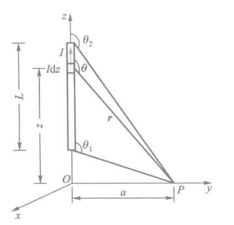

**如图所示，有一段载有电流 $I$ 的直导线，计算距导线 $a$ 处 P 点的磁感应强度 $B$**

点击看推导过程

任取一电流元 $I\mathrm{d}z$ ,作 $I\mathrm{d}z$ 到 P 点的径矢 $\vec r$，则磁感应强度的大小为 $\mathrm{d}B = \dfrac{\mu_0}{4\pi}\dfrac{I\mathrm{d}z\sin\theta}{r^2}$

则直导线上所有的电流元在 P 点产生磁场的合磁感应强度大小为

$$
B = \int \mathrm{d}B = \int \dfrac{\mu\_0}{4\pi}\dfrac{I\mathrm{d}z\sin\theta}{r^2}
$$

接下来我们将 $z、r、\theta$ 的几何关系统一，并推导出磁感应强度

$$
\left\{
\begin{array}{ll}
z=acot(\pi-\theta)=-acot\theta \\
r=\dfrac{a}{\sin\theta}
\end{array}
\right.
\quad \Rightarrow \quad
\mathrm{d}z = acsc^2\theta \mathrm{d}\theta
\quad \Rightarrow \quad
B = \int \dfrac{\mu_0I}{4\pi a}\sin\theta \mathrm{d}\theta
$$

接下来积分得出答案

$$
\boxed{B = \dfrac{\mu_0 I}{4 \pi a} \int_{\theta_1}^{\theta_2} \sin\theta\, \mathrm{d}\theta
= \dfrac{\mu_0 I}{4 \pi a} \left( \cos\theta_1 - \cos\theta_2 \right)}
$$

取 导线无限长 时，$\theta_1 = 0,\theta_2 = \pi$ ，P点的磁感应强度大小为

$$
\boxed{B=\dfrac{\mu_0I}{2\pi a}}
$$

---

---

#### **圆电流轴线**

| 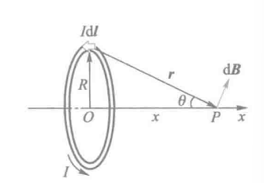 | 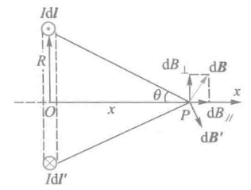 |
| --- | --- |
|  |  |

如上图，**细导线圆环的半径为 R，求其轴线上距圆心 O 为 x 处的 P 点的磁感应强度**

点击看推导过程

在圆电流顶部处取一电流元 $I\mathrm{d}\vec l$ ，并由 $I\mathrm{d}\vec l$ 向 P 点引径矢 $\vec{r}$ ,得出 P 点产生的磁感应强度大小为

$$
\mathrm{d}B = \dfrac{\mu_0}{4\pi} \cdot \dfrac{I\mathrm{d}l \sin 90^\circ}{r^2}
= \dfrac{\mu_0}{4\pi} \cdot \dfrac{I\mathrm{d}l}{r^2}
$$

易得，垂直于x轴方向的磁感应强度会相互抵消，所以仅计算平行于x轴方向的磁感应强度之和 $B_{//}$

$$
\left\{
\begin{array}{ll}
B = B_{//} = \int \mathrm{d}B_{//}=\int \mathrm{d}B\sin\theta \\
\sin\theta=\dfrac{R}{r} \\
\mathrm{d}B=\dfrac{\mu_0}{4\pi} \cdot \dfrac{I\mathrm{d}l}{r^2}
\end{array}
\right .
\quad \Rightarrow \quad
B = \int_0^{2\pi R}\dfrac{\mu_0}{4\pi}\dfrac{I\mathrm{d}l}{r^2}\dfrac{R}{r}=\dfrac{\mu_0IR^2}{2r^3}
$$

带入 $r^2 = x^2 + R^2，S=\pi R^2$，易得

$$
\boxed{
B = \frac{\mu_0 I R^2}{2 \left(R^2 + x^2\right)^{3/2}}
= \frac{\mu_0 I S}{2\pi \left(R^2 + x^2\right)^{3/2}}
}
$$

- 当 $x=0$ ，P在圆心处 时

$$
B_0=\dfrac{\mu_0 I}{2R}
$$

> 几分之一圆，$B_0'$ 就是 $B_0$ 的几分之一

- 正常情况下，我们可以把这个公式化简一下

$$
B = \dfrac{\mu_0I}{2R}\cdot\sin^3\theta=B_0\cdot\sin^3\theta
$$

- 当 $x\gg R$，即 P远离圆电流 时

$$
B = \frac{\mu_0 I R^2}{2 x^3}
= \frac{\mu_0 I S}{2\pi x^3}
$$

#### 带电圆盘轴线

既然有了圆环，那么 圆盘 也很好推导了

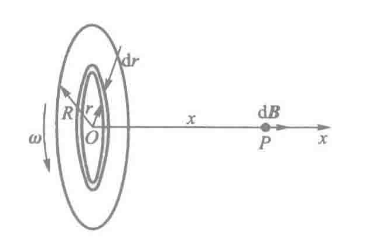

如图所示，**半径为 $R$ 的圆盘上均匀带电，电荷面密度为 $\sigma$ ，若该圆盘以匀角速度 $\omega$ 绕过圆心 $O$ 的 $x$ 轴旋转，求轴线上距圆盘中心 $O$ 为 $x$ 处的磁感应强度**

点击看推导过程

圆盘转动形成的电流可以看作是由许多圆电流组成，则在圆盘上距圆心 $O$ 为 $r$ 处，取一宽为 $\mathrm{d}r$ 的细圆环，其相应的电流为

$$
\mathrm{d}I = \frac{\omega}{2\pi} \, \mathrm{d}q
= \frac{\omega}{2\pi} \cdot \sigma \cdot 2\pi r\, \mathrm{d}r
= \omega \sigma r\, \mathrm{d}r
$$

那么直接计算带入计算

$$
\begin{aligned}
\mathrm{d}B &= \frac{\mu_0}{2} \cdot \frac{r^2\, \mathrm{d}I}{(x^2 + r^2)^{3/2}}
= \frac{\mu_0}{2} \cdot \frac{r^3\, \omega \sigma\, \mathrm{d}r}{(x^2 + r^2)^{3/2}}, \\
B &= \int \mathrm{d}B
= \int_0^R \frac{\mu_0}{2} \cdot \frac{r^3\, \omega \sigma\, \mathrm{d}r}{(x^2 + r^2)^{3/2}} \\
&= \frac{\mu_0 \omega \sigma}{2}
\left( \frac{R^2 + 2x^2}{\sqrt{R^2 + x^2}} - 2x \right)
\end{aligned}
$$

---

接下来引入一下 **磁矩** 的概念，用来描述圆电流的磁性质，有一个平面载流线圈，电流为 $I$ ，线圈面积为 $S$，线圈的总匝数为 $N$，线圈平面法向的单位矢量为 $\vec{e_n}$，得到磁矩 $\vec{m}$ 如下

$$
\vec{m} = NIS\vec{e\_n}
$$

---

#### 载流密绕直螺线管内部轴线

**螺旋管** 指绕在管状物表面的螺旋线圈；**直螺线管** 是指管状物呈圆柱形；每匝通电线圈可以近似看成圆电流；

整个螺线管在轴线上某点产生的磁感应强度等于各匝圆线圈在该点产生的磁感应强度的矢量和

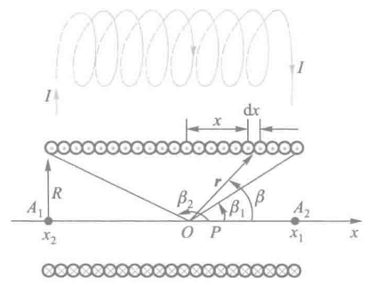

如图，**现有一个密绕直螺线管，半径为 $R$ ，通电流 $I$ ，单位长度绕有 $n$ 匝线圈，试求管内部轴线上任一点 P 处的磁感应强度**

点击看推导过程

在螺线管上取轴线方向为 $x$ 方向，在距 P 点 $x$ 处任意截取直螺管一小段 $\mathrm{d}x$ 该小段上有线圈 $n\mathrm{d}x$ 匝，通有电流 $\mathrm{d}i = In\mathrm{d}x$得出下式

$$
\mathrm{d}B = \frac{\mu_0}{2} \cdot \frac{R^2 n I\, \mathrm{d}x}{\left(R^2 + x^2\right)^{3/2}}
$$

由于螺线管的各小段在 P 点处产生的磁感应强度方向都相同，整个螺线管在 P 点产生的磁感应强度 B 的大小为

$$
B = \int \mathrm{d}B = \int_{x_1}^{x_2} \frac{\mu_0}{2} \cdot \frac{R^2 n I\, \mathrm{d}x}{\left(R^2 + x^2\right)^{3/2}}
$$

积分得

$$
\begin{aligned}
B &= \left. \frac{\mu_0}{2} \cdot \frac{R^2 n I x}{R^2 \sqrt{R^2 + x^2}} \right|_{x_1}^{x_2} \\
&= \frac{1}{2} \mu_0 n I
\left( \frac{x_2}{\sqrt{R^2 + x_2^2}} - \frac{x_1}{\sqrt{R^2 + x_1^2}} \right)
\end{aligned}
$$

同时我们也可得出如下几何关系，进而整理得到

$$
\left\{
\begin{aligned}
\cos\beta_1 &= \frac{x_1}{\sqrt{R^2 + x_1^2}} \\
\cos\beta_2 &= \frac{x_2}{\sqrt{R^2 + x_2^2}}
\end{aligned}
\right.
\quad \Rightarrow \quad
\boxed{
B = \frac{1}{2} \mu_0 n I \left( \cos\beta_2 - \cos\beta_1 \right)
}
$$

其中 $\beta_1$ 和 $\beta_2$ 分别为 $x$ 轴正向与从 P 点引向螺线管两端的径矢之间的夹角（看图会更清晰）

- 如果 螺线管的长度远大于直径 ，我们可以认为这个东西“无限长”，那么易得

$$
\left\{
\begin{aligned}
\beta_1=0 \\
\beta_2=\pi
\end{aligned}
\right.
\quad \Rightarrow \quad
\boxed{
B = \mu_0nI
}
$$

- 如果 P 在“无限长”螺线管的左端面（右端面同理）处，可知两夹角的角度，易得

$$
\left\{
\begin{aligned}
\beta_1=\dfrac{\pi}{2} \\
\beta_2\rightarrow\pi
\end{aligned}
\right.
\quad \Rightarrow \quad
\boxed{
B = \dfrac{1}{2}\mu_0nI
}
$$

于是我们可以得到下图 “ **密绕长直螺线管轴线上的磁场分布** ”

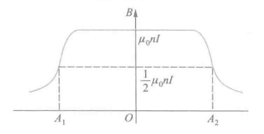

---

#### 匀速运动电荷的磁场

本质上恒定电流的磁场是匀速运动电荷产生的磁场的宏观表现，内容不重要，这里仅占位用

---

### 12.4 真空恒定磁场的基本定理

**磁感应线** 是形象描述磁场分布的假想曲线，其 **切线方向** 表示各点磁感应强度 $\vec{B}$ 的方向，**疏密程度** 表示磁场的强弱

**磁通量** 表示磁场通过某一面积的“磁力线总量”，用符号 $\Phi$ 表示，定义为磁感应强度对该面的曲面积分：

$$
\begin{array}{ll}
\Phi = \int\_S \vec{B} \cdot \mathrm{d}\vec{S} \
\mathrm{d}\vec{S}=\mathrm{d}S\cdot\vec{e\_n}\;\;\;\;\;(\vec{e\_n}为该面元的法向单位矢量)
\end{array}
$$

国际单位制中， 磁通量的单位为 Wb（韦伯），$1\mathrm{Wb}=1\mathrm{T\cdot m^2}$

!!! note
    **电场和磁场类比**

| 对应关系 | **磁场** | **电场（静电场）** | **比较说明** |
| --- | --- | --- | --- |
| **场的基本量** | 磁感应强度 $\vec{B}$ | 电场强度 $\vec{E}$ | 都描述场的强度与方向 |
| **场线名称** | **磁感应线** | **电场线** | 都是表示场方向与强弱的假想曲线 |
| **切线方向** | 与 $\vec{B}$ 同向 | 与 $\vec{E}$ 同向 | 表示该点场的方向 |
| **疏密程度** | 表示磁场强弱 | 表示电场强弱 | 越密集处场越强 |
| **场线形态** | 闭合曲线（无源场） | 起于正电荷，止于负电荷（有源场） | 反映 $\nabla \cdot \vec{B} = 0$ 与 $\nabla \cdot \vec{E} = \rho / \varepsilon_0$ 的差异 |
| **通量表达式** | $\Phi_B = \displaystyle\int_S \vec{B}\cdot d\vec{S}$ | $\Phi_E = \displaystyle\int_S \vec{E}\cdot d\vec{S}$ | 表示场线穿过曲面的“总量” |
| **单位** | T（特斯拉） | V/m（伏每米） | — |

---

#### 磁场的高斯定律

对于闭合曲面来说，闭合曲面上任意一个面积元的法线正方向 $\vec{e_n}$ ，通常规定为 **从曲面内指向曲面外**

- 当磁感线从曲面外穿进曲面内时，该处的磁通量为 **负** $(\theta > 90^\circ)$
- 当磁感线从曲面内穿出的时候，该处的磁通量为 **正** $(\theta < 90^\circ)$

且由于磁感应线是闭合曲线，所以有多少磁感应线穿入闭合曲面，就会有多少磁感应线穿出该曲面，所以可得 **磁感应强度对任意一个闭合曲面的磁通量必定等于零**，即

$$
\boxed{
\oint\_S\vec{B}\cdot\mathrm{d}S=0
}
$$

此定理适用于全部磁场

---

#### 真空中磁场的安培环路定理

真空中磁感应强度 $B$ 对于任意一个闭合回路 $L$ 的环流（也就是线积分）等于真空中的磁导率 $\mu_0$ ，与该闭合回路 $L$ 所包围的电流的代数和 $\sum{I_i}$ 之积，表达式如下：

$$
\oint\_L\vec{B}\cdot\mathrm{d}\vec{l}=\mu\_o\sum{I\_i}
$$

至于 $\sum{I_i}$ 的正负值，则需要依据电流穿过回路时的方向与回路绕行的方向是否符合右手定则

不过有一些需要注意的地方：

1. 上式中的 $\vec{B}$ 是空间所有电流产生的总磁感应强度，但 $\sum{I_i}$ 仅仅指穿过闭合回路的电流的代数和，与闭合回路外的电流无关
2. 即使 $\oint_l\vec{B}\cdot\mathrm{d}\vec{l}$ 等于零，仅仅表明穿过回路的电流的代数和为零，但回路 $L$ 上任一电的磁感应强度 $\vec{B}$ 不一定等于零
3. 该定理仅适用于恒定电流所产生的磁场
4. 被闭合路径包围并对环流有贡献的电流是指与闭合路径互相套链的电流，若是同一电流套链 $N$ 圈（下方左图），则为

   $$
   \oint\_L \vec{B}\cdot\mathrm{d}\vec{l}=\mu\_0NI
   $$

   若没有互相套链，则有 $\displaystyle \sum_i I_i=0$ ，这些电流 $I$ 虽然在 $L$ 处产生的 $B_1,B_2,B_3$ 均不为零，但对整个环流没有贡献

| 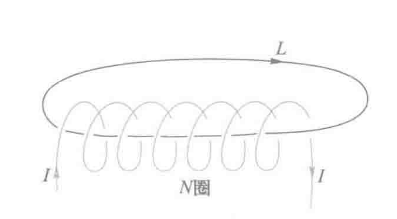 | 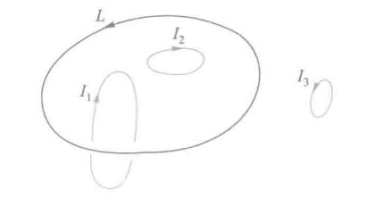 |
| --- | --- |
|  |  |

同时，我们对上式 $\oint_L\vec{B}\cdot\mathrm{d}\vec{l}=\mu_o\sum{I_i}$ 根据斯托克斯公式，有如下推导：

$$
\oint\_L \vec{B} \cdot \mathrm{d}\vec{l}
= \iint\_S (\nabla \times \vec{B}) \cdot \mathrm{d}\vec{S}
= \mu\_0 \sum\_{(L)} I
= \mu\_0 \iint\_S \vec{j} \cdot \mathrm{d}\vec{S}
$$

即得

$$
\boxed{
\nabla \times \vec{B} = \mu\_0 \vec{j}
}
$$

上式就是恒定磁场的安培环路定理得微分形式，其中 $\vec{j}$ 是电流密度矢量

!!! tip
    这里对向量微分算符再次介绍一下，用来对矢量场或标量场进行空间求导的意思

    $$
    \nabla = \hat{i}\dfrac{\partial}{\partial{x}}+\hat{j}\dfrac{\partial}{\partial{y}}+\hat{k}\dfrac{\partial}{\partial{z}}
    $$

    在这个式子中， $\nabla\times\vec{B}$ 是 **磁感应强度的旋度** ，表示磁场在空间的“环流分布”

!!! note
    **电场和磁场的类比**

| 类别 | **电场（Electrostatics）** | **磁场（Magnetostatics）** | **对比与物理意义** |
| --- | --- | --- | --- |
| **场的基本量** | 电场强度 $\vec{E}$ | 磁感应强度 $\vec{B}$ | 描述电场与磁场的强弱与方向 |
| **场源** | 电荷（静止电荷） | 电流（稳恒电流） | 电场由静止电荷产生，磁场由运动电荷（电流）产生 |
| **高斯定律（积分形式）** | $\displaystyle \oint_S \vec{E}\cdot d\vec{S} = \frac{Q_{\text{内}}}{\varepsilon_0}$ | $\displaystyle \oint_S \vec{B}\cdot d\vec{S} = 0$ | 电场有源有汇（电荷），磁场无源（磁感线闭合） |
| **高斯定律（微分形式）** | $\displaystyle \nabla \cdot \vec{E} = \frac{\rho}{\varepsilon_0}$ | $\displaystyle \nabla \cdot \vec{B} = 0$ | 电场散度反映电荷密度；磁场无散度，无“磁单极子” |
| **环路定律（积分形式）** | $\displaystyle \oint_L \vec{E}\cdot d\vec{l} = 0$（静电场） | $\displaystyle \oint_L \vec{B}\cdot d\vec{l} = \mu_0 I_{\text{内}}$ | 静电场为保守场，稳恒磁场具有环流性 |
| **环路定律（微分形式）** | $\displaystyle \nabla \times \vec{E} = 0$ | $\displaystyle \nabla \times \vec{B} = \mu_0 \vec{j}$ | 电场无旋（静态保守），磁场有旋（由电流引起） |
| **通量与环流意义** | 电通量 $\Phi_E = \displaystyle \int_S \vec{E}\cdot d\vec{S}$ | 磁通量 $\Phi_B = \displaystyle \int_S \vec{B}\cdot d\vec{S}$ | 场线穿过曲面的“总量”，体现场源性质 |
| **场线特征** | 电场线从正电荷出发、终止于负电荷 | 磁感线总是闭合，不存在起点或终点 | 电场有源，磁场无源 |
| **本质区别** | 电场是 **标量势场** 的梯度：$\vec{E}=-\nabla V$ | 磁场是 **环流场**，来源于电流：$\nabla\times\vec{B}=\mu_0\vec{j}$ | 电场保守，磁场非保守 |

---

接下来是安培环路定理推导出的一些特定内容，类似于上面比萨定律的推导

#### 无限长载流圆柱形导体的磁场分布

| 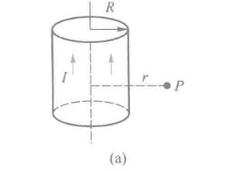 | 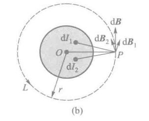 |
| --- | --- |
|  |  |

如上图， **设真空中有一无限长载流圆柱形导体，圆柱半径为 $R$ ，圆柱横截面上均匀地通有电流 $I$ ，沿轴线流动，求磁场分布**

点击看推导过程

由于电流分布的轴对称性，易得圆柱导体内外空间中的磁感线是一系列同轴圆周线。接下来的证明分为两个部分

---

**圆柱导体外的磁场分布**：

设圆柱外一点 P，距轴线为 $r$ ，选择过 P 点的同轴圆周线为积分回路 $L$ ，可以求得 $\vec{B}$ 在回路 $L$ 上的环流为

$$
\left\{
\begin{array}{ll}
\oint_L\vec{B}\cdot\mathrm{d}\vec{l}=2\pi{r}{B} \\
2\pi{rB}=\mu_0I
\end{array}
\right .
\quad \Rightarrow \quad
B = \dfrac{\mu_0I}{2\pi{r}}\;(r   R)
$$

---

**圆柱导体内的磁场分布**：

选 $r<R$ 处的任一点 $P’$ ，并选通过 $P’$ 点半径为 $r$ 的同轴圆周线为积分回路 $L’$ ，由于回路上各点 $\vec{B}$ 大小相同，方向沿 $L’$ 切线方向

$$
\left\{
\begin{array}{ll}
\oint_L\vec{B}\cdot\mathrm{d}\vec{l}=2\pi{r}{B} \\
2\pi{rB}=\dfrac{\mu_0\pi r^2}{\pi R^2}I
\end{array}
\right .
\quad \Rightarrow \quad
B = \dfrac{\mu_0rI}{2\pi R^2}\;(r<R)
$$

---

**那么综合表达式显而易见**

$$
B =
\left\{
\begin{array}{ll}
0, &\quad r = 0 \\
\frac{\mu_0 I r}{2\pi R^2}, &\quad r \leq R \\
\frac{\mu_0 I}{2\pi r}, &\quad r     R
\end{array}
\right.
$$

也可以得到下图的表达式曲线

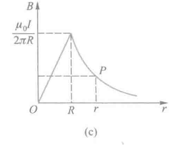

---

#### 长直载流螺线管内的磁场分布

之前算过长直螺线管内轴线上的磁场分布，但其它地方的磁场用比萨定律求解比较复杂，我们可以用安培环路定理来证明

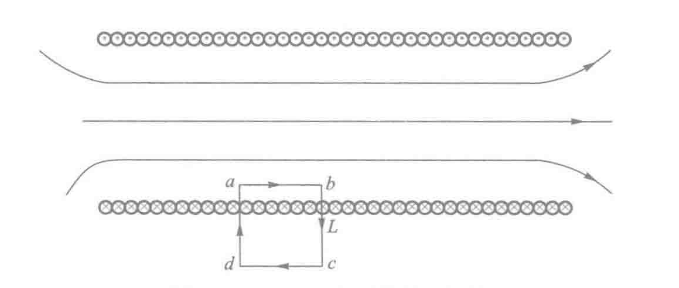

如上图， **设该长直螺线管可视作无限长密绕直螺线管，线圈中通电流 $I$ ，单位长度密绕 $n$ 匝线圈，内部的均匀磁场大小**

点击看推导过程

我们可以从电流分布的对称性可得，管内磁感线不会相交，只会互相平行分布，而且离轴线等距离的各点 $\vec{B}$ 的大小必然相等，方向平行于轴线，管外 $\vec{B}$ 则趋近于零

如上图，选择管内任意点 $P$ 的矩形回路 $abcda$ 为积分回路 $L$ ，绕行方向为 $a\rightarrow b\rightarrow c\rightarrow d\rightarrow a$ ，则环流如下

$$
\oint_L \vec{B} \cdot \mathrm{d}\vec{l}
= \int_{ab} \vec{B} \cdot \mathrm{d}\vec{l}
+ \int_{bc} \vec{B} \cdot \mathrm{d}\vec{l}
+ \int_{cd} \vec{B} \cdot \mathrm{d}\vec{l}
+ \int_{da} \vec{B} \cdot \mathrm{d}\vec{l}
$$

bc，da和cd段上，管内 $\vec{B}$ 与线元 $\mathrm{d}\vec{l}$ 垂直，或管外 $\vec{B}=0$ ，且由于管内平行轴线的 ab 段上的环流

$$
\left\{
\begin{aligned}
&\int_{ab} \vec{B} \cdot \mathrm{d}\vec{l} = B\overline{ab} \\
&\int_{bc} \vec{B} \cdot \mathrm{d}\vec{l} =
\int_{cd} \vec{B} \cdot \mathrm{d}\vec{l} =
\int_{da} \vec{B} \cdot \mathrm{d}\vec{l} = 0
\end{aligned}
\right.
\Rightarrow
\oint_L\vec{B}\mathrm{d}\vec{l}
= \mu_0 I (n\, \overline{ab})
\Rightarrow
\boxed{
B = \mu_0 n I
}
$$

可以发现，长直密螺线管内可视作均匀磁场

---

#### 载流密绕螺绕环的磁场分布

环形螺线管称为 **螺绕环**

| 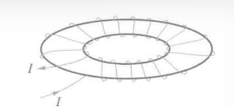 | 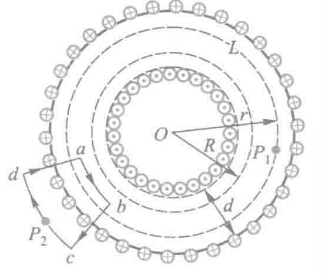 |
| --- | --- |
|  |  |

如上图所示， **设螺线环轴线半径为 $R$，环上均匀密绕 $N$ 匝线圈，通有电流 $I$，求磁场分布情况**

点击看推导过程

根据电流分布的对称性，可以判断环内磁感应线为一系列与螺线环中心轴线同心的圆周线。即同一圆周线上各点 $B$ 的大小相等，方向沿圆周切线方向。

---

**环管内的磁场分布**

设环内有一点 $P_1$，过 $P_1$ 点作以 $O$ 点为圆心、半径为 $r$ 的圆周，并将它选作积分回路 $L$ ，根据安培环路定理，则 $B$ 在回路 $L$ 上的环流为

$$
\oint_L \vec{B} \cdot \mathrm{d}\vec{l} = 2\pi r B = \mu_0 N I
\Rightarrow B = \frac{\mu_0 N I}{2\pi r}
\quad \left( R - \frac{d}{2} < r < R + \frac{d}{2} \right)
$$

当环很细，且 $R$ 很大时，即 $R\gg d$ 时，可以认为 $r\approx R$ ，若令 $n=\dfrac{N}{2\pi R}$，可得环内磁感应强度为

$$
B = \frac{\mu_0 N I}{2\pi R}
= \mu_0 n I
$$

---

**环管外的磁场分布**

当满足 $R\gg d$ ，取任一点$P_2$ 过 $P_2$ 作图中所示扇形积分回路 $abcd$（其中弧 $ab$、$cd$ 为圆弧的很小一部分，$bc$、$da$ 为从 $O$ 点发出的射线的一段），$abcd$ 绕行方向符合右手螺旋定则。显然，根据安培环路定理，$B$ 在回路 $abcd$ 上的环流为

$$
\oint_{abcd} \vec{B} \cdot \mathrm{d}\vec{l}
= \int_{ab} \vec{B} \cdot \mathrm{d}\vec{l}
+ \int_{bc} \vec{B} \cdot \mathrm{d}\vec{l}
+ \int_{cd} \vec{B} \cdot \mathrm{d}\vec{l}
+ \int_{da} \vec{B} \cdot \mathrm{d}\vec{l} \\
= B_{ab} \, \overline{ab} + B_{cd} \, \overline{cd}
$$

此环流应等于回路包围并穿过的电流的 $\mu_0$ 倍，即

$$
B_{ab}\overline{ab}+B_{cd}\overline{cd}=\mu_0n\overline{ab}I
$$

又由于 $B_{ab}\overline{ab}=\mu_0n\overline{ab}I$ 那么易得 $P_2$ 处的磁感强度大小为

$$
B_{cd}=0
$$

由此可知 密绕细螺绕环的磁场仅集中在环管内，$B=\mu_0 n I$，且均匀分布；而环管外无磁场

### 12.5 磁场对电流的作用

#### 载流导线在磁场中所受力

根据磁场对电流的作用规律，磁场对导线中 **长度为 $\mathrm{d}l$ 的小段电流元** 所施加的力，其数学表达式如下：

$$
\mathrm{d}F=BI\mathrm{d}l\sin\theta
$$

矢量表达式如下：

$$
\boxed{
\mathrm{d}\vec{F}=I\mathrm{d}\vec{l}\times\vec{B}
}
$$

该式中各参量物理意义如下：

| 符号 | 名称 | 含义 | 单位 |
| --- | --- | --- | --- |
| $\mathrm{d}F$ | 微元受力 | 导线中长度为 $\mathrm{d}l$ 的电流元受到的磁场力 | N |
| $B$ | 磁感应强度（磁场强度） | 描述磁场强弱和方向的物理量 | T（特斯拉） |
| $I$ | 电流强度 | 通过该导线的电流大小 | A（安培） |
| $\mathrm{d}l$ | 电流元长度 | 电流方向上导线的微小长度元 | m |
| $\theta$ | 夹角 | 电流元方向与磁感应强度 $\vec{B}$ 之间的夹角 | — |

---

#### 无限长载流直导线间的相互作用

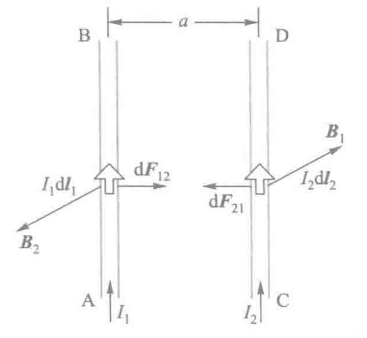

如图，有两条无限长载流平行直导线相距为 $a$，分别通有 $I_1$ 和 $I_2$，在导线上任选一电流元 $I_2\mathrm{d}\vec{l_2}$，根据安培定律，推导如下：

$$
\left\{
\begin{array}{ll}
\mathrm{d}F_{21}=I_2B_1\mathrm{d}\vec{l_2}\\
B_1 = \dfrac{\mu_0I_1}{2\pi a}
\end{array}
\right.
\quad \Rightarrow \quad
\boxed{
\mathrm{d}F_{21} = \dfrac{\mu_0I_1I_2}{2\pi a}\mathrm{d}l_2
}
$$

而 $F_{12}$ 的计算同理，不过多赘述

---

#### 均匀磁场对载流线圈的作用

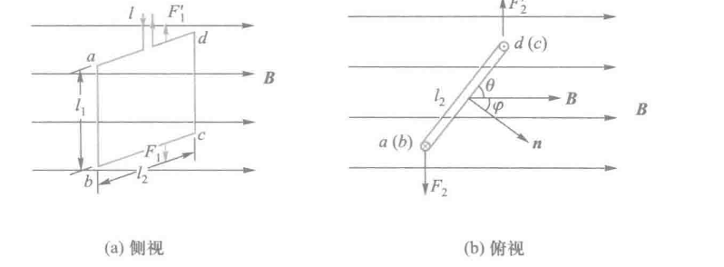

易得，da和bc所受安培力 $F_1$ 和 $F_1’$ 的大小均为

$$
F\_1=F\_1'=BIl\_2\sin\theta
$$

大小相等，方向相反，作用于同一直线，两力抵消

而ab和cd段所受安培力 $F_2$ 和 $F_2’$ 的大小均为

$$
F\_2=F\_2'=BIl\_1
$$

两力大小相等，方向向反，作用于不同直线，因而形成一个力偶，力臂为 $l_2\cos\theta$，则磁场对线圈作用的力矩大小为

$$
M=F\_2l\_2\cos\theta=BIl\_1l\_2\cos\theta=BIS\sin\varphi
$$

若线圈有 $N$ 匝，则线圈所受力矩为

$$
\boxed{
M=NBIS\sin\varphi
}
$$

考虑到线圈的磁矩为 $\vec{m}=NIS\vec{e_n}$ ，可将上式转为矢量式，如下：

$$
\boxed{
M=\vec{m}\times\vec{B}
}
$$

### 12.6 带电粒子在均匀电场和磁场中的运动

高中这种题做麻了，不过多介绍了，各公式如下

**洛伦兹力**

$$
\vec{F\_m}=q\vec{v}\times\vec{B}
$$

**带电粒子的运动半径、周期**

$$
\begin{array}{center}
R=\dfrac{mv}{qB} \
T=\dfrac{2\pi R}{v}=\dfrac{2\pi m}{qB}
\end{array}
$$

## 十三、磁介质

> 在上一章中，我们都是假定载流导线周围是真空的，但在实际情况并不可能。
>
> 载流导线周围有一些物质可以与磁场发生相互作用，从而影响原有的磁场分布。人们称这种物质叫做 **磁介质**
>
> 本章便讨论 **磁介质与磁场的相互作用规律** 以及 **物质磁性的本质**
>
> 同时，本章的内容有点类似于上学期中的“电介质”

### 13.1 磁介质的磁化

磁介质在磁场中会与磁场相互作用，并被磁化，我们假设被磁化后的磁介质大小为 $\vec{B’}$ 。根据场强叠加原理，磁介质内的磁感应强度 $\vec{B}$ 如下：

$$
\vec{B} = \vec{B\_0} + \vec{B'}
$$

实验表明，当磁场介质中磁场 $\vec{B}$ 与该处外磁场 $\vec{B_0}$ 存在如下关系

$$
\boxed{\vec{B} = \mu\_r\vec{B\_0}}
$$

其中， $\mu_r$ 称为 **相对磁导率** ，是决定磁介质本身特性的物理量，反应介质磁化后对磁场的影响程度

而对于无限长直螺线管，其内部的磁场为 $B_0 = \mu_0 n I$ ，当管内充满各向同性磁介质后，管内的磁场大小如下

$$
\boxed{B=\mu\_rB\_0=\mu\_0\mu\_rnI}
$$

!!! note
    $\mu_0$ 是指第十二章中的真空磁导率

于是人们又定义 $\mu=\mu_r\mu_0$ ，将 $\mu$ 称为磁介质的 **磁导率**

---

根据 $\mu_r$ 的大小，物质可分为 **顺磁质、抗磁质** 和 **铁磁质** 三类

- **顺磁质** 是指 $\mu_r$ 略大于1的磁介质，磁化后的附加磁场和外磁场方向相同，对磁场影响较小，可视为 $\mu_r=1$
- **抗磁质** 是指 $\mu_r$ 略小于1的磁介质，磁化后的附加磁场和外磁场方向相反
- **铁磁质** 是指 $\mu_r$ 远大于1的磁介质，磁化后的附加磁场很强，对磁场影响很大

---

**微观解释磁介质对磁场产生影响**

任何物质都是由分子和原子组成的，而分子或原子中的每个电子都有自旋和绕核两种运动，每一种运动都会产生磁效应。而分子或原子中所有电子产生的磁效应的总和可以用一个等效圆电流来表示，这个等效圆电流就称为 **分子电流** ，分子电流所形成的 **磁矩** 称为 **分子磁矩**

!!! note
    磁矩的概念重新声明下

有一个平面载流线圈，电流为 $I$ ，线圈面积为 $S$，线圈的总匝数为 $N$，线圈平面法向的单位矢量为 $\vec{e_n}$，得到磁矩 $\vec{m}$ 如下

$$
\vec{m} = NIS\vec{e_n}
$$

在没有外磁场的时候，每个分子具有的磁矩称为 **分子的固有磁矩** ，用 $\vec{m}$ 来表示。此时每个分子的磁矩取向杂乱无章，所以对外无磁性

但当有外磁场作用时，每个分子都会受到一个磁力矩的作用 $(\vec{M}=\vec{m}\times\vec{B_0})$ ，使得固有磁矩取向统一，从而对外体现出磁性，这个过程称为 **磁化**

---

**磁化强度**

磁化后介质内分子总磁矩不为零，为了表征物质的宏观磁性或介质的磁化程度，人们将 磁介质内某点处单位体积内分子磁矩的矢量和定义为该点的 **磁化强度**，用 $\vec{M}$ 表示，如下

$$
\vec{M}=\dfrac{\sum{\vec{m\_{分子}}}}{\Delta V}=\dfrac{\sum{\vec{m}}+\sum{\Delta\vec{m}}}{\Delta V}
$$

在此式中，$\sum{\vec{m}}$ 是体积 $\Delta V$ 内分子固有磁矩的矢量和，$\sum{\Delta \vec{m}}$ 是体积 $\Delta V$ 内分子附加磁矩的矢量和

---

**磁化电流**

我们可以用 磁化强度 $\vec{M}$ 来描述磁化强度，也可以用 **磁化电流 $I_s$** 来表示（由于电流处于介质表面，又称为 **磁化面电流**）

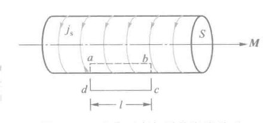

如上图，我们令 $\vec{j_s}$ 表示 **磁化电流密度** 。于是沿棒的轴线方向长为 $l$ 的的表面上，磁化电流的大小为 $\vec{I_s}=\vec{j_s}l$

---

**磁化强度和磁化电流的关系**

类似于在描述电介质极化时的 电极化强度P 和 极化电荷 $\sigma'$ 的关系

**磁化强度 $\vec{M}$** 和 **磁化电流 $I_s$** 也存在一定的关系，推导如下

点击查看推导过程

我们假定一个磁介质棒，截面积为 S ，长为 L，磁化后介质表面的磁化电流密度为 $\vec{j_s}$

则棒内总分子磁矩大小为

$$
\sum{\vec m_{分子}}=\vec{I_s}\cdot S=\vec{j_s}LS
$$

从而推导介质内的磁化强度

$$
\vec{M}=\dfrac{\sum\vec{m_{分子}}}{\Delta V}=\dfrac{\vec{j_s}LS}{LS}=\vec{j_s}
$$

也就是说，当磁化强度的方向与介质表面平行时，磁介质表面磁化电流密度大小等于该处磁化强度的大小

如上图所示，我们可以做一个矩形的长方形闭合回路abcd为积分回路L，介质外 $\vec{M}=0$ ，da、bc垂直于 $\vec{M}$ 。所以 $\vec{M}$ 的环流为

$$
\oint_L \vec{M}\cdot\mathrm{d}L=\int_{\overline{ab}}\vec{M}\cdot{d}L=\vec{M}L
$$

再将 $M=j_s$ 带入上式

$$
\oint_L\vec{M}\cdot\mathrm{d}L=j_sL=I_s
$$

也就是说，**磁化强度再闭合回路上的环流等于穿过闭合回路所包围面积的磁化面电流的代数和**

$$
\boxed{\oint_L\vec{M}\cdot\mathrm{d}L=\sum{\vec{I_s}}}
$$

### 13.2 磁介质中的高斯定理和安培环路定理

先回忆下真空中的高斯定理和安培环路定理

**磁感应强度对任意一个闭合曲面的磁通量必定等于零**

$$
\boxed{
\oint_S\vec{B}\cdot\mathrm{d}S=0
}
$$

**真空中磁感应强度 $B$ 对于任意一个闭合回路 $L$ 的环流（也就是线积分）等于真空中的磁导率 $\mu_0$ ，与该闭合回路 $L$ 所包围的电流的代数和 $\sum{I_i}$ 之积**

$$
\oint_L\vec{B}\cdot\mathrm{d}\vec{l}=\mu_o\sum{I_i}
$$

**高斯定理**

我们在高斯定理的说明中已有介绍，即使在磁介质情况下，高斯定理依然成立，即下式依旧成立

$$
\boxed{
\oint\_S \vec{B}\cdot\mathrm{d}\vec{S}=0
}
$$

---

**安培环路定理**

空间任一点的磁感应强度 $\vec{B}$ 是由导线中的传导电流 $I_0$ 和磁介质表面的磁化电流 $I_s$ 共同产生，因此有磁介质存在时，磁场的安培环路定律应如下

$$
\oint\_L\vec{B}\cdot\mathrm{d}\vec{L}=\mu\_0(\sum{I\_0}+\sum{I\_s})
$$

其中， $\sum{I_0}$ 是穿过闭合回路 $L$ 所围买诺记的传导电流的代数和；$\sum{I_s}$ 是磁化电流的代数和

接下来再把磁化强度和磁化电流的关系代入，得下式

$$
①\oint\_L\vec{B}\cdot\mathrm{d}\vec{L}=\mu\_0(\sum{I\_0}+\oint\_L\vec{M}\cdot\mathrm{d}\vec{L}) \
②\oint\_L({\dfrac{\vec{B}}{\mu\_0}-\vec{M}})\cdot\mathrm{d}\vec{L}=\sum{I\_0}
$$

①式化简得到②式，此时引入新的辅助量 **磁场强度 $H$** ，定义如下

$$
\vec{H}=\dfrac{\vec{B}}{\mu\_0}-\vec{M}
$$

!!! note
    类似于电位移矢量D，这里得磁场强度H仅为辅助矢量，决定场中运动电荷受力的仍然是磁感应强度B

总而言之，在磁介质存在时的安培定律数学表达式如下

$$
\oint\_L\vec{H}\cdot\mathrm{d}\vec{L}=\sum{I}
$$

含义为：**磁场强度H沿任一闭合回路L的线积分等于通过该回路L所围面积的传导电流的代数和**

---

**磁介质的磁化特性**

在各向同性的磁介质内部，任意一点的磁化强度M和磁场强度H成正比，即

$$
\boxed{
\vec{M} = \chi\_m\vec{H}
}
$$

称 $\chi_m$ 为比例系数，称为介质的 **磁化率** ，只与磁介质本身的性质有关

在有此定义后，我们可进而推导更加普适的 **磁场强度定义式**

$$
\vec{B}=\mu\_0(\vec{H}+\vec{M})\
\mu\_r=1+\chi\_m \Downarrow \mu=\mu\_0\mu\_r \
\boxed{
\vec{B}=\mu\vec{H}
}
$$

对于真空中的磁场，我们取 $\chi_m=0、\mu_r=1$

---

#### 有磁介质存在时磁场的安培环路定理的应用

在有磁介质存在时，我们一般先利用 $\oint_L\vec{H}\cdot\mathrm{d}\vec{L}=\sum{I}$ 计算出 $\vec{H}$ 的分布；再由 $\vec{B}=\mu\vec{H}$ 求出 $\vec{B}$ 的分布，从而避免磁化电流 $I_s$ 的计算

不过以上计算的条件需要满足，传到电流和磁介质的分布具有对称性，可以找到恰当的安培环路，使得 $\oint_L\vec{H}\cdot\mathrm{d}\vec{L}=\sum{I}$ 中 $\vec{H}$ 可以通过标量的形式提到积分号外面

---

#### 载流同轴电缆的磁场

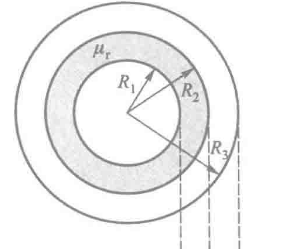

如上图， **一电缆由半径为 $R_1$ 的长直导线和套在外面的内、外半径分别为 $R_2、R_3$ 的同轴导体圆筒组成，其间充满相对磁导率为 $\mu_r$ 的各向同性非铁磁质，电流 $I$ 由半径为 $R_1$ 的中心导体流入纸面，由外面圆筒流出纸面，求磁场分布和紧贴中心导线的磁介质表面的磁化电流**

点击查看推导过程

由于电流分布和磁介质分布的轴对称性，可知磁场分布由轴对称性

选取距轴线距离r为半径的圆为安培环路 $L$ ，取顺时针方向为绕行方向，则有如下推导：

**$r<R_1$** 时

$$
\oint_L\vec{H_1}\cdot\mathrm{d}\vec{l}=2\pi rH_1=\dfrac{I}{\pi R_1^2}\pi r^2 \Rightarrow
H_1=\dfrac{Ir}{2\pi R_1^2}\\
\Downarrow \\
B_1=\mu_1H_1=\dfrac{\mu_0Ir}{2\pi R^2_1}
$$

$R_1<r<R_2$ 时:

$$
\oint_L\vec{H_2}\cdot\mathrm{d}\vec{l}=2\pi rH_2=I \Rightarrow H_2=\dfrac{I}{2\pi r}\\
\Downarrow \\
B_2=\mu_2H_2=\dfrac{\mu_0\mu_r I}{2\pi{r}}
$$

$R_2 < r < R_3$ 时：

$$
\oint_L\vec{H_3}\cdot\mathrm{d}\vec{l}=2\pi{r}H_3=I-\dfrac{I(r^2-R^2)}{R_3^2-R_2^2}
\Rightarrow H_3=\dfrac{I}{2\pi{r}}\dfrac{R_3^2-r^2}{R_3^2-R_2^2}
\\
\Downarrow
\\
B_3 = \mu_3H_3=\dfrac{\mu_0I}{2\pi r}\dfrac{R_3^2-r^2}{R_3^2-R_2^2}
$$

$r   R_3$ 时：

$$
\oint_L\vec{H_4}\cdot\mathrm{d}\vec{l}=2\pi{r}H_4=0
\Rightarrow
H_4=0
\\
\Downarrow
\\
B_4=\mu_4H_4=0
$$

变化曲线如下图

| 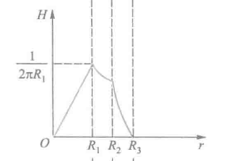 | 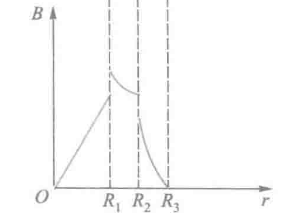 |
| --- | --- |
|  |  |

---

此外，为了求出紧贴中心导线的磁介质表面的磁化电流，我们对 $R_1<r<R_2$ 情况下应用 $\vec{B}$ 的安培环路定理式进行求解，如下

$$
\oint_LB_2\cdot\mathrm{d}\vec{l}=2\pi{r}B_2=\mu_0(I+I_s)
\\
\Downarrow
\\
B_2=\dfrac{\mu_0(I+I_s)}{2\pi{r}}
$$

再与前式得出的 $B_2=\dfrac{\mu_0\mu_r I}{2\pi{r}}$ 进行对比，可以得出磁化电流为

$$
I_s=(\mu_r-1)I
$$

#### 密绕螺绕环内的磁场

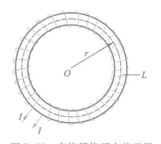

如上图，**在磁导率 $\mu=5.0\times10^{-4}\mathrm{Wb\cdot A^{-1}\cdot m^{-1}}$ 的均匀磁介质圆环上，均匀密绕着线圈，单位长度匝数为 $n=1000 \mathrm{匝\cdot m^{-1}}$ ，导线中通有电流 $I=2.0A$ ，求（1）磁场强度H（2）磁感应强度B（3）磁介质磁化强度M（4）磁化面电流密度 $j_s$**

!!! note
    (1) 由有磁介质时的安培环路定理求解，选取以圆环中心为圆心， $r$ 为半径的圆为安培环路 $L$ ，则由磁介质中安培环路定理可知

$$
\oint_L\vec{H}\cdot\mathrm{d}\vec{l}=2\pi rH=n2\pi{r}I
$$

(2) $B=\mu H$

(3)由 $\vec{H}=\dfrac{\vec{B}}{\mu_0}-\vec{M}$ 得

$$
M = \dfrac{B}{\mu_0}-H
$$

(4)$j_s=M$

### 13.3 铁磁质

铁磁质有如下特点：

1. 铁磁质的相对磁导率 $\mu_r$ 很大，可达几百甚至几万，且不是常量
2. 铁磁质内的 $\vec{B}$ 和 $\vec{H}$ 不成线性关系，$\vec{B}$ 的变花落后于 $\vec{H}$ 的变化
3. 所有的铁磁质均有一个临界温度 $T_c$ ，当 $T>T_c$ 的时候，铁磁质失去铁磁性，变成顺磁质。其中 $T_c$ 被称为居里温度。

> 钴：1404K；铁：1043K；镍：631K

---

**铁磁质的起始磁化曲线&&磁滞回线**

如上图，我们此时以铁磁质为芯制成这样的螺绕环，线圈中通过以电流 $I$ ，设螺绕环单位长度匝数为 $n$ ，则根据有介质时安培环路定理可得

$$
H=\dfrac{NI}{2\pi r}=nI
$$

此时改变电流，同时记录磁场强度H和磁感应强度B，有 $\mu=\dfrac{B}{H}$ 进而画出 $\mu-H$ 曲线、 $B-H$ 曲线如下

| 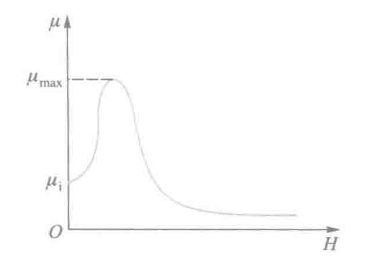 | 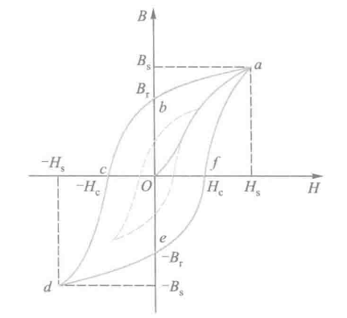 |
| --- | --- |
| 上图中， $\mu_i$ 称为初始磁导率；$\mu_{max}$ 称为最大磁导率 | 从图中可以看出，没有磁化过的铁磁质，随着 $H$ 的增大，铁磁质内 $B$ 也非线性地增大;当 $H$ 到达某个值 $H_s$ 之后，$B$ 不再增大，此时对应的磁钢应强度 $B_s$ 称为 **饱和磁感应强度**；曲线 $Oa$ 称为 **起始磁化曲线** |

实验表明：

- 各种铁磁质的起始磁化曲线都是不可逆的，当 $\vec{H}$ 再减小时，磁感应强度 B 不会沿原路径返回，而是形成一条 **磁滞曲线**
- 当 $H=0$ 时，磁体内部仍有剩余磁感应强度 $B_r$，称为 **剩磁**
- 继续反向增大磁场，直到 $B=0$ 时所需的磁场强度称为 **矫顽力** $H_c$

同时，我们也可以发现，当改变磁场方向，多次增减磁场时， $\vec{B}$ 和 $\vec{H}$ 的关系会形成一个闭合曲线，称为 **磁滞回线**。磁滞回线反映了磁化强度对磁场变化的“滞后性”，即磁感应强度的变化总是 **滞后于磁场强度的变化**。

铁磁质反复磁化会使磁介质本身发热，造成能量损耗，这称为 **磁质损耗**，磁滞损耗的大小与磁滞回线所围面积成正比

---

**铁磁质的分类**

人们根据铁磁材料矫顽力 $H_c$ 的大小，将铁磁材料分为 **软磁材料** 、 **硬磁材料** 和 **矩磁材料** 三类

- **软磁材料**：磁滞回线窄，磁滞损耗小，一般用于 *电机、变压器、继电器、电磁铁等需要频繁磁化和退磁的东西*
- **硬磁材料**：磁滞回线宽，磁滞损耗大，一般用于 *永久磁铁、录音磁带、记录磁带等需要长时间保持磁性的器件*
- **矩磁材料**：磁滞回线接近矩形，剩磁 $B_r$ 非常接近饱和值 $B_s$ ,可以从某一稳定态瞬间翻转到另一稳定态，可表示二进制的0和1，一般用于 *计算机的记忆和存储元件*

---

**铁磁质磁化的微观机制**

铁磁质磁化的特性可以用磁畴理论来解释

**磁畴的概念**：

​ 由于铁磁质原子间的“交换作用”，在无外磁场时电子自旋自发平行排列，形成微小区域，具有强磁性。

​ 未磁化时，各磁畴磁化方向杂乱无序，**整体不表现磁性**

而当 **施加外磁场 $H$** 时，会发生如下变化：

- **磁壁移动**：与 $H$ 方向夹角较小的磁畴扩大范围。
- **磁畴转向**：磁畴方向逐渐旋转到 $H$ 方向
- 当所有磁畴方向一致时，铁磁质达到磁饱和

**剩磁现象**：

​ 撤去外磁场后，磁畴不能完全恢复原状，一部分磁畴的排列仍被保留，使铁磁质 **保留部分磁性**，即为 **剩磁**。

**居里点现象**：

​ 当温度升高到 **居里点** 时，剧烈的热运动破坏磁畴结构，铁磁质转变为 **顺磁质** 。

---

### 章节总结

**基本概念**

- **磁介质**：能与磁场相互作用并改变磁场分布的物质。
- 磁感应强度：$\vec B = \mu_r \vec B_0$，磁导率：$\mu = \mu_0 \mu_r$
- 分类：顺磁质（$\mu_r>1$）、抗磁质（$\mu_r<1$）、铁磁质（$\mu_r\gg 1$）

**磁化与磁化强度**

- 外磁场使分子磁矩趋于同向 → **磁化**
- 磁化强度：$\displaystyle \vec M = \frac{\sum \vec m}{\Delta V}$
- 与磁化电流关系：$\displaystyle \oint_L \vec M \cdot d\vec l = \sum I_s$

**磁介质中的基本定律**

- 高斯定理：$\displaystyle \oint_S \vec B \cdot d\vec S = 0$
- 安培环路定理（含磁化）：
  $\displaystyle \oint_L \vec H \cdot d\vec l = \sum I_0$，
  $\displaystyle \vec H = \frac{\vec B}{\mu_0} - \vec M$
- 磁化率：$\vec M = \chi_m \vec H$，$\vec B = \mu \vec H$

铁磁质特点

- $\mu_r$ 大且非线性，$B$ 滞后于 $H$
- 存在 **饱和磁感应强度 $B_s$**、**剩磁 $B_r$**、**矫顽力 $H_c$**
- 磁滞回线面积 ∝ 磁滞损耗

**应用与微观机制**

- 常用公式：密绕线圈 $H = nI$，$B = \mu H$，$M = \dfrac{B}{\mu_0} - H$
- 铁磁质由磁畴组成，外场作用下磁畴移动、转向 → 磁化
- 超过居里温度后转为顺磁质
