# 十四、十五章

## 十四、电磁感应

本章将讨论电磁感应现象的基本规律、动生电动势和感生电动势、自感与互感现象，最后讨论磁场的能量问题

### 14.1 电磁感应的基本定律

电磁感应现象

总结为一句话：**当穿过闭合导体回路的磁通量发生变化时，闭合导体回路中就会出现电流** 。

其中，所产生的电流被称为 **感应电流**。在回路中出现电流，说明回路中有电动势存在，在回路中由于磁通量的变化而引起的电动势称为 **感应电动势**

---

法拉第电磁感应定律

总结为一句话：**当穿过回路所包围面积的磁通量发生变化时，回路中产生的感应电动势的大小与穿过回路的磁通量对时间的变化率成正比** 。公式如下：

$$
\boxed{
\varepsilon\_i=-\dfrac{\mathrm{d}\Phi\_m}{\mathrm{d}t}
}
\tag{14-1-1}
$$

其中负号反映了感应电动势的方向与磁通量变化之间的关系

---

楞次定律

> 本定律是用来判断感应电流方向的定律

总结为一句话，即：**闭合回路中感应电流的方向，总是使得感应电流所激发的磁场阻碍引起感应电流的磁通量的变化**

如下图所示，我们规定与绕行方向成右手螺旋关系的磁通量为正，反之为负；

- 当穿过闭合回路包围面积的磁通量增加时，感应电动势 $\varepsilon_i < 0$，这表明此时感应电动势的方向与L绕行方向相反
- 当穿过闭合回路包围面积的磁通量减少时，感应电动势 $\varepsilon_i > 0$，这表明此时感应电动势的方向和L的绕行方向相同

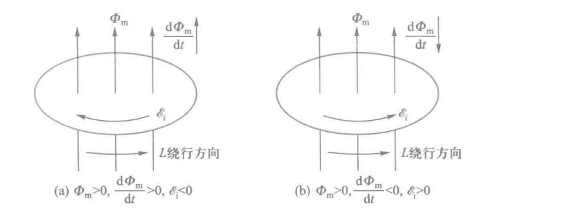

---

此外，回路中感应电流只与 **穿过回路的磁通量对时间的变化率** 有关系，而与 **穿过回路的磁通量** 及 **回路的材料** 无关

另外，由于磁通量通常是空间位置和时间的函数，因此磁通量对时间的一阶导数通常也应是空间位置和时间的函数， 只有当位置和时间唯一确定后，线圈中的感应电动势才有确定的值

例如，如果在闭合回路中电阻为 $R$ ，则回路中感应电流为

$$
I_i=\dfrac{\varepsilon_i}{R}=-\dfrac{1}{R}\dfrac{\mathrm{d}\Phi_m}{\mathrm{d}t}
$$

在 $t1$ 到 $t2$ 这段时间内，通过回路任一截面的感应电量为

$$
q_i=\int_{t_{1}}^{t_2}{I_i}\mathrm{d}t=-\dfrac{1}{R}\int_{\Phi_1}^{\Phi_2}\mathrm{d}\Phi_m=-\dfrac{1}{R}(\Phi_{m2}-\Phi_{m1})
$$

此式表明，在 $t_1$ 到 $t_2$ 这段时间内感应电量仅与回路中磁通量的变化量成正比，而与磁通量变化的快慢无关。

如果从实验中测出电阻R和通过回路界面的感应电量为 $q_i$ ,就可以计算出磁通量变化量

---

在实际情况中，线圈大多由许多匝串联而成，在这种情况下，整个线圈中产生的感应电动势应该是每匝线圈中产生的感应电动势之和

我们取穿过各匝线圈的磁通量为 $\Phi_{m1}，\Phi_{m2}，\cdots，\Phi_{mn}$ 时，总电动势为

$$
\begin{align}
\varepsilon\_i&=-\dfrac{\mathrm{d}}{\mathrm{d}t}(\Phi\_{m1}+\Phi\_{m2}+\cdots+\Phi\_{mn})\
&=-\dfrac{\mathrm{d}}{\mathrm{d}t}(\sum\_{i=1}^{n}\Phi\_{mi})\
&=-\dfrac{\mathrm{d}\psi}{\mathrm{d}t}
\end{align}
$$

其中，我们令 $\psi=\sum_{i=1}^{n}\Phi_{mi}$ 是穿过各匝线圈的磁通量的总和，称为 **穿过线圈的全磁通**

当穿过各匝线圈的磁通量相等时，N匝线圈中的全磁通为 $\psi=N\Phi_m$ ，称为 **磁链**

此时，公式变化为

$$
\varepsilon\_i=-\dfrac{\mathrm{d}\psi}{\mathrm{d}t}=-N\dfrac{\mathrm{d}\Phi\_m}{\mathrm{d}t}
$$

在国际单位制中， $\Phi_m$ 或 $\psi$ 的单位为韦伯(Wb)，$\varepsilon_i$ 的单位为伏特（V）

!!! note
    例题：设有一无铁芯的螺绕环，单位长度上匝数为每米5000匝，螺绕环的截面积 $S=2\times10^{-3}$，金属导线的两端和电源及可变电阻串联称闭合电路，在环上再绕一线圈A，其匝数N=5匝，电阻为 $R=2\Omega$ ，调节可变电阻R使通过螺绕环的电流I每秒减少20A，求(1)线圈A中产生的感应电动势 $\varepsilon_i$ 及感应电流 $I_i$ ;(2) 2 s内通过线圈 A 的感应电荷量 $q_i$

---

(1)螺绕环截面积很小，可认为磁场全部集中在环内，而且是均匀磁场，故有

$$
B=\mu_0nI
$$

线圈A所包围的面积上只有螺绕环的截面部分有磁场，故通过线圈A的磁通量 $\Phi_m$ 为

$$
\Phi_m=BS=\mu_0nIS
$$

线圈A中的感应电动势为

$$
\varepsilon_i=-N\dfrac{\mathrm{d}\Phi_m}{\mathrm{d}t}=-\mu_0nNS\dfrac{\mathrm{d}I}{\mathrm{d}t}
$$

将数值带入，我们可以得到 $\varepsilon_i=1.26\times10^{-3}\mathrm{V}$

线圈A中感应电流为 $I_i=\dfrac{\varepsilon_i}{R}=6.3\times 10^{-4}\mathrm{A}$

---

(2)在2s内通过线圈A截面的感应电荷量 $q_i$ 为

$$
\begin{align}
q_i&=\int_{t_1}^{t_2}I_i\mathrm{d}t=6.3\times10^{-4}\times2\mathrm{C} \\
&=1.26\times10^{-3}\mathrm{C}
\end{align}
$$

### 14.2 动生电动势

> 可以注意到，上一个例题中，电磁感应现象的产生使因为磁场的变化引起的。那么当线圈相对于磁场做相对运动时，同样会产生电磁感应现象。

我们将在恒定磁场中，由于导体回路或一段导线相对于磁场运动是产生的感应电动势称为 **动生电动势**，而将导体回路固定不动时，仅由于磁场的变化产生的感应电动势称为 **感生电动势**。我们接下来讨论的为 **动生电动势**

---

动生电动势的产生原因

我们可以假设一段长为 L 的导体ab在均匀磁场B中平动时，导体ab中产生动生电动势的物理过程。

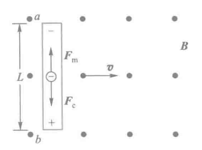

如上图所示：导体ab以速度v沿垂直于B的方向运动，导体中的自由电子将随导体以同样的速度v一起运动，每个电子受到 **方向向上的洛伦兹力 $\vec{F_m}$** 为

$$
\vec{F\_m}=-e\vec{v}\times\vec{B}
$$

自由电子在该力的作用下，由于导体表面的约束，只能沿导体向上运动，结果在a端积累负电荷，在b端积累正电荷，从而在导体中产生由b指向a的静电场 $\vec{E}$ 。这样，每个电子还要受到 **方向向下的静电场力 $\vec{F_e}$** 的作用，即

$$
\vec{F\_e}=-e\vec{E}
$$

当导体两端的电荷累积到一定程度时，$\vec{F_m}$ 与 $\vec{F_e}$ 达到平衡，导体内自由电子达到动态平衡不再有宏观定向运动，这时运动导体 ab 相当于一个电源， a端为负极，电势较低，b端为正极，电势较高

作用在电子上的洛伦兹力就是一种非静电力，洛伦兹力在运动导体中克服静电力 $\vec{F_e}$ 做功，将正电荷由a端通过电源内部搬运到b端，则单位正电荷所受的非静电力即 **非静电场强 $\vec{E_K}$** 为

$$
\vec{E_K}=\dfrac{\vec{F_m}}{-e}=\dfrac{-e(\vec{v}\times\vec{B})}{-e}=\vec{v}\times\vec{B}
$$

那么再根据电动势的定义，我们可以计算 **运动导体ab上的动生电动势** 为

$$
\varepsilon_i=\int_{-}^{+}\vec{E_K}\cdot\mathrm{d}\vec{l}=\int_a^b(\vec{v}\times\vec{B})\cdot\mathrm{d}\vec{l}
$$

接下来，由于 $\vec{v}\perp\vec{B}$ ，若导体 ab 上所选取的线元 $\mathrm{d}\vec{l}$ 方向与 $\vec{v}\times\vec{B}$ 方向一致，那么上式可继续化简如下

$$
\varepsilon_i=\int_a^b(\vec{v}\times\vec{B})\cdot\mathrm{d}\vec{l}=\int_0^LvB\mathrm{d}l=BLv
$$

> 这下看懂了

在此式中，$Lv$ 为导体 ab 在单位时间内扫过的面积。由此可见，动生电动势也等于运动导体在单位时间内切割的磁感应线数

---

对于非均匀磁场中任意形状的金属导线，以及金属导线上各部分的运动速度不完全相同时的一般情况

我们取一段以速度 $\vec{v}$ 运动的导线元 $\mathrm{d}\vec{l}$ ，设其所在的磁场为 $\vec{B}$ ，根据上面的分析，我们可以首先求得导线元 $\mathrm{d}\vec{l}$ 上产生的动生电动势为

$$
\mathrm{d}\varepsilon\_i=(\vec{v}\times{\vec{B}})\cdot\mathrm{d}\vec{l}
$$

整个导体的动生电动势积分即可

那么如果导线回路是闭合的，且整个闭合回路都在磁场中运动，那么回路中各段均能产生动生电动势。此时，整个闭合回路中的动生电动势为

$$
\varepsilon\_i=\oint\mathrm{d}\varepsilon\_i=\oint(\vec{v}\times\vec{B})\cdot\mathrm{d}\vec{l}
$$

!!! note
    按照惯例，来一道例题

**例：** 如下图所示，铜棒OA长L=0.5m，处在方向垂直纸面向内的匀强磁场B=0.01T中，沿逆时针方向绕O轴转动，角速度为 $\omega=100\pi\;\mathrm{rad}\cdot\mathrm{s^{-1}}$,求铜棒中的动生电动势，若是半径为 $R=0.5\mathrm{m}$ 的铜盘绕O轴转动，则盘心O点和通判边缘之间的电势差为多少

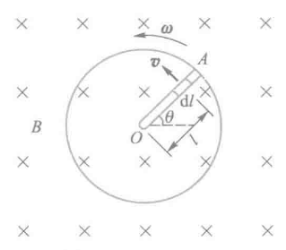

**解：** 由于铜棒上各段速度大小不同，因此不能直接用 $BLv$ 解决。在铜棒上取一线元 $\mathrm{d}\vec{l}$ ，认为 $\mathrm{d}\vec{l}$ 上速度大小相等，为 $v=\omega l$,则 $\mathrm{d}\vec{l}$ 上产生的动生电动势为

$$
\mathrm{d}\varepsilon_i=(\vec{v}\times\vec{B})\cdot\mathrm{d}\vec{l}=vB\mathrm{d}l
=l\omega B\mathrm{d}l
$$

其中 $\mathrm{d}\vec{l}$ 方向选在 $\vec{v}\times\vec{B}$ 的方向，则整个铜棒上产生的动生电动势可积分得

$$
\varepsilon_i=\int\mathrm{d}\varepsilon_I=\int_0^Ll\omega B\mathrm{d}l=\dfrac{1}{2}L^2\omega{B}
$$

带入数值即可，O为正极，A为负极

### 14.3 感生电动势 感生电场

接下来讨论感生电动势的物理规律

一个静止的导体或导体回路，当它所在处的磁场发生变化时，穿过它的磁通量也会发生变化，这时导体或导体回路中也会产生感应电动势，这样产生的电动势称为感生电动势

> 我们这里所说的磁场发生变化，其原因可能是磁场源的运动或通电导线中电流大小的变化

---

感生电动势产生的原因

上一节中，我们在讨论动生电动势时提到，产生动生电动势的非静电力时洛伦兹力。那么在导体或导体回路静止的情况下，感生电动势是怎么产生的呢？

这时的感应电流是由原来静止的电荷收到非静电力作用而形成的，而静止电荷受到的力只能是电场力，因此这时的非静电力本质应该是 **电场力** 。而这种电场是由变化的磁场引起的，麦克斯韦将这种磁场称为 **感生电场**（又称为 **涡旋电场**）。

表述如下：**变化的磁场在闭合导体中激发了一种电场，这种电场称为感生电场，感生电流的产生就是这一电场作用于导体中自由电荷的结果**。并加以推广：**不管有无导体存在，变化的磁场总是在空间激发电场**

---

感生电场的环路定理

若 $F_i=qE_i$ 是形成回路中感生电动势的非静电力，则非静电场强 $E_K=E_i$

我们取感生电场为 $\vec{E_i}$ ，一段棒元为 $\mathrm{d}\vec{l}$

由电动势定义，由于磁场的变化，则 **在导线ab上产生的感生电动势** 为

$$
\boxed{
\varepsilon\_i=\int\_a^b\vec{E\_i}\cdot\mathrm{d}\vec{l}
}
\tag{14-3-1}
$$

而在 **闭合导体回路L上产生的感生电动势** 为

$$
\boxed{\varepsilon\_i=\oint\_L\vec{E\_i}\cdot\mathrm{d}\vec{l}}
\tag{14-3-2}
$$

再由法拉第电磁感应定律推导

$$
\varepsilon\_i=-\dfrac{\mathrm{d}\Phi\_m}{\mathrm{d}t}
=-\dfrac{\mathrm{d}}{\mathrm{d}t}\int\_S\vec{B}\cdot\mathrm{d}\vec{S}
\tag{14-3-3}
$$

又由于回路L是静止的，其形状和面积不随时间变化，而一般情况下磁感应强度 $\vec{B}$ 又是空间位置和时间 t 的函数，因此又上面两个式子可以推导如下

$$
\boxed{
\varepsilon\_i
=\oint\_L\vec{E\_i}\cdot\mathrm{d}\vec{l}
=-\iint\_S\dfrac{\partial\vec{B}}{\partial{t}}\cdot\mathrm{d}\vec{S}
}
\tag{14-3-4}
$$

此式即为感生电场的环路定理。式子中曲面积分的区域S是以回路L为边界。当选定了面积的发现方向后，环路的绕向与面积的法向成右手螺旋关系时为正

不过教材中似乎隐含了磁场分量方向，将向量的面积积分简化为标量面积积分的形式，如下

$$
\boxed{
\varepsilon\_i
=\oint\_LE\_i\cdot\mathrm{d}l
=-\int\_S\dfrac{\partial B}{\partial{t}}\cdot\mathrm{d}S
}
\tag{14-3-5}
$$

---

感生电场的性质

根据环路性质不同（是否保守），静电场和感生电场的对比如下：

|  | 静电场 ( $\vec{E}_s$ ) | 感生电场 ( $\vec{E}_i$ ) |
| --- | --- | --- |
| 闭合回路的环路积分 | 恒为 **0** | 一般 **不为 0** |
| 数学表达 | ($\displaystyle \oint_L \vec{E}_s\cdot d\vec{l}=0$) | ($\displaystyle \oint_L \vec{E}_i\cdot d\vec{l} = -\frac{d\Phi}{dt}\neq 0$) |
| 场性质 | **保守场** | **非保守场**、有“旋转性” |
| 电势概念 | 能建立全局电势函数 | 一般不能定义电势（不可积） |

即 *静电场不产生净功，感生电场能够驱动电流做功*

根据场线性质不同（是否有源），对比如下：

|  | 静电场 | 感生电场 |
| --- | --- | --- |
| 场线起终点 | 从正电荷出发 → 终止于负电荷（有头有尾） | 完全闭合（无头无尾） |
| 相关方程 | ($\displaystyle \oint_S \vec{E}_s \cdot d\vec{S} = \frac{Q}{\varepsilon_0} \neq 0$) | ($\displaystyle \oint_S \vec{E}_i \cdot d\vec{S} = 0$) |

即 *静电场有“源”——电荷；感生电场无源，场线成封闭回路*

根据产生机制，对比如下：

| 场类型 | 原因 |
| --- | --- |
| 静电场 | 静止电荷产生 |
| 感生电场 | **时间变化的磁场** 产生（电磁感应） |

我们在上面也注意到存在 $\displaystyle \iint_S \vec{E_i}\cdot\mathrm{d}\vec{S}=0$ ，我们可以将向量形式化简为标量形式，如下：

$$
\oint\_SE\_i\cdot\mathrm{d}S=0
\tag{14-3-6}
$$

即 **感生电场的高斯定理**

---

感生电动势的计算

两种基本方法：

1. 若磁场在空间分布具有对称性，在磁场中导体中又不构成闭合回路，可以利用式(14-3-4)求出空间 $E_i$ 的分布，然后再利用式 (14-3-1)求出导体上的感生电动势
2. 若导体为闭合回路，或虽然不是闭合的，但可以通过加辅助线构成闭合回路，这是可以直接用法拉第电磁感应定律式(14-1-1)进行求解

接下来举几个例子

!!! note
    **例1** 如图所示，有一个局限在半径为 R 的圆柱形空间的均匀磁场，方向垂直纸面向里，磁场的变化率 $\dfrac{\mathrm{d}B}{\mathrm{d}t}$ 为常数且小于零，求距圆心O为r处的P点的感生电场场强

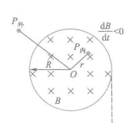

**解** 根据磁场对称性可知，空间的感生电场也是对称的，即 $E_i$ 线应该是一系列以O为圆心的同心圆，做半径为r的圆形回路L沿顺时针方向，回路所围面积S的发现垂直纸面向里，分为以下两种情况

(1) $0<r\leq R$ 时，P点在圆柱内，则有

$$
\oint_LE_i\mathrm{d}l=-\int_S\dfrac{\partial B}{\partial t}\cdot\mathrm{d}S
$$

即

$$
2\pi rE_i=\pi r^2\dfrac{\mathrm{d}B}{\mathrm{d}t} \\
E_i = \dfrac{r}{2}\dfrac{\mathrm{d}B}{\mathrm{d}t}
$$

$E_i$ 的方向确定：由题意 $\dfrac{\mathrm{d}B}{\mathrm{d}t}<0$，故 $\dfrac{\mathrm{d}B}{\mathrm{d}t}$ 与法线方向相反，即向外

(2) $r＞R$，P点在圆柱外，此时注意到变化磁场的有效面积只存在于R内，即有

$$
2\pi r\cdot E_i=\pi R^2\dfrac{\mathrm{d}B}{\mathrm{d}t}
$$

得

$$
E_i=\dfrac{R^2}{2r}\dfrac{\mathrm{d}B}{\mathrm{d}t}
$$

同样，$E_i$ 线的方向也沿顺时针方向， $E_i$ 随 r 的变化关系如下图

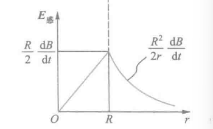

!!! note
    **例2** 在半径为 $R$ 的圆柱状空间内存在均匀磁场，且 $\dfrac{dB}{dt}     0$，有一长为 $l$ 的金属棒放在磁场中，位置如图所示。求棒两端的感生电动势。

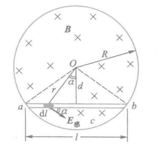

**解** 取弓形 $abca$ 为积分回路，绕行方向为顺时针，回路所围面积 $S$ 的法线方向垂直纸面向里，并设 $\theta$ 为三角形 $abO$ 的顶角，则有

$$
\oint_{abca} E_{\text{i}}\cdot dl
 =\int_{ab} E_{\text{i}}\cdot dl
 +\int_{bca} E_{\text{i}}\cdot dl,
$$

而

$$
\begin{align}
\varepsilon_{ab}
 &=\int_{ab} E_{\text{i}}\cdot dl
 =\oint_{abca} E_{\text{i}}\cdot dl
 -\int_{bca} E_{\text{i}}\cdot dl \\
 &=\frac{l}{2}\sqrt{R^2-\left(\frac{l}{2}\right)^2}\frac{dB}{dt}
 \end{align}
$$

方向：从 $a\rightarrow b$，其中

$$
\begin{align}
\oint_{abca} E_{\text{i}}\cdot dl
 &=\frac{d\Phi}{dt}
 =-\int_S \frac{\partial B}{\partial t}\cdot dS
 =-S_{abca}\frac{dB}{dt} \\
 &=-\left[
    \dfrac{\theta}{2\pi}\pi{R^2}-\dfrac{l}{2}\sqrt{R^2-\left({\dfrac{l}{2}}\right)^2}
    \right]
    \dfrac{\mathrm{d}B}{\mathrm{d}t}\\
 \oint_{bca}E_i\cdot\mathrm{d}l &=-\dfrac{R}{2}\dfrac{\mathrm{d}B}{\mathrm{d}t}
    \theta R
    =-\dfrac{\theta R^2}{2}\dfrac{\mathrm{d}B}{\mathrm{d}t}
 \end{align}
$$

!!! note
    **例3** 如图所示，在垂直于纸面内非均匀的随时间变化的磁场 $B = kx\cos \omega t$ 中，有一弯成 $\theta$ 角的金属架 $COD$，$OD$ 与 $x$ 轴重合，一导体棒 $MN$ 垂直于 $OD$，并以恒定速度 $v$ 垂直于 $MN$ 沿 $OD$ 方向向右滑动，设 $t = 0$ 时 $x = 0$（即 $t = 0$ 时 $MN$ 在 $x = 0$ 处），求框架内感应电动势的变化规律。

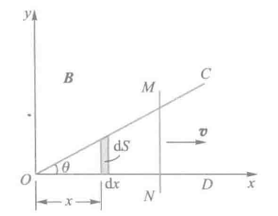

\*\*解\*\*显然，本例磁场随时间和空间同时变化，导体又运动。根据分析，感应电动势必然既有动生电动势又有感生电动势。

在图中取面积元 $dS$，则

$$
dS = y,dx = x\tan\theta,dx,
$$

任意时刻 $t$，穿过回路 $OMN$ 总的磁通量为

$$
\Phi_m = \int_S \vec{B}\cdot d\vec{S} = \int_0^l kx\cos\omega t \cdot x\tan\theta,dx = \frac{1}{3}kx^3\tan\theta\cos\omega t,
$$

由法拉第电磁感应定律

$$
\begin{align}
\varepsilon_i &= -\frac{d\Phi_m}{dt}
= -\frac{1}{3}k x^3 \tan\theta \cdot (-\omega\sin\omega t) - kx^2 \frac{dx}{dt}\tan\theta \cos\omega t \\
&= \frac{1}{3}k v t^2 \tan\theta (\omega\sin\omega t - 3\cos\omega t)
\end{align}
$$

式中，$x = vt$。从结果可以看出，金属框架上总的感应电动势包括第一项感生电动势和第二项动生电动势。

---

### 14.4 自感与互感

在实际问题中，磁场的变化往往是由电流的变化引起的，所以本节内容主要讨论感生电动势与电流变化的直接关系

通过自感现象和互感现象来讨论这个问题

---

#### 自感

当通过线圈的电流发生变化时，引起穿过线圈自身回路的磁通量发生变化，由此产生的电磁感应现象称为自感现象，对应的电动势称为自感电动势

同时由于铁磁质的磁性与电流的变化存在着非线性的关系，故下面的讨论假定空间无铁磁质存在：

---

自感系数推导

由比萨定律可知，当回路的形状、大小、位置及周围磁介质不变时，回路中电流所产生的磁场与电流成正比，所以通过回路的全磁通也正比于回路中的电流，即

$$
\psi=LI
\tag{14-4-1}
$$

式中，L为比例系数，称为 **回路线圈的自感系数**，其量值取决于线圈的形状、大小、位置、匝数和周围的磁介质及其分布，而与电流无关，在式（14-4-1）中，若令 $I=1$,则 $L=\psi$ ，也就是：**回路的自感系数在量值上等于回路的电流为一个单位时，通过这个回路所包围面积的全磁通**

由法拉第电磁定律，我们可以推导出 **回路中自感电动势** 为

$$
\varepsilon\_L=-\dfrac{\mathrm{d}\psi}{\mathrm{d}t}=-\dfrac{\mathrm{d}(LI)}{\mathrm{d}t}
=
\left(
L\dfrac{\mathrm{d}I}{\mathrm{d}t}+
I\dfrac{\mathrm{d}L}{\mathrm{d}t}
\right)
\tag{14-4-2}
$$

式中，第一项代表电流变化产生的自感电动势；第二项代表因回路几何形状、大小、位置和磁介质种类及分布的变化而产生的自感电动势

若L不随时间变化，即 $\dfrac{\mathrm{d}L}{\mathrm{d}t}=0$ 则有

$$
\varepsilon\_L=-L\dfrac{\mathrm{d}I}{\mathrm{d}t}
\tag{14-4-3}
$$

此式表明：**回路中的自感系数，在量值上等于回路中的电流每单位时间改变1单位时，在回路中产生的自感电动势**

这个负号表明了 $\varepsilon_L$ 总是要阻碍回路本身电流的变化，而且回路的自感系数L越大，回路中的电流也就更不容易改变。因此我们可以认为自感系数 $L$ 是回路 **电磁惯性** 的量度

---

单位

在国际单位制中，自感系数的单位是 **亨利**，用符号H表示

$$
1\;\mathrm{H}=1\;\dfrac{\mathrm{Wb}}{\mathrm{A}}=1\;\dfrac{\mathrm{V}}{\mathrm{A/s}}
$$

---

计算过程

一些简单情况下可以利用式(14-4-1)计算，步骤如下：

1. 设线圈中通电流 $I$
2. 确定电流 $I$ 在线圈内产生的磁场及其分布
3. 求穿过线圈的全磁通
4. 由式(14-4-1)求得 $L=\dfrac{\psi}{I}$

!!! note
    **例** 计算长直螺线管的自感系数。设螺线管长为 $l$，截面积为 $S$，单位长度上的匝数为 $n$。管内充满磁导率为 $\mu$ 的均匀磁介质。

**解**　设长直螺线管内通电流 $I$，并忽略边缘效应，则螺线管内的均匀磁场为

$$
B = \mu n I,
$$

通过螺线管的全磁通为

$$
\psi = NBS = nl \cdot \mu n I \cdot S = \mu n^2 V I.
$$

由式（14-4-1）得

$$
L = \frac{\psi}{I} = \mu n^2 V.
$$

#### 互感

两个邻近的回路 $L_1$ 和 $L_2$，分别通有电流 $I_1$ 和 $I_2$，如图 8-23 所示。$I_1$ 的磁场有一部分磁通量穿过回路 $L_2$，当其他条件不变只是 $I_1$ 变化时，穿过回路 $L_2$ 的磁通量会发生变化，在回路 $L_2$ 中引起感生电动势。同理，回路 $L_2$ 中的电流 $I_2$ 变化时，也会在回路 $L_1$ 中产生感生电动势。

这种 **由于一个载流回路中电流变化引起邻近另一回路中产生感生电动势的现象称互感现象。所产生的电动势称互感电动势，而这两个回路，通常叫做互感耦合回路。**

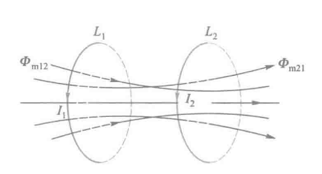

---

互感系数推导

由比萨定律可知，若回路的几何形状、相对位置、周围磁介质的磁导率分布均不变，那么电流 $I_1$ 的磁场穿过回路 $L_2$ 的全磁通 $\psi_{21}$ 与 $I_1$ 成正比。同理电流 $I_2$ 的磁场穿过回路 $L_1$ 的磁通 $\psi_{12}$ 成正比，即

$$
\psi\_{21}=N\_2\Phi\_{m21}=M\_{21}I\_1\
\psi\_{12}=N\_1\Phi\_{m12}=M\_{12}I\_2
\tag{14-4-4}
$$

式中，$M_{21}$ 和 $M_{12}$ 为比例系数，且 $M_{21} = M_{12}$。我们可统一用 $M$ 表示，称为两个回路之间的 **互感系数**，简称 **互感**。

从式（14-4-4）可以看出，**两个回路的互感系数在量值上等于其中一个回路中电流为一个单位时，穿过另一个回路所围面积的全磁通**

显然，**互感系数与两个耦合回路的形状、大小、匝数、相对位置以及周围磁介质的磁导率有关**。

由法拉第电磁感应定律，有

$$
\varepsilon\_{21}=-\dfrac{\mathrm{d}\psi\_{21}}{\mathrm{d}t}=-\dfrac{\mathrm{d}(MI\_1)}{\mathrm{d}t}
=-\left(
M\dfrac{\mathrm{d}I\_1}{\mathrm{d}t}+
I\_1\dfrac{\mathrm{d}M}{\mathrm{d}t}
\right)
\
\varepsilon\_{12}=-\dfrac{\mathrm{d}\psi\_{12}}{\mathrm{d}t}=-\dfrac{\mathrm{d}(MI\_2)}{\mathrm{d}t}
=-\left(
M\dfrac{\mathrm{d}I\_2}{\mathrm{d}t}+
I\_2\dfrac{\mathrm{d}M}{\mathrm{d}t}
\right)
$$

若 $M$ 保持不变，即 $\displaystyle \dfrac{\mathrm{d}M}{\mathrm{d}t}=0$ ，则有

$$
\varepsilon\_{21}=-M\dfrac{\mathrm{d}I\_1}{\mathrm{d}t}
\
\varepsilon\_{12}=-M\dfrac{\mathrm{d}I\_2}{\mathrm{d}t}
\tag{14-4-5}
$$

此式表明，**互感系数的量值也等于一个回路中电流随时间的变化率为一个单位时，在另一个回路中所引起的感生电动势的绝对值**

另外还可以看出，当一个回路中的电流随时间的变化率一定时，互感系数越大，则通过互感在另一回路中引起的互感电动势也就越大。因此可以说，**互感系数 $M$ 是表明两耦合回路互感强弱的物理量**

---

单位

同自感系数，都为亨利，符号为H

---

计算过程

计算方式同自感系数

1. 设线圈中通电流 $I$
2. 确定电流 $I$ 在线圈内产生的磁场及其分布
3. 求穿过线圈的全磁通
4. 由式(14-4-4)求得 $M=\dfrac{\psi_{21}}{I_1}$

!!! note
    **例** 两个长度均为 $l$ 的共轴空心长直螺线管，如图所示。外管半径 $R_1$，匝数 $N_1$，自感系数 $L_1$；内管半径 $R_2$，匝数 $N_2$，自感系数 $L_2$。求它们的互感系数 $M$ 及与 $L_1$、$L_2$ 的关系。

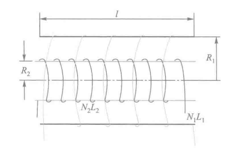

**解** 设外管通有电流 $I_1$ ，则管内的磁感应强度 $B_1$ 为

$$
B_1=\mu_0{n_1}{I_1}=\mu_0\dfrac{N_1I_1}{l}
$$

穿过内管的全磁通为

$$
\psi_{21}=N_2B_1S_2=\dfrac{\mu_0N_1N_2I_1}{l}\pi R^2
$$

所以

$$
M=M_{21}=\dfrac{\psi_{21}}{I_1}=\dfrac{\mu_0N_1N_2}{l}\pi R_2^2
$$

再由上一个例题的结果，即

$$
L_1=\mu_0n_1^2V_1=\mu_0\dfrac{N_1}{l}\pi R_1^2
\\
L_2=\mu_0n_2^2V_2=\mu_0\dfrac{N_2}{l}\pi R_2^2
$$

消去 $N_1$ 和 $N_2$，可得

$$
M=\dfrac{R_2}{R_1}\sqrt{L_1L_2}
$$

当然，必须指出，此结果是在题设条件下的两个耦合回路得到的。而一般情况下，$M=K\sqrt{L_1L_2}$ ，且 $K\le1$，称 $K$ 为耦合系数

只有当 $R_1=R_2$ ，且每个回路的自身全磁通都通过另一个回路（或称为无漏磁）时，才有 $K=1$

而在有漏磁的情况下，即使 $R_1=R_2$ 则总存在 $K<1$ ，即 $M<\sqrt{L_1L_2}$

### 14.5 磁场的能量

静电场中我们就知道，带电系统形成的过程中，外力必须克服静电场力而做功，最后转化为带电系统或电场的能力。电容器作为存储电能的器件，电场的能量密度 $\omega_e=\dfrac{1}{2}\varepsilon E^2=\dfrac{1}{2}DE$。

同理，在建立电流磁场过程中，显然外力也必须克服由于电磁感应引起的反电动势而做功，从而消耗电源的电能并转化为磁场的能量而存储起来，**载流线圈** 便是这样一个器件

---

磁场能量公式

我们考虑具有一个线圈的简单电路，如下图所示，讨论电流在增长过程中建立其磁场的情况，从而推导出磁场能量公式。

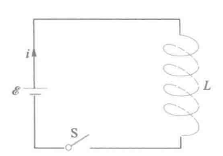

当闭合S时，在具有自感 $L$ 的线圈种电流 $i$ 由 0 增长到稳定值 $I$ ，**线圈自感电动势** 为

$$
\varepsilon\_L=-L\dfrac{\mathrm{d}i}{\mathrm{d}t}
$$

$\mathrm{d}t$ 时间内，**电源电动势 $\varepsilon_L$ 反抗自感电动势 $\varepsilon_L$ 做功** 为

$$
\mathrm{d}W=-\varepsilon\_Li\mathrm{d}t=Li\mathrm{d}i
$$

再根据功能原理，外力做功 $\mathrm{d}A$ 应等于线圈种磁场能量的增量 $\mathrm{d}W_m$ ，当电流 $i$ 由 $0$ 增加到 $I$ 时，对上式积分

$$
W\_m=\int\mathrm{d}W\_m=\int\mathrm{d}W=\int\_0^ILi\mathrm{d}i
$$

当 $L$ 为定值时，有

$$
W\_m=\dfrac{1}{2}LI^2
\tag{14-5-1}
$$

此式表明，具有自感L的线圈，当通以电流I时所具有的磁场能量公式

---

磁场能量密度

磁场的能量与电场能量一样也是定域在场中的，所以也可以用场量表示，并可以引入 **磁场能量密度**

下面以 **长直螺线管** 为特例导出磁场能量密度公式，设长直螺线管通电流 $I$ ，忽略边缘效应后，管内磁感应强度为 $B=\mu n I$,自感为 $L=\mu n^2V$，带入式(14-5-1)得

$$
W\_m=\dfrac{1}{2}LI^2=\dfrac{1}{2}\mu n^2V\left(\dfrac{B}{\mu n}\right)^2
=\dfrac{1}{2}\dfrac{B^2}{\mu}V
$$

由于长直螺线管的磁场集中于管内，管内磁场基本是均匀的，其体积就是V，所以管内的 **磁场能量密度** 为

$$
\omega\_m=\dfrac{W\_m}{V}=\dfrac{1}{2}\dfrac{B^2}{\mu}=\dfrac{1}{2}BH
\tag{14-5-2}
$$

> H表示磁场强度，单位为特斯拉的那一个物理量
>
> 此式可适用于各类磁场的普遍公式。

该式说明，在任何磁场中，某点的磁场能量密度，只与该点的磁感应强度和磁介质有关，是空间位置的点函数

如果是 **非均匀磁场** ，那么可以将总磁场划分为无数个体积元 $\mathrm{d}V$ ，使得 $\mathrm{d}V$ 内的磁场是均匀的，则 $\mathrm{d}V$ 处的磁能为

$$
\mathrm{d}W\_m=\omega\_m\mathrm{d}V=\dfrac{1}{2}BH\mathrm{d}V
\tag{14-5-3}
$$

对整个磁场不为零的空间积分，得到磁场的总能量

$$
W\_m=\dfrac{1}{2}\int\_VBH\mathrm{d}V
\tag{14-5-4}
$$

## 十五、电磁场与电磁波

> 上一章中，麦克斯韦为了解释产生感生电动势的原因，提出了 **涡旋电场**，也就是变化的磁场可以激发涡旋电场
>
> 随后麦克斯韦又提出了 **位移电流** 的假设，提出变化的电场反过来可以激发磁场

本章将学习位移电流的概念，以及全电流安培环路定理，然后介绍麦克斯韦提出的麦克斯韦方程组，最后讨论电磁波的产生、传播及其基本性质

### 15.1 位移电流

我们曾讨论过 **恒定电流的磁场** 满足安培环路定理 $\displaystyle \oint_L H\cdot\mathrm{d}l=\sum I$, $\displaystyle \sum I$ 为穿过回路 $L$ 为边界的任意曲面 $S$ 的传导电流代数和

那么在非恒定电流的情况下，这个定理是否适用？

---

不连续传导电流下，矛盾的安培定律

我们假设存在一个无分支的不含电容器的闭合电路，在这个电路中的任何时刻，通过导体上任何截面的电流总是相等的，即传导电流是连续的

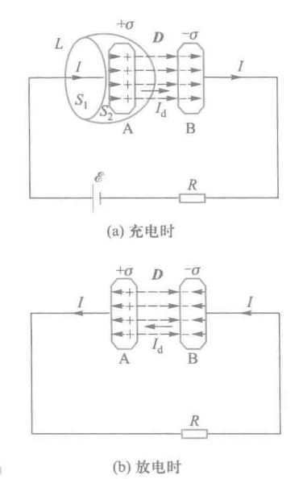

但如果是含有电容器电路的暂态过程中，如上图所示，无论是充电或者放电，传导电流都不可以在电容器的两极板之间通过，因而对整个电路来说，传导电流其实是不连续的

但在不连续的情况下，我们如果应用安培环路定理，将得到一个矛盾的结果：

我们取图(a)中一个包围平板A的封闭曲线，它由曲面 $S_2$ 和平面 $S_1$ 组成，两面的共同边界是 $L$，分别应用安培环路定理

平面时，有传导电流I穿过 $S_1$ ，所以安培环路定理如下

$$
\oint\_L H\cdot\mathrm{d}l=I
$$

曲面处，无传导电流穿过 $S_2$ ，安培环路定理如下

$$
\oint\_L H\cdot\mathrm{d}l=0
$$

上述结果表明了，在非恒定电流的磁场中， $H$ 的环流与以闭合回路 $L$ 为边界的曲面有关，选取不同曲面，环流的值不同，出现了严重的矛盾。

---

位移电流

在上述电路中，当电容器充、放电时，对于电容器两极板外侧的电路有

$$
\dfrac{\mathrm{d}q}{\mathrm{d}t}=I
$$

而在两极板之间，有随着时间变化的电位移 $D$ 和电位移通量 $\Phi_D$ 。根据上学期所学的静电学知识，平板电容器中 $D=\sigma,\Phi_D=DS=\sigma S=q$ 可知：**无论放电还是充电，在量值上电容器极板间电位移通量随时间的变化率均匀**

$$
\dfrac{\mathrm{d}\Phi\_D}{\mathrm{d}t}
=\dfrac{\mathrm{d}(DS)}{\mathrm{d}t}
=\dfrac{\mathrm{d}(\sigma S)}{\mathrm{d}t}
=\dfrac{\mathrm{d}q}{\mathrm{d}t}
=I
$$

在方向上：

- 充电时电位移随时间的变化率 $\displaystyle \dfrac{\mathrm{d}\vec{D}}{\mathrm{d}t}$ 的方向与电场 $\vec{E}$ 的方向一致，同时也与导体中电流方向一致
- 放电时电位移随时间的变化率 $\displaystyle \dfrac{\mathrm{d}\vec{D}}{\mathrm{d}t}$ 的方向与电场 $\vec{E}$ 的方向相反，同时也与导体中电流方向依旧一致(因为其实反的是电场)

为此，提出了如下假设:

**变化的电场从产生磁场的角度可以看作是一种电流**，因此在电容器两极板之间可以认为存在着 **电流和电流密度** 。它们被称为 **位移电流** 和 **位移电流密度**，即

$$
\vec{j\_d}=\dfrac{\mathrm{d}\vec{D}}{\mathrm{d}t} \
I\_d=\dfrac{\mathrm{d}\Phi\_D}{\mathrm{d}t}=\int\_S\dfrac{\mathrm{d}D}{\mathrm{d}t}\cdot\mathrm{d}S
\tag{15-1-1}
$$

> D=D(r,t)，其实更标准的写法应该是偏导，这里将r固定，将D变为一个关于t的函数了
>
> 课本中的 $\psi$ 和这里的 $\Phi_D$ 代表一个含义，也可以直接认为是 $q$ （换为q似乎更好理解一些）

上述定义表明：

- 电场中某点的位移电流密度矢量等于该点电位移矢量对时间的变化率
- 通过电场中某截面的位移电流等于通过该截面的电位移通量对时间的变化率

---

全电流定律

> 引入位移电流后，之前矛盾的安培环路定律即可进行修正，进而提出全电流定律

麦克斯韦提出了全电流概念，即 **在普遍状态下，通过空间某截面的全电流是通过这一截面的传导电流 $I_c$ 和位移电流 $I_d$ 的代数和**，如下式

$$
I\_S=I\_C+I\_D
\tag{15-1-2}
$$

继续推广为非恒稳的情况，如下式

$$
I\_S=\oint\_L\vec{H}\cdot\mathrm{d}\vec{l}=I\_C+I\_D
=\int\_S\vec{j}\cdot\mathrm{d}\vec{S}+\int\_S\dfrac{\partial\vec{D}}{\partial{t}}\cdot\mathrm{d}\vec{S}
\tag{15-1-3}
$$

式中， $S$ 是以 $L$ 为边界的曲面

至此，我们证明了电场和磁场的内在联系，反映了自然现象的对称性，即 **变化的磁场能产生电场，变化的电场也能产生磁场，变化的电场和磁场永远相互联系着，形成统一的电磁场**

### 15.2 麦克斯韦方程组

从本书开始至此，我们讨论了静电场、恒定电场、恒定磁场以及变化磁场的各种规律。

> 大一统是对的

而麦克斯韦方程组便是统一描述电磁场普遍规律的方程，如下

$$
\oint\_S\vec{D}\cdot\mathrm{d}\vec{S}=\sum q=\int\_V\rho\mathrm{d}V
\tag{15-2-1}
$$

$$
\oint_S\vec{B}\cdot\mathrm{d}\vec{S}=0
\tag{15-2-2}
$$

$$
\oint_L\vec{E}\cdot\mathrm{d}\vec{l}=-\dfrac{\mathrm{d}\Phi}{\mathrm{d}t}=-\int_S\dfrac{\partial\vec{B}}{\partial{t}}\cdot\mathrm{d}\vec{S}
\tag{15-2-3}
$$

$$
\oint_L\vec{H}{\cdot}{\mathrm{d}\vec{l}}=I_C+I_D=\int_S\vec{j}\cdot\mathrm{d}\vec{S}+\int_S\dfrac{\partial{D}}{\partial{t}}\cdot\mathrm{d}\vec{S}
\tag{15-2-4}
$$

---

电场中的高斯定理

方程(15-2-1)是电场中的高斯定理，反映了电场的性质。

在一般情况下，电场包括自由电荷产生的电场（$E_1, D_1$），它是 **有源无旋场**，电场线和电位移线均是不闭合的。`通过任何封闭曲面的电位移通量等于它所包围的自由电荷的代数和`。同时它也包括变化磁场产生的感生电场（$E_2, D_2$），因为感生电场是涡旋场，其电场线和电位移线均是闭合的，通过任何封闭曲面的电位移通量为零。

所以方程(15-2-1)说明：**在任何电场（$D = D_1 + D_2$）中，通过任何封闭曲面的电位移通量等于该封闭曲面包围的自由电荷的代数和。**

---

磁场中的高斯定理

方程(15-2-2)是磁场中的高斯定理，反映了磁场性质。

磁场（$B_1, H_1$）可以由传导电流产生，磁场（$B_2, H_2$）也可以由位移电流（即变化电场）产生。所有磁场都是涡旋场，磁感应线都是闭合曲线。

所以方程(15-2-2)说明：**在任何磁场（$B = B_1 + B_2$）中，通过任何封闭曲面的磁通量总是等于零。**

---

法拉第电磁感应定律

方程(15-2-3)是法拉第电磁感应定律，反映了变化磁场和电场的关系。

一般情况下，由自由电荷产生的电场（$E_1, D_1$）是无旋场，满足电场的场强环流定理 $\oint_L E_1 \cdot dl = 0$ 而由变化磁场产生的电场（$E_2, D_2$）是涡旋场，满足法拉第电磁感应定律。
所以方程(15-2-3)说明：**在任何电场（$E = E_1 + E_2$）中，电场强度沿任意闭合曲线的线积分等于穿过该曲线所包面积的磁通量对时间变化率的负值。**

---

全电流定律

方程(15-2-4)是全电流定律，反映了变化电场和磁场的关系。

在一般情况下，磁场（$B_1, H_1$）可以由传导电流产生，磁场（$B_2, H_2$）也可以由位移电流（即变化电场）产生，然而所有磁场的环流均不为零。
所以方程(15-2-4)说明：**在任何磁场（$H = H_1 + H_2$）中，磁场强度沿任意闭合曲线的线积分等于穿过该闭合曲线所包围面积的全电流。**

---

各场量间的关系

对于均匀的、各向同性的介质，各场量还有下列关系：

$$
D = \varepsilon E, \quad B = \mu H, \quad j = \gamma E.
$$

---

微分形式

设存在矢量场 $\vec{A}=A_x\vec{i}+A_y\vec{j}+A_z\vec{k}$ ，则利用在矢量分析中的高斯公式，可得

$$
\oint_S\vec{A}\cdot\mathrm{d}\vec{S}=\int_V\mathrm{div}\vec{A}\cdot\mathrm{d}V
$$

其中 $\displaystyle \mathrm{div}\vec{A}=\dfrac{\partial{A_x}}{\partial{x}}+\dfrac{\partial{A_y}}{\partial{y}}+\dfrac{\partial{A_z}}{\partial{z}}$ 称为矢量场的A的 **散度**，那么我们将高斯公式带入到式(15-2-1)和式(15-2-2)中，有

$$
\oint_S\vec{D}\cdot\mathrm{d}\vec{S}=\int_V\mathrm{div}\vec{D}\mathrm{d}V=\int_V\rho\mathrm{d}V \\
\oint_S\vec{B}\cdot\mathrm{d}\vec{S}=\int_V\mathrm{div}{\vec{B}}\cdot\mathrm{d}V=0
$$

由此可推出

$$
\mathrm{div}\vec{D}=\rho \\
\mathrm{div}\vec{B}=0
$$

再结合斯托克斯公式

$$
\oint_L\vec{A}\cdot\mathrm{d}\vec{L}=\int_S\mathrm{rot}\vec{A}\cdot\mathrm{d}\vec{S}
$$

式中 $\mathrm{rot}\mathbf{A} = \begin{vmatrix} \mathbf{i} & \mathbf{j} & \mathbf{k} \\ \dfrac{\partial}{\partial x} & \dfrac{\partial}{\partial y} & \dfrac{\partial}{\partial z} \\ A_x & A_y & A_z \end{vmatrix}$ 将斯托克斯公式应用于式(15-2-3)、式(15-2-4)，得

$$
\oint_L\vec{E}\cdot\mathrm{d}\vec{L}=\int_S\mathrm{rot}\vec{E}\cdot\mathrm{d}\vec{S}=-\int_S\dfrac{\partial\vec{B}}{\partial t}\cdot\mathrm{d}\vec{S} \\
\oint_L\vec{H}\cdot\mathrm{d}\vec{L}=\int_s\mathrm{rot}\vec{H}\cdot\mathrm{d}\vec{S}=\int_S\vec{j_c}\cdot\mathrm{d}\vec{S}+\int_S\dfrac{\partial D}{\partial t}\cdot\mathrm{d}\vec{S}
$$

进而推导出

$$
\mathrm{rot}\vec{E}=-\dfrac{\partial \vec{B}}{\partial t}\\
\mathrm{rot}\vec{H}=\vec{j_c}+\dfrac{\partial \vec{D}}{\partial t}
$$

### 15.3 电磁波

LC电磁振荡

由一个电容器C和一个自感线圈L串联而成的 $LC$ 振荡电路，由于电磁振荡与机械振动由类似的运动形式，产生电磁振荡的电路称为振荡电路

具体过程不做过多解释，高中期间应该有所涉及，下面放个动图，可自行理解

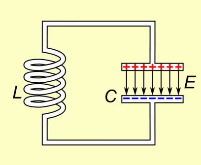

课本也未给出振荡电路的固有振荡频率推导，这里直接给出公式，其中 $L$ 是以亨利为单位的电感； $C$ 是以法拉为单位的电容

$$
\nu=\dfrac{1}{2\pi\sqrt{LC}}
$$

---

电磁波的产生与传播

想要让 $LC$ 振荡回路中的电磁能量有效发射出去，必须满足以下两个条件：

1. 频率要高
2. 电路要开放

为了解决问题1，我们应尽量减小L和C，而根据 $L=\mu_0n^2V$ 和 $C=\dfrac{\varepsilon_0 S}{d}$ 可知，可以通过减小线圈的匝数n来减小L，通过减小两极板相对面积S和增加两极板距离d来减小C，那么理想情况就是将回路拉成一根直导线

当高频率交变电流在天线内往复振动时，在天线的两端就会出现正负交替的等量的异号电荷，形成 **振荡电偶极子**

最简单的震荡电偶极子模型是电锯随时间按余弦或正弦规律进行变化，即

$$
\vec{p}=\vec{p_0}\cos\omega t
$$

式子中 $\vec{p_0}$ 是电偶极子电距的振幅，$\omega$ 是振荡角频率

而接下来是一些时刻下，电偶极子附近电场线的变化

| 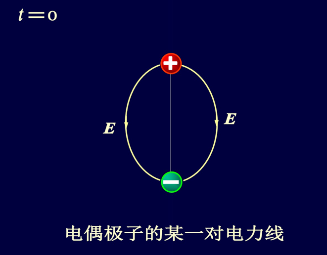 | 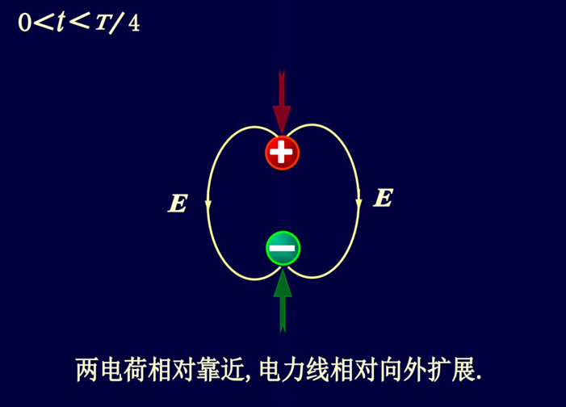 |
| --- | --- |
| 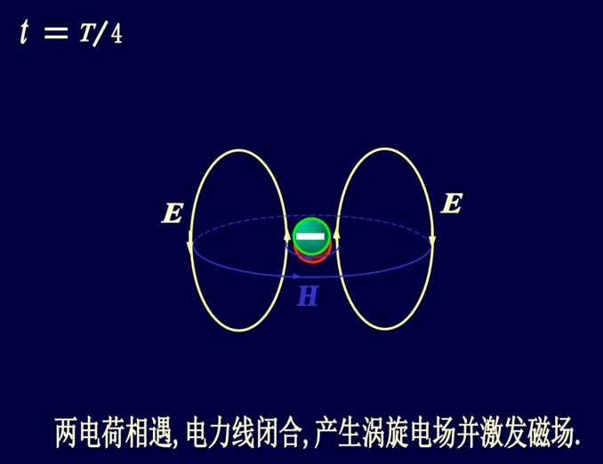 | 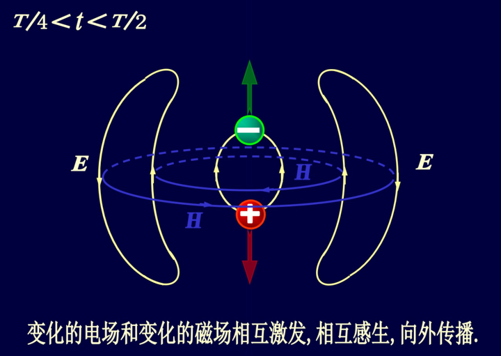 |
| 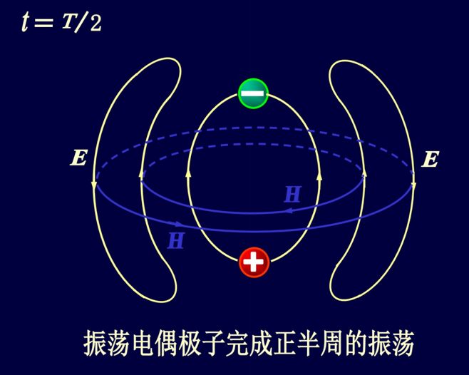 | 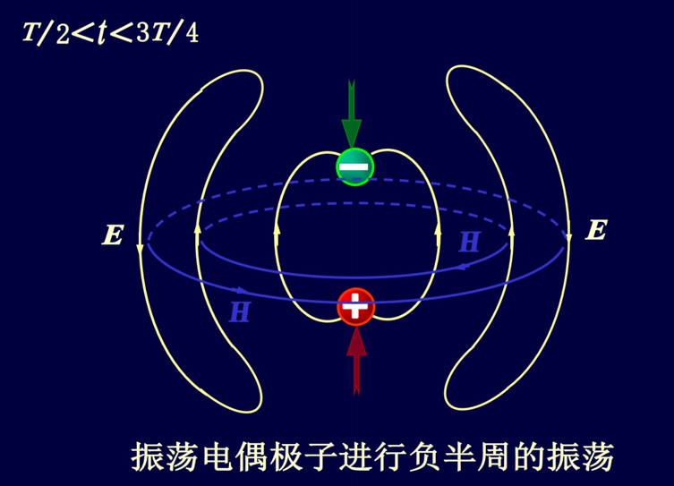 |
| 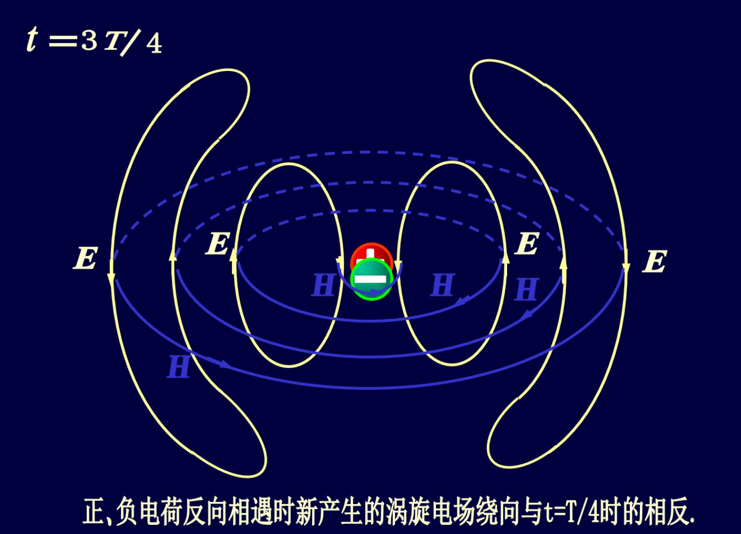 | 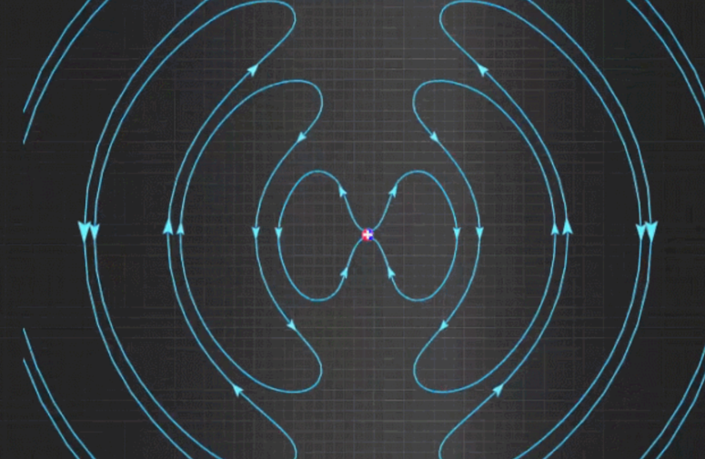 |

若以振荡电偶极子的中心为坐标原点，以振子轴线为极轴的球坐标来描述电磁场，通过求解麦克斯韦方程组可以得到，在 $r\gg \lambda$ 的波长中任意一点P处的电场强度 $E$ 和磁场强度 $H$ 的数值分别为

$$
E(r,t)=\dfrac{p_0\omega^2\sin\theta}{4\pi\varepsilon u^2r}\cos\omega\left(t-\dfrac{r}{u}\right)
\\
H(r,t)=\dfrac{p_0\omega^2\sin\theta}{4\pi ur}\cos\omega\left(t-\dfrac{r}{u}\right)
$$

式中 $\omega$ 为振荡电偶极子的角频率， $p_0$ 为振荡电偶极子的振幅，$r$ 为从振荡电偶极子中心到 $P$ 点的位矢 $\vec{r}$ 的大小，$\theta$ 为位矢 $\vec{r}$ 与极轴的夹角， $u$ 为电磁波的传播速度，$\varepsilon=\varepsilon_0\varepsilon_r、\mu=\mu_0\mu_r$ ，分别为介质的电容率和磁导率

可以证明出来，电磁波的传播速度为

$$
u=\dfrac{1}{\sqrt{\mu\varepsilon}}
$$

那么我们如果把 $u$ 带入上式，可以推导如下关系

$$
\dfrac{E}{H}=\sqrt{\dfrac{\mu}{\varepsilon}}
$$

此外，在 $r$ 足够大的一个小范围内，我们可以认为 $\theta$ 和 $r$ 的变化很小，可以视为常量。这是电场强度和磁场强度的振幅 $E_0$ 和 $H_0$ 也可以视为场量。于是上述两个式子可以如下化简

$$
\begin{align}
E(r,t)&=E_0\cos\omega\left(t-\dfrac{r}{u}\right)
\\
&=E_0\cos\left(\omega{t}-\dfrac{2\pi}{\lambda}r\right)
\\
H(r,t)&=H_0\cos\omega\left(t-\dfrac{r}{u}\right)
\\
&=H_0\cos\left(\omega{t}-\dfrac{2\pi}{\lambda}r\right)
\end{align}
$$

上述两式即平面电磁波的波函数

---

电磁波的主要性质

1. 电磁波是横波。波场中任意一点处的电场强度 $\vec{E}$ 、磁场强度 $\vec{H}$ 都与波的传播方向垂直，并且 $\vec{E}、\vec{H}和\vec{r}$ 三者成右手螺旋关系，即 $\vec{E}\times\vec{H}$ 的方向就是 $\vec{r}$ 的方向

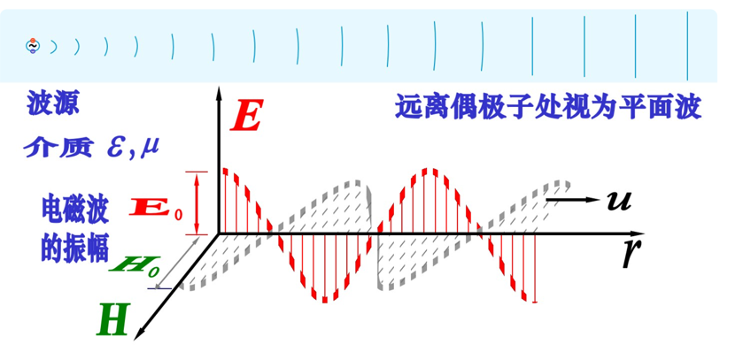

1. $\vec{E}$ 和 $\vec{H}$ 同相位，且数值大小成比例。

$$
\dfrac{E}{H}=\sqrt{\dfrac{\mu}{\varepsilon}}
$$

1. 电磁波在真空中的传播速度与真空中的光速相等。

---

电磁波的能量和动量

**电磁波的能量密度**

电场和磁场中已经得到的能量密度如下

$$
w_e=\dfrac{1}{2}\varepsilon E^2,\;w_m=\dfrac{1}{2}\mu H^2
$$

于是电磁波的能量密度为

$$
w=w_e+w+m=\dfrac{1}{2}\varepsilon E^2+\dfrac{1}{2}\mu H^2
$$

再带入 $\dfrac{E}{H}=\sqrt{\dfrac{\mu}{\varepsilon}}$ 进而得

$$
w=\varepsilon E^2=\sqrt{\varepsilon\mu}EH=\dfrac{EH}{u}
\tag{15-3-1}
$$

带入E、H，又

$$
w=\varepsilon E_0^2\cos^2\left(wt-\dfrac{2\pi r}{\lambda}\right)
$$

于是得到平均能量密度

$$
\overline{w}=\dfrac{1}{T}\int_t^{(t+T)}w\mathrm{d}t=\dfrac{1}{2}\varepsilon E_0^2
=\dfrac{1}{2}\cdot\dfrac{E_0H_0}{u}
$$

---

**电磁波的强度**

电磁波再单位时间内通过与波的传播方向垂直的单位截面内的电磁波的能量称为 **电磁波的能流密度**，并用符号 $S$ 表示。设电磁波沿 $\vec{r}$ 方向传播， $\mathrm{d}\vec{A}$ 是纯至于传播方向上的某一截面。若电磁波的能量密度为 $w$ ，则 $\mathrm{d}t$ 时间内通过该截面的电磁波的能量为 $w\cdot{u}\mathrm{d}t\cdot\mathrm{d}\vec{A}$，则能流密度为

$$
S=\dfrac{w\cdot{u}\mathrm{d}t\cdot\mathrm{d}\vec{A}}{\mathrm{d}t\cdot\mathrm{d}{A}}
=w\cdot u
=EH
$$

而能量的辐射方向与电磁波的传播方向一致，即与 $\vec{E}\times\vec{H}$ 的方向相同，又因为 $\vec{E}\perp\vec{H}$，所以上式的矢量表示如下

$$
\vec{S}=\vec{E}\times\vec{H}
$$

其中 $\vec{S}$ 是 **能流密度矢量**

得到 **平均电磁波强度**

$$
\begin{align}
\overline{S}&=\dfrac{1}{T}\int_t^{t+T}E_0H_0\cos^2\left(\omega t-\dfrac{2\pi}{\lambda}r\right)\mathrm{d}t\\
&=\dfrac{1}{2}E_0H_0=\dfrac{1}{2}u\varepsilon E_0^2
\end{align}
$$

在波动光学中，我们把电磁波的强度称为光强，并用符号 $I$ 表示，即

$$
I=\overline{S}=\dfrac{1}{2}E_0H_0=\dfrac{1}{2}u\varepsilon E_0^2
$$

式中，$u$ 为电磁波的传播速度， $\varepsilon$ 为介质的电容率，在真空中， $u=c,\varepsilon=\varepsilon_0$

---

**电磁波的动量**

在真空中单位体积内电磁波的动量为

$$
p=\dfrac{w}{c}=\dfrac{EH}{c^2}
$$

动量的方向就是电磁波的传播方向，即与 $\vec{E}\times\vec{H}$ 的方向相同，所以单位体积内电磁波动量的矢量表达式为

$$
\vec{p}=\dfrac{\vec{E}\times\vec{H}}{c^2}=\dfrac{\vec{S}}{c^2}
$$

---

电磁波谱

可见光式人眼可以感知到的电磁波，波长约为380~780nm

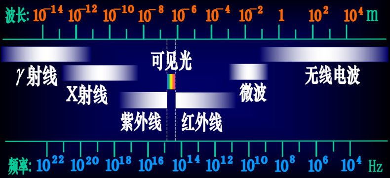
