# 数字逻辑

> 时间有限，内容或有诸多不足，期待斧正

## 1.1 概述

电子电路按 **功能** 分为模拟电路和数字电路

用来处理数字信号的电子线路称为 **数字电路**

按照单个芯片所集成的 **逻辑门** 数量将数字集成电路分为`小规模（SSI）`,`中规模（MSI）`,`大规模（LSI)`,`超大规模（VLSI)`

**数字计算机的组成**

数字计算机由 **存储器、运算器、控制器、输入设备和适配器等** 主要部分组成

| image-20250408175916815 |
| --- |
| 图1.3 数字计算机的一般结构 |

**数字系统的层次结构**

​ **电子元件->基本逻辑器件->逻辑功能部件->复杂逻辑功能部件->复杂数字系统**

| image-20250408181638098 |
| --- |
| 图1.2 数字系统的层次结构 |

根据电路的 **结构特点** 和 **对输出信号响应规则** 的不同，可以分为 **组合逻辑电路** 和 **时序逻辑电路**

- **组合逻辑电路** ： 一个逻辑电路在任何时刻的稳定输出仅取决于该时刻的输入，而与电路过去的输入无关
- **时序逻辑电路** ： 一个逻辑电路在任何时刻的稳定输出不仅取决于该时刻的输入，而且与过去的输入相关

**数字逻辑电路的研究方法** 有两个主要任务：一是 **分析** ，二是 **设计**

## 1.2 数制及其转换

一种进位计数制包含着 **基数** 和 **位权** 两个基本要素：

- **基数** ： 计数制中所用到的数字符号的个数。基数为R的计数制称为R进制
- **位权** ： 在一种进位计数制表示的数中，用来表明不同数位上数值大小的一个固定常熟

> 例如，十进制数的位权是10的整数次幂，其个位的位权是100,十位的位权是101

一个R进制数可以有下面两种表示方法

- **并列表示法** ：又称位置计数法
- **多项式表示法** ：又称按权展开法

## 1.3 带符号的二进制数的代码表示

为了区分一般书写表示的带符号二进制数和数字系统中的带符号二进制数

- 用“+”、“-”表示正、负的二进制数称为符号数的 **真值** ，
- 把将符号和数值一起编码的二进制数称为 **机器数** 或 **机器码** ，常用的机器码有`原码、反码、补码`三种

### 1.3.1 原码&反码&补码

用 **原码** 表示带符号二进制数时，符号位用 **0表示正，1表示负** ，数值位保持不变

用 **反码** 表示带符号的二进制数时，负数反码除符号位不变，其它均取反， **正数不变**

用 **补码** 表示带符号的二进制数，符号位与原码相同，负数的补码为反码+1， **正数不变**

**小数**

X1 = -0.1011 -> [X1]原 = 1.1011 -> [X1]反 = 1.0100 -> [X1]补 = 1.0101

X2 = +0.1011 -> [X2]原 = 0.1011 -> [X2]反 = 0.1011 -> [X2]补 = 0.1011

**整数**

X1 = -1101 -> [X1]原 = 11101 -> [X1]反 = 10010 -> [X1]补 = 10011

X2 = +1101 -> [X2]原 = 01101 -> [X2]反 = 01101 -> [X2]补 = 01101

Tip

这里的X1和X2是有符号二进制数，不是十进制数

若本身小数X1 = -1.01,则[X1]原 = 11.01；[X1]反 = 10.10； [X1]补 = 10.11

## 1.4 几种常用的编码⭐

### 二-十进制码（BCD码）

#### 8421码

是一种 **有权码** ，即每个十进制数转为自己对应的4位二进制数

> (258)10 = (0010 0101 1000)8421码

#### 2421码

另一种 **有权码** ，其4位二进制码从高位至低位的权依次为2、4、2、1。若一个十进制字符X的2421码为a3a2a1a0,则该字符的值为 X = 2a3+4a2+2a1+a0

在2421码种，十进制字符0和9、1和8、2和7、3和6、4和5的各码位互为相反，称为 **对9的自补代码**

Important

2421码不具备单值性，为了与十进制字符一一对应，2421码不允许出现以下6种状态（也就是0101~1010)

0101，0110，0111，1000，1001，1010

#### 余3码

余3码是由8421码加上0011形成的一种无权码，也是 **对9的自补代码**

Important

余3码不允许出现下面6种状态（0000-0010，1101-1111）

0000，0001，0010，1101，1110，1111

Tip

两个余3码进行加减时，如果有进位，则结果加3；无进位则结果减3

### 1.4.2 可靠性编码

#### 格雷码

其特点是： **任意两个相邻的数，其格雷码仅有一位不同**

| image-20250408190811729 |
| --- |
| 表1.4 与4为二进制码对应的典型格雷码 |

*其实就是第一位不变，后面每一位和前一位取异或*

#### 奇偶检验码

**奇检验** ： 使信息位和检验位中“1”的个数为奇数

**偶检验** ： 使信息位和检验位中“1”的个数为偶数

> 例如，（1001101）2奇偶检验码表示时的两种编码方式为
>
> | 信息位（7位） | 采用奇检验的检验位（1位） | 采用偶检验的检验位（1位） |
> | --- | --- | --- |
> | 1001101 | 1 | 0 |

## 逻辑代数基础

#### 代入规则

#### 反演规则

将逻辑函数F表达式中所有的“·”和”+“互换，”0“和”1”互换，原变量和反变量互换，运算顺序不变 => 得到原函数的反函数

*除了顺序，其它全反*

#### 对偶规则

将逻辑函数F表达式中所有的“·”和”+“互换，”0“和”1”互换，运算顺序不变 => 得到原函数的对偶式

*除了变量、顺序，其它全反*

#### 最小项

如果一个具有n个变量的函数的 **与项** 包含全部n个变量，每个变量都以原变量或反变量形式出现，且仅出现一次，则该 **与项** 被称为 **最小项** ，或 **标准与项**

性质如下：

- 任意最小项，其响应变量有且仅有一种取值使这个最小项的值为1
- 相同变量构成的两个不同最小项相与为0
- n个变量的全部最小项相或为1
- n个变量构成的最小项有n个相邻最小项（相邻最小项是指除一个变量互为相反外，其余部分均相同的最小项）

#### 最大项

略

## 集成门电路与触发器

## 根据采用的半导体器件分类

- 采用双极型半导体器件作为元件的 **双极型集成电路**
- 采用金属-氧化物-半导体场效应管作为元件的 **单极型集成电路** ，简称为MOS集成电路
- 双极型速度快、负载能力强，但是功耗大、结构复杂；单极型结构简单、制造方便、集成度搞、功耗低

#### 双极型集成电路分类

- TTL（三极管-三极管逻辑）电路
- ECL（射极耦合逻辑）电路
- I2L（集成注入逻辑）电路

#### MOS集成电路分类

- PMOS(P沟道MOS)
- NMOS(N沟道MOS)
- CMOS(互补MOS)

## 根据集成规模的大小分类

- 小规模集成电路(SSI)
- 中规模集成电路(MSI)
- 大规模集成电路(LSI)
- 超大规模集成电路(VLSI)

## 根据设计方法和功能定义分类

- 非用户定制电路（标准集成电路）
- 全用户定制电路（专用集成电路ASIC）
- 半用户定制电路

## 3.2 半导体器件的开关特性

### 3.2.1 晶体二极管的开关特性

1. 静态开关特性
2. 正向特性：外加正向电压达到阈值电压时，二极管处于 **导通** 状态
3. 反向特性：外加反向电压在一定数值范围内时，反向电阻很大，反向电流很小，二极管处于 **截止** 状态
4. 动态开关特性

二极管的动态特性是指二极管在 **导通** 与 **截止** 状态转换过程中的特性，它表现为两种状态之间的转换需要一定的时间

通常把二极管从正向导通到反向截止所需要的时间称为 **反向恢复时间** ，而把二极管从反向截止到正向导通所需要的时间称为 **开通时间**

### 3.2.2 晶体三级管的开关特性

1. 静态特性

双极型晶体三极管（BJT)(简称三级管)由集电结和发射结两个PN结构成。根据两个PN结的偏置极性，三极管有 **截止、放大、饱和** 3种工作状态.图3.5(a)给出了一个简单的NPN三极管共发射极开关电路，输出特性曲线如图3.5(b)

| image-20250408201853341 |
| --- |
| 图3.5 三极管开关电路及其输出特性 |

三极管在截止与饱和这两种稳态下的特性称为 **三极管的静态开关特性**

1. 动态特性

三极管在饱和与截止两种状态转换过程中具有的特性称为三极管的动态特性

### 3.3.2 TTL集成逻辑门电路

**TTL与非门的主要外部特性参数**

1. **输出逻辑电平**
2. **输出高电平VOH** : 典型值为3.6V;规范值VOH>=2.4V
3. **输出低电平VOL** : 典型值为0.3V;规范值VOL<=0.4V
4. **开门电平与关门电平**
5. **开门电平VON** : 保证输出为额定低电平时所允许的最小输入高电平值，表示使与非门开通的高电平的最小值。产品规范值VON<=1.8V;典型值1.5V
6. **关门电平VOFF** ：保证输出为额定高电平允许的最大输入低电平值，表示使与非门断的低电平的最大值。产品规范值VOFF>=0.8V；典型值1.3V

VON越小，输入高电平时的抗干扰能力越强；VOFF反之

1. **扇入系数和扇出系数**
2. **扇入系数NI** ：允许的输入端数目
3. **扇出系数NO** : 输出端连接同类门的最多个数，反映了与非门的带负载能力。
4. 平均传输延迟时间

   **tpd** : *指一个矩形波信号从与非门输入端传到与非门输出端所延迟的时间*

| image-20250411224611549 |
| --- |
| 图3.14 TTL与非门的传输延迟时间 |

**$t~{pd} = (t~{PHL} + t~{PLH})/2$** ;平均延迟时间是反应与非门开关速度的一个重要参数。典型值约为10ns,一般小于40ns

1. 平均功耗

在空载条件下工作时所消耗的电功率。输出为低电平时的功耗称为PON,输出为高电平时的功耗称为POFF。PON总是大于POFF

平均功耗P=(PON+POFF)/2。一般为20mW左右

1. **集成电路芯片用法**

VCC为电源引脚。GND为接地脚，NC为空脚

| image-20250411225406493 |
| --- |
| 图3.15 7400、7410、7420引脚图 |

#### 两种特殊的门电路⭐

##### 集电极开路与非门（OC门）

将两个与非门的 **输出端** 直接对接，实现\*与\*逻辑功能，如图3.21(a)。由于 **这种与逻辑功能得实现并没有使用与门，而是由门电路输出引线连接实现的，故称为线与逻辑** 。但是直接连接可能导致逻辑门损坏

| image-20250411225612363 |
| --- |
| 图3.21 两个TTL与非门输出端直接并接使用的情况 |

为了实现 **线与** 功能，设计了 **集电极开路门（OC门)** 。电路结构和逻辑符号如下：

| image-20250411230035607 |
| --- |
| 图3.22 集电极开路与非门的电路结构和逻辑符号 |

##### 三态输出门（TS门）

三态门有3种输出状态： **输出高电平、输出低电平和高阻状态**

即工作状态下输出为 **逻辑“1“** 或者 **逻辑“0”** ，禁止状态下，输出呈 **高阻抗** ，相当于开路

| image-20250411230441440 |
| --- |
| 图3.25 三态输出与非门电路结构和逻辑符号 |

### 3.3.3 CMOS集成逻辑门电路

略，自己看

### 常用门电路符号及表达式

| image-20250411231041004 |
| --- |
| 表3.12 常用门电路符号及表达式 |

## 3.4 触发器⭐

触发器具有如下特点：

1. 触发器有两个互补的输出端Q和Q
2. 触发器有两个稳定状态.输出端Q=1、Q=0称为“1”状态；输出端Q=0、Q=1称为“0”状态. **输入信号不发生变化时，触发器状态不变**
3. 通过信号作用从一个稳定状态转移到另一个稳定状态，把输入信号作用之前的状态称为 **现态** 记作Qn或Qn。作用后的状态称为 **次态** ，记作Qn+1或Qn+1

### 3.4.1 基本R-S触发器

#### 与非门构成的基本R-S触发器

R:复位（reset),即置0

S:置位（set),即置1

加在逻辑符号输入端的小圆圈表示低电平或负脉冲有效，\* **就是说输入信号为0时这个端口工作** \*

| image-20250413215624508 |
| --- |
| 图3.36 与非门构成的R-S触发器 |

原理略过，直接看 **逻辑功能描述**

1. **功能表**

| image-20250413215802584 |
| --- |
| 表3.13 与非门构成的基本R-S触发器功能表 |

Tip

***可以用语言分析一下，记得比较快***

1. R,S均工作（都是0）=>机器混乱=>所以功能不定
2. R工作，S不工作=>置零端工作，置一端不工作=>机器置零
3. S工作，R不工作=>置一端工作，置零端不工作=>机器置一
4. R,S均不工作=>机器不工作=>原状态不变

1. **状态表**

或称作状态转移表，表示现态与次态之间的转移关系

| image-20250413220217886 |
| --- |
| 表3.14 与非门构成的基本R-S触发器状态表 |

Tip

就是说，`某现态`在经过什么样的R-S信号输入之后，会变成什么样的`次态`

1. **状态图**

反应触发器两种状态之间转移关系的有向图，或称为 **状态转移图**

| image-20250413220600877 |
| --- |
| 图3.37 与非门构成的基本R-S触发器的状态图 |

Tip

**圆圈** 表示稳定状态； **箭头** 表示在输入信号作用下状态转移的方向； **箭头旁的标注** 表示状态转移的条件

***也就是说：圆圈里的状态，经过标注所示的信号输入，可以变成箭头指向的状态***

1. **次态方程**

就是正常的方程，一般带有约束条件
$$
Q^{n+1}=\overline{S}+R·Q
$$

$$
R + S=1
$$

且可做出卡诺图

| image-20250413221453402 |
| --- |
| 图3.38 与非门构成的基本R-S触发器的次态卡诺图 |

1. **激励表**
2. **就是变为了：如果我想让机器发生这样的变化，我应该怎么样输入R和S** \*

| image-20250413221633384 |
| --- |
| 表3.15 与非门构成的基本R-S触发器激励表 |

Important

与非门构成的基本R-S触发器有一个特点:当输入端S连续出现多个置1信号，或者R出现多个置0信号时，仅第一个信号使触发器反转

可以利用这一特性消除机械开关振动引起的尖脉冲信号

#### 或非门构成的基本R-S触发器

- **其实和与非门一样，主要看触发器信号输入端是否有圆圈表示取负** \*

| image-20250413222303966 |
| --- |
| 图3.42 或非门构成的R-S触发器 |

| image-20250413222327091 |
| --- |
| 表3.16 或非门构成的基本R-S触发器功能表 |

#### 基本R-S触发器总结

R端工作时Q为0，S端工作时Q为1。默认输入信号为1时工作，有圆圈则取反

### 3.4.2 常用的时钟控制触发器⭐⭐⭐

实际中，往往要求触发器按一定的时间节拍动作，即让输入信号的作用受到 **时钟脉冲（CP）** 的控制

通常把时钟脉冲（CP）作用前的状态称为“现态”；作用后的状态称为“次态”

#### 钟控R-S触发器

逻辑符号如图3.43(b)所示。该触发器由4个与非门构成，上面的两个与非门G1和G2构成基本R-S触发器，下面的两个与非门G3、G4组成控制电路，称为控制门

| image-20250413223114085 |
| --- |
| 图3.43 钟控R-S触发器 |

**功能描述：**

1. CP=0的条件下，触发器始终不变
2. CP=1的条件下， **等同于基本R-S触发器**

#### 钟控D触发器

将基本R-S触发器的控制电路进行修改后形成的：实现了对触发器工作的定时控制，还可以将输入信号D转化为一堆互补信号送到基本R-S触发器的两个输入端

| image-20250413223958797 |
| --- |
| 图3.45 钟控D触发器 |

**功能描述**

1. CP=0时触发器始终不变
2. CP=1时，次态Qn+1=D

| image-20250413224320658 |
| --- |
| 功能表、状态表、激励表、状态图如图 |

Tip

D触发器的输出始终和输入信号相同

#### 钟控J-K触发器

对基本R-S触发器进行了改造，S->J，R->K。

解决了时钟脉冲作用期间两个输入同时为1导致触发器状态不确定的问题

| image-20250413224614571 |
| --- |
| 图3.47 钟控J-K触发器的逻辑电路和逻辑符号 |

**功能描述：**

1. CP=0时触发器不变,CP=1时接受信号输入
2. J(S)=0,K(R)=0 => R、S均不工作 => 触发器状态不变
3. J(S)=0,K(R)=1 => R工作、S不工作 => 触发器置0
4. J(S)=1,K(R)=0 => S工作、R不工作 => 触发器置1
5. J(S)=1,K(R)=1 => R、S工作 => 触发器反转（0变1，1变0）

| image-20250413225036243image-20250413225306116 |
| --- |
| CP=1时功能表、状态表、状态图、次态卡诺图、激励表 |

次态方程
$$
Q^{n+1}=J\overline{Q}+\overline{K}Q
$$

#### 钟控T触发器

将钟控J-K触发器的输入端J和K连起来，用T表示，构成了钟控T触发器

| image-20250413225428236 |
| --- |
| 图3.49 钟控T触发器的逻辑电路和逻辑符号 |

**功能描述**

1. CP=0时，触发器状态不变
2. T=0时，触发器状态不变
3. T=1时，触发器取反输出

| image-20250413225645294 |
| --- |
| CP=1时功能表、状态表、激励表、状态图 |

次态方程：
$$
Q^{n+1}=T⊕Q
$$

Important

钟控T触发器当T为1时，就触发状态反转，相当于一位二进制计数器，因此又称为计数触发器

#### 简单结构钟控触发器总结

当CP=0时都不工作，CP=1时才接受信号并变化

| 触发器 | 工作原理 |
| --- | --- |
| 钟控R-S触发器 | 同基本R-S触发器 |
| 钟控D触发器 | 输出和输入D相同 |
| 钟控J-K触发器 | J=S,K=R,同基本R-S触发器(同时工作时反转) |
| 钟控T触发器 | T=1时反转 |

> “空翻”现象：在CP=1的时候，任何输入信号的变化都会导致输出改变，引起多次翻转。会造成状态的不确定和系统工作的混乱
>
> 为克服“空翻”现象，使得触发器的反转在 **某一时刻完成** ，引出下面两种触发器

#### 主从钟控触发器

两个简单结构的钟控R-S触发器组成，一个为主触发器，一个为从触发器

| image-20250413231305898 |
| --- |
| 图3.51 主从R-S触发器的逻辑电路和逻辑符号 |

**逻辑实现**

1. CP=1或CP=0时，均不发生改变
2. CP由1->0那一刻，输出根据主触发器改变（等同于基本R-S触发器）

> **举个例子**
>
> | image-20250413231942072 |
> | --- |
> | 图3.52 主从R-S触发器的工作波形 |
>
> 这里存在两段时间CP=1，正常的钟控R-S触发器可见Q主，正常分析即可
>
> 而只有当CP由1->0的那一刻，真正的输出端`Q`根据Q主此时的状态发生改变

由于主从R-S触发器状态的变化发生再时钟脉冲CP的下降沿（1->0)时刻，因此可以成为 **下降沿触发**

Tip

时钟端`CI`的小圆圈就表示下降沿触发，没有的话就可以看作 **上升沿触发**

#### 主从J-K触发器

原理一致，都是变为了 **上升沿触发** 或 **下降沿触发** ，只不过考虑的变为了钟控J-K触发器

#### 维持-阻塞钟控触发器

| image-20250413233146127 |
| --- |
| 图3.56 维持-阻塞D触发器的逻辑电路和逻辑符号 |

**逻辑实现**

1. CP=1或CP=0时，无论输入什么都不变
2. CP由0->1时，根据D的输入改变输出

Tip

维持-阻塞D触发器逻辑功能与前述D触发器的逻辑功能完全相同。

实际使用的该触发器有多个D输入端，此时各个输入之间是相与的关系。

例如有3个输入端时，次态方程为
$$
Q^{n+1}=D\_1D\_2D\_3
$$

### 3.4.3 \*不同类型时钟控制触发器的相互转换

略

## 组合逻辑电路

按照是否有记忆功能分为组合逻辑电和时序逻辑电路两大类型

### 4.1 组合逻辑电路分析

#### 4.1.1 分析方法概述

根据逻辑电路图写出输出函数表达式->化简输出函数表达式->列出输出函数真值表

#### 4.1.2 分析举例

这部分可能出成期末试题，建议自己认真看看，就不写在文件里了

### 4.2 组合逻辑电路设计

#### 4.2.1 设计方法概述

建立给定问题的逻辑描述->求出逻辑函数的嘴贱表达式->选择逻辑门类型并进行逻辑函数变换->画出逻辑电路图

#### 4.2.2 设计举例

略

### 4.3 组合逻辑电路的险象

信号经过逻辑门和导线会产生时间延迟，导致当电路所有输入达到稳定状态时，输出并不是立即达到稳定状态

#### 4.3.1 险象的产生

- **竞争现象** ： 输入信号经过不同路径到达输出端的时间有先有后的现象
- **险象** ： 电路中竞争现象的存在使得输入信号的变化可能引起输出信号出现非预期的错误输出
- **非临界险象** ： 不产生错误输出的竞争
- **临界险象** ： 产生错误输出的险象

Tip

通常按错误输出脉冲信号的极性将组合电路中的险象分为“0”型险象和”1“型险象

错误输出信号为负脉冲，称为”0“型险象；反之称为”1”型险象

#### 4.3.2 险象的判断

分为代数法和卡诺图法，***代数法不好用，就是枚举，直接卡诺图***

| image-20250414181223422 |
| --- |
| 卡诺图判断险象 |

#### 4.3.3 险象的消除

##### 1. 增加冗余项

`例4.17 用增加冗余项的方法消除下式的险象`
$$
F=\overline{A}C+B\overline{C}D+A\overline{B}\overline{C}
$$

**解** :做卡诺图如图4.24

| image-20250414181921798 |
| --- |
| 图4.24 卡诺图 |

这里将所有”相切“的地方圈起来,然后加上这些虚线圈的项就可以了

##### 2. 增加惯性延时环节

在输出端增加RC电路作为惯性延时环节，过滤掉高频率的尖脉冲信号

##### 3. 选通法

从消除险象变为避开险象，在时间上加以控制，避开险象脉冲

*就是加个开关，信号全都到了再开闸*

## 同步时序逻辑电路

### 5.1 时序逻辑电路概述

#### 5.1.1 时序逻辑电路的结构

时序逻辑电路的输出不仅取决于当时的输入，而且还与电路过去的输入有关，因此，电路必须具有记忆功能，以保存过去的输入信息，所以时序逻辑电路的一般结构如图5.1所示，由 **组合电路** 和 **存储电路** 两部分组成，提供过 **反馈回路** 将两部分连成一个整体

| image-20250414191238993 |
| --- |
| 图5.1 时序逻辑电路的一般结构 |

- x1……xn为时序逻辑电路的输入信号，又称为组合电路的外部输入信号
- Z1,……，Zm为时序逻辑电路的输出信号，又称为组合电路的外部输出信号
- y1，……，ys为时序逻辑电路的“状态”，又称其为组合电路的内部输入信号
- Y1,……，Yr为时序逻辑电路中的激励信号，又称为组合电路的内部输出信号， **激励信号决定下一时刻的状态**

时序逻辑电路的状态y1……y2是存储电路对过去输入信号记忆的结果，它随着外部信号的作用而变化

“现态”yn -> “次态”yn+1

时序逻辑电路具有如下特征;

1. 电路由组合顶啊路和存储电路组成，具有对过去输入进行记忆的功能
2. 电路中包含反馈电路，通过反馈使电路功能与“时序”相关
3. 电路的输出由电路当时的输入和状态共同决定

#### 5.1.2 时序逻辑电路的分类

##### 按照电路的工作方式分类

- 同步时序逻辑电路：各触发器状态的改变受到统一时钟信号控制
- 异步时序逻辑电路：电路中无统一的时钟信号同步，电路输入信号的变化将直接导致电路状态的变化

##### 按照电路的输出/输入关系分类

- Mealy型：时序逻辑电路的输出是电路输入和电路状态的函数
- Moore型：时序逻辑电路的输出仅仅是电路状态的函数

Tip

Mealy型电路是将过去的输入转换成状态后与输出建立联系，当前的输入直接和输出建立联系

Moore型电路则是将全部输入转换成电路状态后再输出建立联系

不太理解的话可以看后面的状态表

| image-20250414195532996 |
| --- |
| 图5.3 两种模型的输出/输入关系图 |

##### 按输入信号的形式进行分类

分为 **脉冲型** 和 **电平型**

| image-20250414195657014 |
| --- |
| 图5.5 时序逻辑电路的输入信号波形 |

#### 5.1.3 同步时序逻辑电路的描述方法

##### 逻辑函数表达式

需要用3组逻辑函数表达式

1. 输出函数表达式：反应输出Z与输入x和状态y之间关系的表达式
2. 激励函数表达式：反映了存储电路的输入Y与电路输入x和状态y之间的关系
3. 次态函数表达式：反映同步时序逻辑电路的次态yn+1与激励函数Y和电路现态y之间的关系

##### 状态表

直接上表

| image-20250414201937176 |
| --- |
| Mealy型和Moore型电路状态表格式 |

解释一下：

- Mealy型：
- 最左边一列是现态，也就是目前的状态
- 右边是`输入x`的的值，写在斜杠左侧，以及`输出Z`的值写在斜杠右侧
- 意思就是 **现态y** ，经过 **输入x** 的信息输入后，会变成 **次态yn+1** ,同时输出 **输出Z**
- 也就是跟次态关系不大，次态变化和输出是同时进行的
- Moore型：
- 各名称含义一样
- 大概就是 **现态y** ,经过 **输入x** 的信息输入后，会变成 **次态yn+1** ,之后根据次态y输出 **输出Z**
- 也就是根据状态决定输出

##### 状态图

反映同步时序逻辑电路状态转移规律及相应输入/输出取值关系的 **有向图** 。

| image-20250427092547890 |
| --- |
| 图5.6 Mealy型和Moore型电路的状态图形式 |

解释一下图中内容：

- 带圆圈的字符表示电路状态
- 连接圆圈的有向线段表示状态的转移关系
- 箭头的起点表示现态，箭头的终点表示次态
- Mealy型：
- 如图(a)所示，在有向箭头旁标出了输入条件，以及在该输入和现态下相应的输出
- Moore型：
- 如图(b)所示，将电路的输出写在了状态的右下方，其它与Mealy一样

### 5.2 同步时序逻辑电路分析

如图5.7

| image-20250427093651575 |
| --- |
| 图5.7 同步时序逻辑电路的分析过程 |

#### 5.2.2 分析举例

单独开一章写

### 5.3 同步时序逻辑电路设计

| image-20250427101317023 |
| --- |
| 图5.19 同步时序逻辑电路设计的一般步骤 |

例题单独开一章

#### 状态化简

所谓状态化简，就是采用某种化简技术从原始状态表中消去多余状态，得到一个既能正确地描述给定地逻辑功能，又能使所包含地状态数目达到最少的状态表，这种状态表为最简状态表

1. **等效状态和等效类**
2. 等效状态

   **定义** 状态Si和Sj是完全确定状态表中的两个状态，如果对于所有可能的输入序列，分别从Si和Sj出发，所得到的输出相应序列完全相同，则状态Si和Sj是等效的，称之为“等效对”

   **判断方法** 假定Si和Sj是完全确定原始状态表中的两个现态，则Si和Sj等效的条件可归纳为一位输入的各种取值组合下满足如下两条。

   1. 输出相同
   2. 次态属于下列情况之一：

      a. 次态相同

      b. 次态交错或称为各自的现态

      c. 次态循环或为等效对
3. 等效类

   所谓等效类是指由若干彼此等效的状态构成的集合。在一个等效类中的任意两个状态都是等效的。
4. 最大等效类

   不被任何别的等效类所包含的等效类。 **不是其它等效类的子集**
5. **利用隐含表进行状态化简**

| image-20250427112601021 |
| --- |
| 图5.25 状态化简的一般步骤 |

> **举个例子：例5.8 化简表5.13所示原始状态表**
>
> 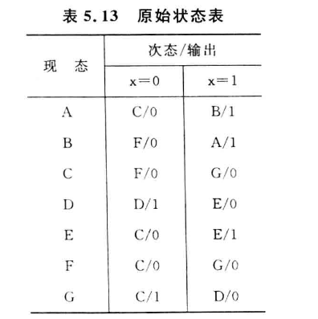
>
> 我们们可以做出隐含表如下
>
> 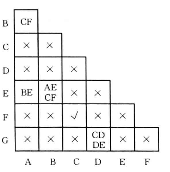
>
> 这里解释一下这个隐含表，每一种记号解释一个
>
> - **X** :看状态`A`和状态`C`的状态表，两者在哪个输入条件下的输出都不相同，因此直接记为 **X**
> - **√** :看状态`F`和状态`C`的状态表，两者在满足一个等效对的条件(见上面等效对的判断条件)，记为 **√**
> - **其它状态** ：简单来说，就是两个状态之间存在次态相同，就把其它状态写进去
>
> 例如状态`A`和状态`B`,两者存在次态相互交叉的情况(次态互相指)，就把他们指向的其它次态给写进去
>
> `D`和`G`，两者存在一个次态相同，所以就把所有的都给记录进来
>
> 接下来再逐一判断 **其它状态** 格。
>
> - `A`和`B`状态对应的格子是CF,那么看一下`C`和`F`对应的格子，发现是√，说明`A`和`B`等效的
> - `A`和`E`对应的格子是`BE`,于是可以出现这样子 AE->BE->CF√ ，所以E也是A，B的等效对
> - 其它依次类推，得出最大等效对{A，B，E},{C,F},{D},{G}
>
> 接下来使{A，B，E}=a , {C,F}=b , {D}=c , {G}=d , 可以作出最小化状态表
>
> 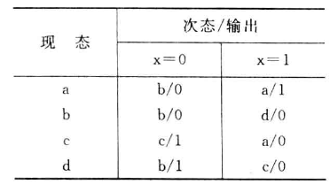

#### 状态编码

是指给最简状态表中用字母或数字表示的状态，指定一个二进制代码，形成二进制状态表。也成为状态分配，或者状态赋值

状态编码的任务是：

1. 确定二进制代码的位数(所需触发器个数)
2. 寻找一种最佳的或接近最佳的状态分配方案，以便使所设计的时序电路最简单

> 就是把你上面得到的最简状态表用二进制表示出来
>
> **比如**
>
> 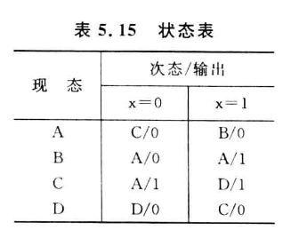
>
> 经过状态编码可以得到
>
> 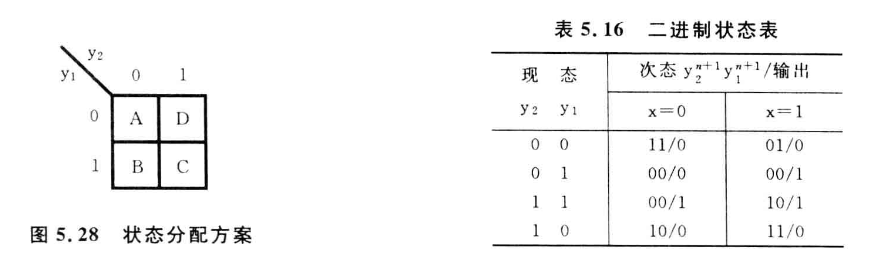

#### 确定激励函数和输出函数并画出逻辑电路图

根据二进制状态表确定 **触发器数目** 并 **选定触发器类型** -> 根据 **二进制状态表和触发器的激励表或者次态方程** ，求出 **触发器的激励函数表达式和电路的输出函数表达式**

列出4种时钟控制触发器的激励表⭐⭐⭐

| image-20250429190831285 | image-20250429190906387 |
| --- | --- |
| 表5.17 R-S触发器激励表 | 表5.18 D触发器激励表 |
| image-20250429191523048 | image-20250429191555703 |
| 表5.19 J-K触发器激励表 | 表5.20 T触发器激励表 |

求激励函数和输出函数的最简表达式一般分为两步：

1. 列出激励函数和输出函数真值表
2. 画出激励函数和输出函数卡诺图，化简后写出最简表达式

> **举个例子，例5.10 用J-K触发器和适当的逻辑门实现表5.21所示二进制状态表的功能**
>
> | image-20250429192322265 |
> | --- |
> | **表5.21** |
>
> **解:**
>
> ​ 根据给出的状态表和J-K触发器的激励表可以列出激励函数和输出函数的真值表
>
> | image-20250429192830111 |
> | --- |
> | 表5.22 激励函数和输出函数真值表 |
>
> [!IMPORTANT]
>
> > 这边解释一下激励函数和输出函数真值表怎么来的
> >
> > - 表5.21第一行：
> > - y2y1=00,经过x=0的输入之后，变成y2y1=11，输出Z=0
> > - 对应寻找表5.19。y2由0->1时，J2=1、K2=d,因此记录
> > - 同理，y1由0->1时，J1=1、K2=d,再次记录
> > - 其余行同理
>
> 由真值表可作出激励函数和输出函数的卡诺图，如图5.29
>
> | image-20250429193905803 |
> | --- |
> | 图5.29 激励函数和输出函数卡诺图 |
>
> 得到化简后的激励函数和输出函数的最简表达式
> $$
> J\_2 = \overline{xy\_1}
> $$
>
>
$$
J_1 = K_1 = 1
$$

>
$$
K_2 = \overline{x}
$$

>
$$
Z=y_2 y_1+xy_1=(y_2+x)y_1
$$

>
> 因此可作逻辑电路图如图5.30
>
> | image-20250429194341950 |
> | --- |
> | 图5.30 逻辑电路 |

#### 5.3.4 同步时序逻辑电路设计举例

单独开一章说

## 中规模通用集成电路及其应用

先介绍一下 **常用中规模组合逻辑电路**

使用最广泛的中规模组合逻辑集成电路由`二进制并行加法器`、`译码器`、`编码器`、`多路选择器`和`多路分配器`

### 二进制加法并行器

是一种能够并行产生两个n为二进制数“算术和”的逻辑部件。按 **进位方式** 不同，可以分为`串行进位二进制并行加法器`,`超前进位二进制并行加法器`

#### 串行进位二进制并行加法器

本质上就是模拟我们计算的方式，使用全加器实现(第三章内容)

| image-20250429200909866 |
| --- |
| 图7.1 串行进位4位二进制并行加法器的结构框图 |

但是这种加法器的运算速度较慢，且位数越多，速度越低。因此出现了超前进位二进制并行加法器

#### 超前进位二进制并行加法器

这个加法器就是跟据输入信号同时形成各位向高位“进位”的二进制并行加法器。跟据全加器的功能，可写出第i位全加器的进位输出函数表达式为
$$
C\_i = \overline{A\_i}B\_iC\_{i-1}+A\_i\overline{B\_i}C\_{i-1}+A\_iB\_i\overline{C\_{i-1}}+A\_iB\_iC\_{i-1}=(A\_i⊕B\_i)C\_{i-1}+A\_iB\_i
$$
由进位函数表达式可知，当第i位的被加数Ai和加数Bi均为1时，有AiBi=1,不论低位运算结果如何，本位必然产生进位输出(Ci=1)

- 定义Gi=AiBi为 **进位产生函数** 。Ai⊕Bi=1时，使Ci=Ci-1。
- 定义Pi=Ai⊕Bi为 **进位传递函数** 。
- 将Pi和Gi代入全加器的“和”及“进位”输出表达式
  $$
  F\_i=A\_i⊕B\_i⊕C\_{i-1}=P\_i⊕C\_{i-1}
  $$

$$
C\_i=P\_iC\_{i-1}+G\_i
$$

#### 典型芯片

常用并行加法器有 **`4位超前进位二进制并行加法器74283`** ，该器件引脚排列图和逻辑符号如图7.2。其中

- A4、A3、A2、A1和B4、B3、B2、B1为两组4位二进制加数。
- F4、F3、F2、F1为相加产生的4位”和“
- C0为最低为的进位输入
- FC4为最高位的进位输出

> 也就是Fi=Ai+Bi
>
> C0来源于之前器件的进位
>
> FC4生成对下一个器件的进位

#### 应用举例

单独讲

### 译码器和编码器

**译码器** 的功能是对具有特定含义的输入代码进行“翻译”，将其转换成相应的输出信号

**编码器** 的功能是对输入信号按一定规律进行编排，使魅族输出代码具有特定含义

#### 译码器

有二进制译码器、二-十进制译码器、数字显示译码器

> 其实就是在硬件上实现二进制到其它的转换

##### 二进制译码器

将n个输入变量变为2n个输出函数，且输出函数由输变量构成的最小项具有对应关系的一种多输出组合逻辑电路

从结构上来看，有n个输入端、2n个输出端和一个使能输入端。

> 例如，n=3时，输入端为101，则输出端只有Y5输出有效电平，（101）2=（5）10

常见的MSI二进制译码器有2-4线（2输入4输出）译码器、3-8线（3输入8输出）译码器和4-16线译码器

| image-20250506192913868 |
| --- |
| **图7.7 74138译码器的引脚排列图和逻辑符号** |

该译码器真值表如表7.1

| image-20250506193008076 |
| --- |
| **表7.1 74138译码器真值表** |

其中S1、S2,S3为使能端、作用是禁止或选通译码器

##### 二-十进制译码器

将4位BCD码的10组代码翻译成10个与十进制数字符号对应的输出信号

> 内容和上面的二进制译码器相同，这里变为了8421码、余3码这样子

##### 七段显示译码器

数字LED屏

| image-20250506194945850 |
| --- |
| **图7.11 7448的引脚排列图和逻辑符号** |

| image-20250506195014682 |
| --- |
| 表7.4 7448的功能表 |

| image-20250506195114686 |
| --- |
| 图7.12 七段显示译码工作原理以及笔画与字形关系 |

#### 编码器

常见的有二-十进制编码器和优先编码器

> 译码器功能反过来就是编码器

##### 二-十进制编码器

将十进制的10个数字0~9分别编成4位BCD码。例如图7.13所示的是按键式8421码编码器的逻辑电路

| image-20250506195703886 |
| --- |
| 图7.13 按键式8421码编码器 |

##### 优先编码器

它与上述二-十进制编码器的最大区别是：二-十进制编码器的输入信号是互斥的，即 **任何时候只允许一个输入端为有效信号** 。优先编码器的各个输入信号不是互斥的， **允许多个输入端同时为有效信号**

优先编码器的每个输入具有不同的优先级别，当多个输入信号有效时吗，能识别输入信号的优先级别，并对其中优先级别最高的一个进行编码，产生相应的输出代码

| image-20250506201224963 |
| --- |
| 图7.14 74148优先编码器引脚排列和逻辑符号 |

| image-20250506201300750 |
| --- |
| 表7.6 74148真值表 |

- 下角标的号码越大，优先级越高。

> 例如，I1、I4、I6为0，其余为1.输出按优先级较高的I6编码，也就是QcQBQA=001,*(6)10=(110)2*
>
> 当I6=1时，QcQBQA=011，*(4)10=(100)2*
>
> 若当I4也为1时，QcQBQA=110,*(1)10=(001)2*

- IS为选通输入端，当IS=0时，编码器工作
- OS为选通输出端，当IS=0时且没有信号输入的时候，OS为0(也就是工作但是这个时候没有输入)
- OEX为工作状态标志，当IS=1时 或 当IS=0但无信号输入 时，OEX=1（也就是当选通输入有效并且有信号输入的时候，OEX=0）

### 多路选择器和多路分配器

多路选择器和多路分配器的基本功能就是对多路数据的选择与分配，在公共传输线上实现多路数据的分时传送

#### 多路选择器

又称为数据选择器或多路开关，常用MUX表示，它多路输入、单路输出，逻辑功能是从多路输入中选择一路到输出端

##### 典型芯片

`双四路MUX 74153`、`8路MUX 74152`(无使能控制端)、`74151`和`16路MUX 74150`

**双四路MUX 74153** 中有两个4路MUX。其中

- G为使能控制端，低电平有效。
- D0 ~ D3为数据输入端
- A1、A0为选择控制端，两个MUX共用
- Y为输出端

| image-20250506205310964 |
| --- |
| 图7.16 74153引脚排列图和逻辑符号 |

功能表如下

| image-20250506205425048 |
| --- |
| 表7.7 4路MUX 74153的功能表 |

> 其实就是，A1A0对应的二进制数是几，就输出第几个输入口的数

##### 应用举例

单独另开

#### 多路分配器

又称为数据分配器，用DEMUX表示。结构与多路选择器相反，单输入、多输出的逻辑部件。 **输入数据具体从哪一路输出由选择控制变量决定**

| image-20250506210122267 |
| --- |
| 图7.20 4路DEMUX的逻辑符号 |

- D为数据输入端
- A1、A0为选择控制输入端
- f0 ~ f3为数据输出端

| image-20250506210246818 |
| --- |
| 表7.8 4路DEMUX功能表 |

> 其实就是，A1A0对应的二进制数是几，就将D的值从第几个口输出，其它口都输出0

*DEMUX常与MUX联用，以实现多通道数据分时传送*。通常在发送端由MUX将各路数据分时送至公共传输线，接收端再由DEMUX将公共线上的数据分配到相应的输出端

### 常用中规模时序逻辑电路

#### 集成计数器

计数器是一种能在输入信号作用下依次通过预定状态的时序逻辑电路。计数器中的“数”是用触发器的状态组合来表示的，在计数脉冲的作用下使一组触发器的状态依次转换成不同的状态组合来表示数的变化。

计数器在运行时，所经历的状态是周期性的，通常将一次循环所包含的状态总数称为计数器的“模”

集成计数器的种类很多，有不同的分类方法

- 工作方式：同步计数器、异步计数器
- 进位制: 二进制计数器、十进制计数器、任意进制计数器
- 加法计数器、减法计数器、加/减可逆计数器

集成计数器一般具有计数、保存、清除、预置等功能

##### 集成同步计数器

常见的集成同步计数器有 **4位二进制同步加法计数器74161、单时钟4位二进制可逆计数器74191、单时钟十进制同步可逆计数器74190、双时钟4位二进制同步可逆计数器74193**

4位二进制同步可逆计数器74193的引脚排列图和逻辑符号如图

| image-20250506212240956 |
| --- |
| 图7.23 74193的引脚排列图和逻辑符号 |

| image-20250506212334498 |
| --- |
| image-20250506212342305 |

- CLR为高电平时，计数器被清0
- 当LD为低电平时，计数器被预置为A、B、C、D端输入的值
- 当计数脉冲由CPu端输入时，计数器进行累加计数
- 当计数脉冲由CPD端输入时,计数器进行累减计数

4位二进制计数器是模为16的计数器。下面举例介绍用4为二进制同步可逆计数器74193构成模为任意R计数器的方法

1. **构成模小于16的计数器**

利用计数器的清楚、预置等功能，可以很方便欸都实现模小于16的计数器

Tip

**例 用4位二进制同步可逆计数器74193构成模10加法计数器**

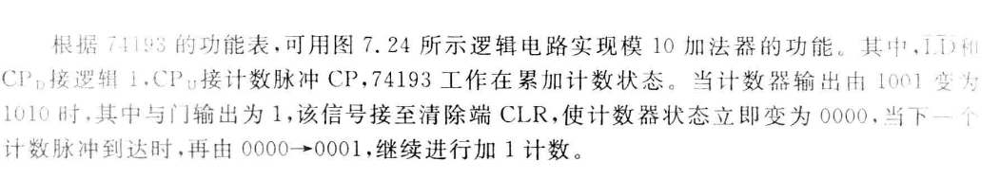

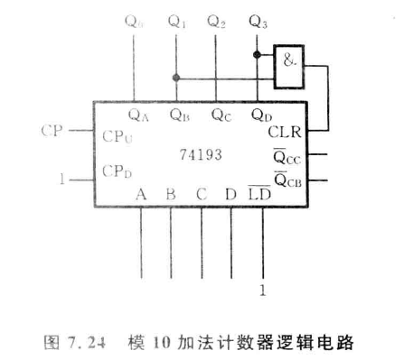

可以这么认为，当到达某个点的时候就触发CLR清零就好了，(1010)2对应的就是Q3=1,Q1=1的时候，给这俩 **与** 上

Tip

**例 用4位二进制同步可逆计数器74193构成模12减法计数器**

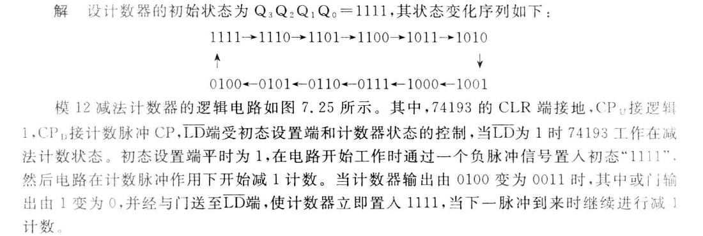

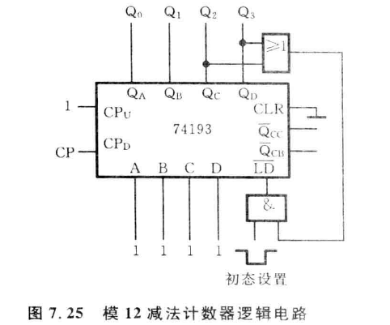

1. **构成模大于16的计数器**

利用计数器的进位输出或者错位输出脉冲作为计数脉冲，将多个4位计数器进行级联，构成模大于16的计数器。

例如将两片74193按图所示进行连接，即为一个模为256的减法计数器

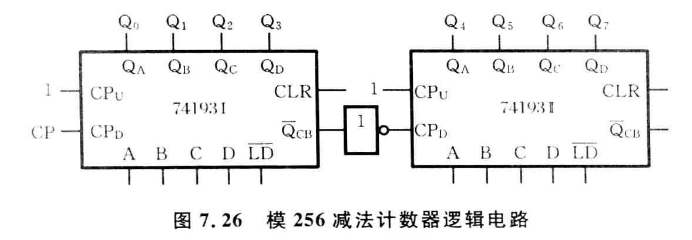

Tip

**例 用两片4位二进制同步可逆计数器74193构成模(147)10的加法计数器**

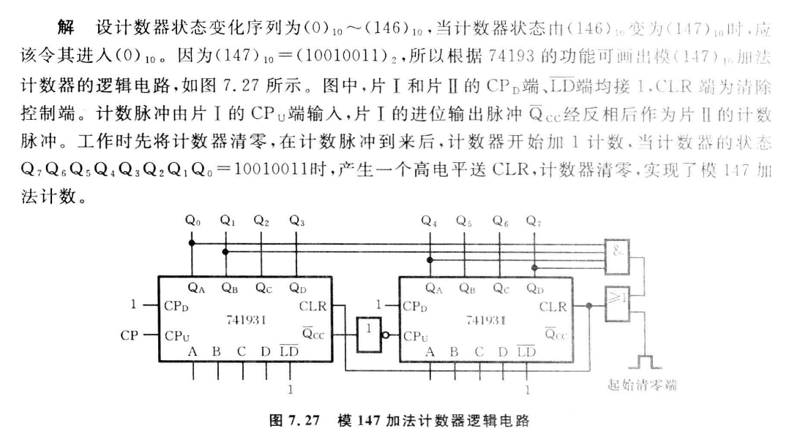

同样的道理，记得怎么样连上两片74193就好，147的时候对应得二进制从右往左一一对应过去

##### 集成异步计数器

常用得异步时序逻辑器件有 **二-五-十进制加法计数器74290** 、 **双时钟4位二进制加法计数器74293**

74290内部包括

- 4个主从J-K触发器
- 触发器0组成模2计数器，计数脉冲由CPA提供、
- 触发器1 ~ 3组成异步模5计数器，计数脉冲由CPB提供

| image-20250506214515054 |
| --- |
| 图7.28 74290的引脚排列图和逻辑符号 |

| image-20250506214543681 |
| --- |
| 表7.11 74290的功能表 |

集成异步计数器74290有6个输入和4个输出。

- R0A、R0B为清零输入信号，高电平有效
- R9A、R9B为置9(1001)输入信号，高电平有效
- CPA、CPB为计数脉冲信号
- QD、QC、QB、QA为数据输出信号

可以归纳除74290有以下功能

- **异步清零功能**

当R9A·R9B=0且R0A=R0B=1时，可以实现异步清零的操作，使得QDQCQBQA=0000

- **异步置9功能**

当R9A=R9B=1时，不论R0A、R0B以及输入脉冲为何值，均可实现异步置9操作

- **计数功能**

当R9A·R9B=0，且R0A·R0B=0时，电路实现如下计数功能

1. **模2计数器** :若将计数脉冲加到CPA端，并从QA端输出，则可以实现1位二进制加法计数
2. **模5计数器** :若将计数脉冲加到CPB端，并从QD,QC,QB端输出，则可实现五进制加法计数

   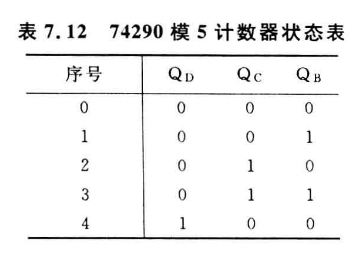
3. **模10计数器** ：用74290构成模10计数器有两种方法：一是构成8421码十进制计数器；二是构成5421码十进制计数器。两种方式的连接图如下图

   | image-20250506222209216 |
   | --- |
   | 图7.29 74290构成的两种模10计数器连接示意图 |

   > (a)中将QA和CPB连接起来，会使得每来两个计数脉冲，QA就会产生一个负跳变，使模五计数器增1。
   >
   > 经过10个脉冲作用后，模5计数器循环一周，实现8421码十进制加法计数
   >
   > 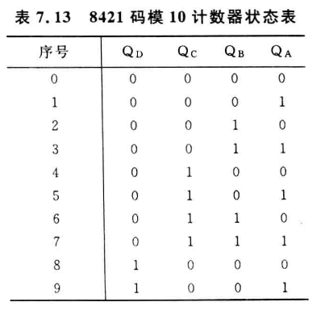
   >
   > (b)中，计数脉冲器加到模5计数器的CPB端，并将模5计数器的高位输出端QD接到模2计数器的CPA端。这种情况下，每来5个计数脉冲，QD产生一个负跳变。使模2计数器加一
   >
   > 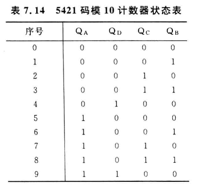

#### 集成寄存器

寄存器的主要组成部分是触发器，一个触发器能存储1位二进制代码，所以要存放n位二进制代码的寄存器应包含n个触发器。

中规模集成电路寄存器除了具有 **接收数据** 、 **保存数据** 和 **传送数据** 等基本功能外，通常还有 **左、右移位** ， **串、并输出** 以及 **预置** 、 **清零** 等多种功能

##### 典型芯片

下面介绍一下74194芯片，这是一种常用的4位双向移位寄存器。其管脚排列图和逻辑符号如下图

| image-20250506224151837 |
| --- |
| 图7.32 74194的管教排列图和逻辑符号 |

| image-20250506224231519 |
| --- |
| 74194引线说明、控制端功能、功能表 |

### 常用中规模信号产生与变换电路(集成定时器555)

集成定时器555是一种将模拟电路功能与逻辑电路功能巧妙地结合在一起的中规模集成电路。常用的集成定时器555有 **5G555(TTL电路)** 、 **CC7555（CMOS电路）**

#### 5G555的电路结构与逻辑功能

##### 电路结构和工作原理

| image-20250506225235549 |
| --- |
| 图7.37 5G555的电路结构和管脚功能 |

集成定时器5G555由 **电阻分压器** 、 **电压比较器** 、 **基本R-S触发器** 、 **放电三极管** 和 **输出缓冲器** 5部分组成。定时器的功能主要取决于比较器C1和C2，由它们的输出直接控制基本R-S触发器的状态和放电三极管T的状态，从而决定整个电路的输出状态

- **电阻分压器** 由3个阻值均为5kΩ的电阻串联构成分压器，为电压比较器C1和C2提供参考电压

当电压控制端CO不外加控制电压\*vCO\*时，VR1=⅔VCC , VR2=⅓VCC，当外加控制电压\*vco\*时，比较器的参考电压将发生变化，相应电路的阈值、触发电平也将随之改变，并进而影响电路的定时参数。

*为了防止干扰，CO端一般通过一个小电容(0.01μF)接地，以防旁路高频干扰*

- **电压比较器C1和C2** 是两个结构相同的理想运算放大器

当运算放大器的同相输入V+大于反向输入V-时，输出为高电平1信号，反之为低电平0信号

> 上面两个结合，就作为了这个器件的开关
>
> 比较器C1的同相输入端（+端）接参考电压VR1，反相输入端（-端）与阈值输入端TH相连时，其输出R端的状态取决于与之输入信号\*vTH\*和VR1的比较结果。
>
> - *vTH*<VR1时，输出R为高电平1
> - *vTH*>VR1时，输出R为低电平0
>
> 比较器C2的同相输入端（+端）与触发输入端TR相连，反相输入端（-端）接参考电压VR2时，其输出端S的状态取决于这两个输入信号的比较结果
>
> - *vTR*<VR2时，输出S为低电平0
> - *vTR*>VR2时，输出S为高电平1
>
> 就是这样理解：
>
> - C1控制R-S触发器的R端，+端电压 < -端电压时，R为高电平
> - C2控制R-S触发器的S端，+端电压 < -端电压时，S为低电平

- **基本R-S触发器** 。
- 触发器输入信号R、S为比较器C1，C2的输出。
- 触发器Q的状态为电路输出端OUT的状态，触发器Q端状态控制放电三极管T的导通与截止。
- 当外部复位信号RD为0时，可使\*v0\*=0，定时器输出直接复位。
- **放电三极管T** 构成泄放电路，T的集电极即输出端D。如果将D端经过一个外接电阻接至电源，可以形成一个反相器:
- 当Q=0时，T导通，D端输出为低电平0
- 当Q=1时，T截止，D端输出为高电平1

> 综合来说，D端的逻辑状态与输出端OUT的状态相同

- **输出缓冲器** .提高负载能力，并隔离负载对定时器的影响

##### 电路功能

5G555的功能表如下

| image-20250507222056867 |
| --- |
| 表7.20 5G555功能表 |

当CO不外接控制电压时，功能表如下(其实差不多的，可以理解为基准电压变成了一个已知值)

| image-20250507222344321 |
| --- |
| 表7.21 5G555不外接控制电压时的功能表 |
