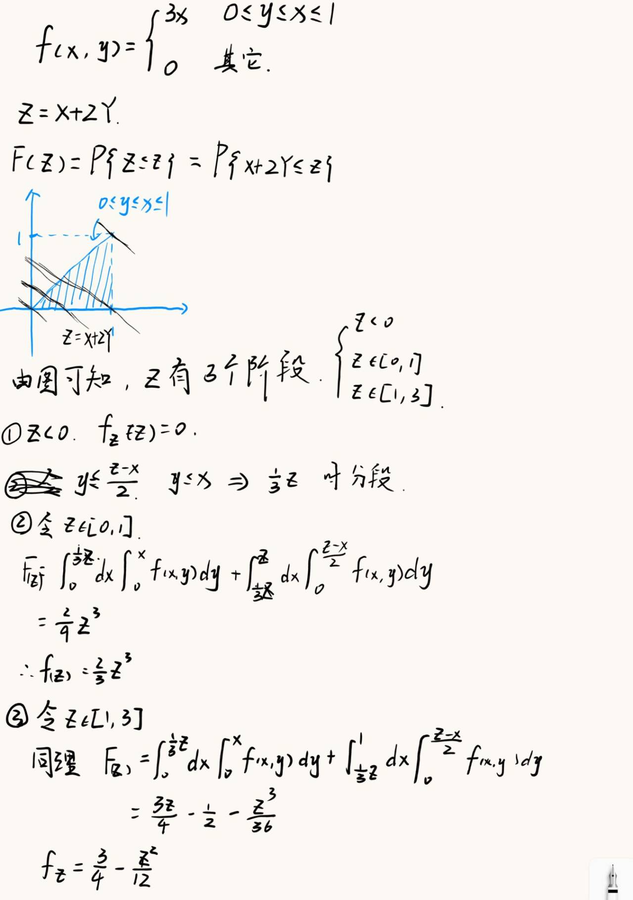

# 概率论与数理统计

## 第一章 随机事件和概率

$P(AB)=P(A)P(B)$ 则称事件 $A、B$ 独立

全概率公式 ：$P(A)=\displaystyle\sum_{i=1}^{n}P(A|B_i)P(B_i)$

## 第二章 随机变量及其分布

- 设随机试验的样本空间，$X=X(\omega)$ 是定义在样本空间 $\Omega$ 上的实值单值函数，称 $X=X(\omega)$ 为 **随机变量** ，一般用大写字母 $X,Y,Z,\cdots$ 等表示随机变量，用小写字母 $x,y,z,\cdots$ 表示随机变量的取值
- **连续性随机变量 \*\* ：设 $X$ 是一个随机变量， $x$ 是任意实数，函数 $F(x)=P\text\{X \le x\text\},-\infty<x<+\infty$ 称为 \*\* $X$ 的分布函数，表示 $X$ 的取值落在实数 $x$ 左侧的概率** ## 常见的离散型随机变量的分布

### 二项分布 $B(n,p)$

随机变量 $X$ 表示 $n$ 重伯努利试验中事件 $A$ 发生的次数，记每次试验中事件 $A$ 发生的概率为 $p$，则 $X$ 的分布律为

$$
P\{X=k\}=
C_n^kp^k(1-p)^{n-k}
$$

### 0-1分布

设随机变量 $X$ 只可能取 0 与 1两个值，它的分布律为

$$
P\{X=k\}=
p^k(1-p)^{1-k},
k=0,1,(0<p<1)
$$

### 几何分布 $Ge(p)$

可列重伯努利试验中，记每次试验中事件 $A$ 发生的概率为 $p$，随机变量 $X$ 表示事件 $A$ **首次发生时的试验次数** ，其分布律为

$$
P\{X=k\}=
(1-p)^{k-1}p
\;\;\;\;(k=1,2,\cdots)
$$

### 泊松分布 $P(\lambda)$/$\pi(\lambda)$

设随机变量 $X$ 所有可能取得值为 $0,1,2,\cdots$，其分布律为

$$
P\{X=k\}=
\displaystyle\dfrac{\lambda^ke^{-\lambda}}{k!}
,(k=0,1,2,\cdots)
$$

其中 $\lambda>0$ 是常数，则称 $X$ 服从参数为 $\lambda$ 的泊松分布 **泊松定理** ：设 $\lambda>0$ 是一个常数， $n$ 是任意正整数，设 $\lambda=np_n$ ，则对于任意固定的非负整数 $k$ 有

$$
\lim_{n\rightarrow\infty}P\{X=k\}=
\lim_{n\rightarrow\infty}C_n^kp_n^k(1-p_n)^{n-k}=
\dfrac{(np_n)^k}{k!}e^{-np_n}
\;\;(k=0,1,2,\cdots)
$$

### 超几何分布 $H(n,M,N)$

随机变量 $X$ 的分布律为

$$
P\{X=k\}=
\displaystyle\dfrac{C_M^KC_{N-M}^{n-k}}{C_N^n}
,k=max\{0,n-N+M\},\cdots,min\{n,M\}
$$

## 连续型随机变量的分布

### 均匀分布 $U(a,b)$

连续性随机变量 $X$ 的概率密度为

$$
f(x)=
\begin{cases}
\dfrac{1}{b-a}, & a<x<b,\\
0, & \text{其他}.
\end{cases}
$$

### 指数分布 $E(\lambda)$

连续性随机变量 $X$ 的概率密度为

$$
f(x)=
\begin{cases}
\lambda e^{-\lambda x}\;\;\;,x>0\\
0\;\;\;\;\;\;\;\;\;\;,x\le 0
\end{cases}
$$

$X$ 的分布函数为

$$
F(x)=
\begin{cases}
1-e^{-\lambda x}, & x>0,\\
0, &x\le 0
\end{cases}
$$

### 正态分布 $N(\mu,\sigma^2)$

连续型随机变量 $X$ 的概率密度为

$$
f(x)=
\displaystyle\dfrac{1}{\sqrt{2\pi}\sigma}e^{-\dfrac{(x-\mu)^2}{2\sigma^2}},-\infty<x<+\infty
$$

- 性质
  - 曲线关于 $x=\mu$ 对称，且当 $x=\mu$ 的时候，$f(x)_{max}=\dfrac{1}{\sqrt{2\pi}\sigma}$
  - 曲线以 $Ox$ 轴为水平渐进线
- 常用结论
  - $P\{X>\mu\}=P\{X<\mu\}=\dfrac{1}{2}$
  - $Y=aX+b\sim N(a\mu+b,a^2\sigma^2),a\ne 0$
    正态分布的标准化
    若 $X\sim N(\mu,\sigma^2)$,则 $Z=\dfrac{X-\mu}{\sigma}\sim N(0,1)$

## 第三章 多维随机变量及其分布

## 第四章 数字特征

### 切比雪夫不等式

设随机变量具有数学期望 $E(X)=\mu$ 方差 $D(X)=\sigma^2$ ,则对于任意正数 $\epsilon$ ,有以下不等式

$$
P\{|X-E(X)|\ge\epsilon\}\le\dfrac{D(X)}{\epsilon^2}
$$

### 协方差

对于二维随机变量 $(X,Y)$，若 $E(X-E(X))(Y-E(Y))$ 存在，则称它为 $X$ 与 $Y$ 的协方差，记作 $Cov(X,Y)$

$$
Cov(X,Y)=E(XY)-E(X)E(Y)
$$

性质

### 相关系数

对于二维随机变量 $(X,Y)$ 若 $D(X)\ne 0,D(Y)\ne 0$ 则称

$$
\displaystyle\rho_{XY}=\dfrac{Cov(X,Y)}{\sqrt{D(X)}\sqrt{D(Y)}}
$$

为X和Y的相关系数，表明两者线性相关的程度，绝对值越大，线性相关的程度越高

## 第五章 大数定理和中心极限定理

大数定理的本质其实是频率收敛为概率

### 切比雪夫大数定律

**切比雪夫不等式** 设 $X_1,X_2,\cdots,X_n,\cdots$ 是一列两两不想关的随机变量序列，期望和方差均存在，且方差 $D(X_i)$ 一致有界，则对于 $\forall \epsilon>0$ 有

$$
\lim_{n \to \infty}
P\left(
\left|
\frac{1}{n}\sum_{i=1}^{n} X_i
\frac{1}{n}\sum_{i=1}^{n} E X_i
\right|
< \varepsilon
\right)
= 1
$$

特别的，如果 $X_1,X_2,\cdots,X_n,\cdots$ 有相同的期望 $\mu$ 则有

$$
\lim_{n \to \infty}
P\left(
\left|
\frac{1}{n}\sum_{i=1}^{n} X_i
\mu
\right|
< \varepsilon
\right)
= 1
$$

### 辛钦大数定律

设 $\{X_n\}$ 为一独立同分布的随机变量序列，且数学期望存在， $E(X_i)=\mu$ ,则对任意的 $\epsilon>0$ ，都有

$$
\lim_{n \to \infty}
P\left(
\left|
\frac{1}{n}\sum_{i=1}^{n} X_i
\mu
\right|
< \varepsilon
\right)
= 1
$$

### 伯努利大数定律

设 $f_A$ 是 $n$ 重伯努利试验中事件 $A$ 发生的次数， $p$ 是 $A$ 在每次试验中发生的概率，则对于任意的 $\epsilon>0$ 都有

$$
\lim_{n \to \infty}
P\left(
\left|
\frac{f_A}{n}
p
\right|
< \varepsilon
\right)
= 1
$$

### 中心极限定理

**列维–林德伯格定理** ：设 $X_1,X_2,\dots,X_n,\dots$ 是一列独立同分布的随机变量，且 $E X_k=\mu,\; D X_k=\sigma^2>0,\; k=1,2,\dots$，则对任意 $x\in\mathbb{R}$，有

$$
\lim_{n\to\infty}
P\!\left(
\frac{\sum_{k=1}^{n} X_k - n\mu}{\sqrt{n}\,\sigma}
\le x
\right)
=
\Phi(x)
=
\frac{1}{\sqrt{2\pi}}
\int_{-\infty}^{x} e^{-t^2/2}\,dt
$$

**棣莫弗–拉普拉斯定理** ：在 $n$ 重伯努利试验中，事件 $A$ 在每次试验中出现的概率为 $p\,(0<p<1)$，$X_n$ 为 $n$ 次试验中事件 $A$ 发生的次数，则对任意 $x\in\mathbb{R}$ 有

$$
\lim_{n\to\infty}
P\!\left(
\frac{X_n-np}{\sqrt{n p(1-p)}}
\le x
\right)
=
\Phi(x)
=
\frac{1}{\sqrt{2\pi}}
\int_{-\infty}^{x} e^{-t^2/2}\,dt
$$

---

随机变量 $X_1,X_2,\cdots,X_n,\cdots$ 相互独立，服从同一分布，且具有数学期望和方差为 $\displaystyle E(X_k)=\mu$ , $D(X\_k)=\sigma^2>0 (k=1,2,\cdots) 则随机变量之和 $\displaystyle \sum_{k=1}^nX_k$ 的标准化变量为

$$
\displaystyle
Y_n=
\dfrac{
\displaystyle\sum_{k=1}^{n}X_k-E(\sum_{k=1}^{n}X_k)
}{
\sqrt{
D(\displaystyle\sum_{k=1}^{n}X_k)
}
}
=
\dfrac{
\displaystyle\sum_{k=1}^{n}X_k-n\mu
}{
\sqrt{n}\sigma
}
$$

的分布函数 $F_n(x)$ 对于任意 $x$ 满足

$$
\begin{align}
\lim_{n\rightarrow\infty}F_n(x)=&
\lim_{n\rightarrow\infty}P\left\{
\dfrac{
\sum_{k=1}^{n}X_k-n\mu
}{
\sqrt{n}\sigma
}
\le
x
\right\}\\
=&\int_{-\infty}^{x}\dfrac{1}{\sqrt{2\pi}}e^{-t^2/2}\mathrm{d}t=\Phi(x)
\end{align}
$$

## 第六章 数理统计基本概念

- 总体 ：研究对象某项数量指标的全体称为 **总体 \*\* ，构成总体的每个成员称为 \*\*个体**
  - *例如，研究一批机器的寿命，则全部机器的寿命构成问题的总体，每一台机器的寿命是一个个体，总体是寿命 $X$ 服从的分布*
- 样本 ：在相同条件下对总体 $X$ 进行 $n$ 次简单随机抽样，得到的 $n$ 个观察结果。 $X_1,X_2,\dots,X_n$ **相互独立 \*\* 且 \*\* 同分布于总体 \*\* $X$，称 $X_1,X_2,\dots,X_n$ 为来自总体 $X$ 的一个 \*\* 简单随机样本 \*\* ，简称 \*\* 样本 \*\* ，其中 $n$ 称为 \*\* 样本容量 \*\* .抽样得到的一组实数记为 $x_1,x_2,\dots,x_n$，称为 \*\* 样本观察值 \*\* ，简称 \*\* 样本值** 。
  - \*例如，从该批机器中随机抽取 20 台测定其寿命，既得到容量为 20 的样本观测值 $x_1,x_2,\cdots,x_{20}$ 抽取前无法预知每台样本的寿命，因此样本 $X_1,X_2,\cdots,X_{20}$ 是随机变量
- 经验分布函数 ：设 $X_1,X_2,\cdots,X_n$ 为总体 $X$ 的一个样本，其样本值为 $x_1,x_2,\cdots,x_n$,则称函数

\displaystyle F\_n(x)=\dfrac{{x\_1,x\_2,\cdots,x\_n中小于或等于x的个数}}{n}(-\infty<x<+\infty)
为样本值 $x_1,x_2,\cdots,x_n$ 的经验分布函数

- 统计量和统计值 定义 不含任何未知参数的样本函数 $g(X_1,X_2,\dots,X_n)$ 称为 **统计量 \*\* 。设 $x_1,x_2,\dots,x_n$ 是对应于样本 $X_1,X_2,\dots,X_n$ 的样本值，则称 $g(x_1,x_2,\dots,x_n)$ 是 $g(X_1,X_2,\dots,X_n)$ 的观测值，称为 \*\* 统计值** 。
- 常用统计量
  - **样本均值** ：

$$
\bar X = \frac{1}{n}\sum_{i=1}^{n} X_i
$$

- **样本方差** ：

$$
S^2=\frac{1}{n-1}\sum_{i=1}^{n}(X_i-\bar X)^2=\frac{1}{n-1}\left(\sum_{i=1}^{n} X_i^2 - n\bar X^2\right)
$$

- **样本标准差** ：

$$
S = \sqrt{S^2}=\sqrt{\frac{1}{n-1}\sum_{i=1}^{n}(X_i-\bar X)^2}
$$

- **样本k阶原点矩** ：

$$
A_k=\frac{1}{n}\sum_{i=1}^{n} X_i^k,\quad k=1,2,\dots
$$

- **样本k阶中心距** ：

$$
B_k=\frac{1}{n}\sum_{i=1}^{n}(X_i-\bar X)^k,\quad k=1,2,\dots
$$

### 三大抽样分布 ：

统计量的分布称为 **抽样分布**

**$\chi^2$ 分布：** 设 $X_1,X_2,\dots,X_n$ 是来自总体 $N(0,1)$ 的样本，则统计量

$$
\chi^2 = X_1^2 + X_2^2 + \cdots + X_n^2
$$

服从自由度为 $n$ 的 $\chi^2$ 分布，记为 $\chi^2 \sim \chi^2(n)$。

- 可加性
- $\chi^2\sim\chi^2(n)$ 则有 $E(\chi^2)=n,D(\chi^2)=2n$

---

**t分布** ：设 $X\sim N(0,1)$ ,$Y\sim\chi^2(n)$ 且 $X,Y$ 独立，则称随机变量

$$
t=\dfrac{X}{\sqrt{Y/n}}
$$

服从自由度为 $n$ 的 $t$ 分布，记为 $t\sim t(n)$

- 偶函数
- $t_{1-\alpha}=-t_{\alpha}(n)$

---

**F分布** 设 $X \sim \chi^2(n_1)$，$Y \sim \chi^2(n_2)$，且 $X,Y$ 独立，则称随机变量

$$
F = \frac{X / n_1}{Y / n_2}
$$

服从自由度为 $(n_1,n_2)$ 的 $F$ 分布，记为 $F \sim F(n_1,n_2)$，其中 $n_1$ 称为第一自由度，$n_2$ 称为第二自由度

- 若 $F\sim F(n_1,n_2)$ ，则 $\dfrac{1}{F}\sim F(n_2,n_1)$
- $F_{1-\alpha}(n_1,n_2)=\dfrac{1}{F_\alpha(n_2,n_1)}$

### 正态总体抽样分布

**一个正态总体** 假设 $X_1,X_2,\dots,X_n$ 是来自正态总体 $X\sim N(\mu,\sigma^2)$ 的样本，样本均值与样本方差分别是

$$
\bar X=\frac{1}{n}\sum_{i=1}^{n}X_i,
\qquad
S^2=\frac{1}{n-1}\sum_{i=1}^{n}(X_i-\bar X)^2
$$

则有以下结论：
1） 样本均值的分布

$$
\bar X \sim N\!\left(\mu,\frac{\sigma^2}{n}\right),
\qquad
\frac{(\bar X-\mu)\sqrt n}{\sigma}\sim N(0,1)
$$

2） 样本均值 $\bar X$ 与样本方差 $S^2$ 相互独立；

== 3）== 卡方分布性质

$$
\frac{(n-1)S^2}{\sigma^2}
=
\frac{\displaystyle\sum_{i=1}^{n}(X_i-\bar X)^2}{\sigma^2}
\sim \chi^2(n-1),
\qquad
\frac{\displaystyle\sum_{i=1}^{n}(X_i-\mu)^2}{\sigma^2}
\sim \chi^2(n)
$$

4） t 分布

$$
T=\frac{\bar X-\mu}{S/\sqrt n}
\sim t(n-1)
$$

---

**两个正态总体** 设 $X_1,\dots,X_{n_1}$ 是取自总体 $X\sim N(\mu_1,\sigma_1^2)$ 的一个样本，$Y_1,\dots,Y_{n_2}$ 是取自总体 $Y\sim N(\mu_2,\sigma_2^2)$ 的一个样本，且这两个样本相互独立，即 $X_1,\dots,X_{n_1},Y_1,\dots,Y_{n_2}$是 $n_1+n_2$ 个相互独立的随机变量，则有：

1） 均值之差的分布

$$
\frac{(\bar X-\bar Y)-(\mu_1-\mu_2)}
{\sqrt{\dfrac{\sigma_1^2}{n_1}+\dfrac{\sigma_2^2}{n_2}}}
\sim N(0,1)
$$

2） 方差比的分布

$$
\frac{S_1^2/\sigma_1^2}{S_2^2/\sigma_2^2}
\sim F(n_1-1,n_2-1)
$$

3） 当 $\sigma_1^2=\sigma_2^2=\sigma^2$ 时

$$
\frac{(\bar X-\bar Y)-(\mu_1-\mu_2)}
{S_w\sqrt{\dfrac{1}{n_1}+\dfrac{1}{n_2}}}
\sim t(n_1+n_2-2)
$$

其中

$$
S_1^2=\frac{1}{n_1-1}\sum_{i=1}^{n_1}(X_i-\bar X)^2,
\qquad
S_2^2=\frac{1}{n_2-1}\sum_{i=1}^{n_2}(Y_i-\bar Y)^2,
S_w^2=\frac{(n_1-1)S_1^2+(n_2-1)S_2^2}{n_1+n_2-2}.
$$

## 第七章 点估计与估计量的评价

设总体分布函数 $F(x;\theta)$ 的形式为已知， $\theta$ 是 **待估参数** ，$X_1,X_2,\dots,X_n$ 为总体 $X$ 的一个样本， 其样本值为$x_1,x_2,\dots,x_n$
点估计即构造一个适当的统计量 $\hat\theta=\theta(X_1,X_2,\dots,X_n)$，用它的观测值 $\hat\theta=\theta(x_1,x_2,\dots,x_n)$作为未知参数 $\theta$ 的近似值。称 $\hat\theta=\theta(X_1,X_2,\dots,X_n)$为 $\theta$ 的 **估计量 \*\* ，$\hat\theta=\theta(x_1,x_2,\dots,x_n)$ 为 $\theta$ 的 \*\* 估计值** 。

### 矩估计法

用样本矩估计同阶的总体矩，用样本矩的函数估计总体矩的函数，这种估计方法称为参数的 **矩估计**

!!! note
    步骤
    估计 k 个位置参数 $\theta_1,\theta_2,\cdots,\theta_n$ $X_1,X_2,\cdots,X_n$ 为来自总体 $X$ 的样本，令

$$
\dfrac{1}{n}\displaystyle\sum_{i=1}^{n}X_i^l=E(X^l)(l=1,2,\cdots,k)
$$

解得 $\hat\theta_l=\theta(X_1,\cdots,X_n)$

!!! tip
    1. 矩估计使用前提是有总体矩的存在
    2. 用样本一阶原点矩 $\bar X$ 估计期望 $E(X)$
    3. 用样本二阶中心矩 $\dfrac{1}{n}\displaystyle\sum_{i=1}^{n}(X_i-\bar X)^2$ 估计方差 $D(X)$

### 最大似然估计法

**似然函数离散型总体** $X$，设 $P\{X=a_i\}=p(a_i;\theta),\quad i=1,2,\ldots,\quad \theta\in\Theta$

则称

$$
L(\theta)=L(x_1,\ldots,x_n;\theta)=\prod_{i=1}^{n} p(x_i;\theta)
$$

为该总体的似然函数。 **连续型总体** $X$，设 $X\sim f(x;\theta),\quad \theta\in\Theta$ 则称

$$
L(\theta)=L(x_1,\ldots,x_n;\theta)=\prod_{i=1}^{n} f(x_i;\theta)
$$

为该总体的似然函数。

> 将似然函数理解为恰好取到样本值的概率

=最大似然估计=

固定样本值 $x_1,x_2,\ldots,x_n$，在 $\theta\in\Theta$ 内使似然函数 $L(\theta)=L(x_1,\ldots,x_n;\theta)$ 达到最大的参数值 $\hat\theta(x_1,\ldots,x_n)$，作为参数 $\theta$ 的估计值。 **最大似然估计不变性原理：** 设 $\hat\theta$ 是未知参数 $\theta$ 的最大似然估计，函数 $g(\theta)$ 具有单值反函数，则 $g(\hat\theta)$ 是参数 $g(\theta)$ 的最大似然估计量。

> 设总体 $X\sim N(\mu,\sigma^2)$（$\mu,\sigma^2$ 都未知），则 $EX=\mu$ 的最大似然估计为 $\bar X$, $DX=\sigma^2$ 的最大似然估计为 $\frac{1}{n}\sum_{i=1}^{n}(X_i-\bar X)^2$。

!!! note
    步骤（以连续性总体 $X\sim f(x;\theta)$ 为例）
    1. 构造似然函数 $L(\theta)=L(x_1,\cdots,x_n;\theta)=\displaystyle\prod_{i=1}^{n}f(x_i;\theta)$
    2. 取对数 $\ln L(\theta)=L(x_1,\cdots,x_n;\theta)=\displaystyle\sum_{i=1}^{n}\ln f(x_i;\theta)$
    3. 解方程 $\displaystyle\dfrac{\mathrm{d}[\ln L(\theta)]}{\mathrm{d}\theta}=0$

## 第八章 区间估计

设总体 $X$ 的分布中含有一个未知参数 $\theta$。若对于给定的概率 $1-\alpha(0<\alpha<1)$，存在两个统计量$\hat\theta_1=\hat\theta_1(X_1,X_2,\ldots,X_n)$ 与 $\hat\theta_2=\hat\theta_2(X_1,X_2,\ldots,X_n)$，使得

$$
P\{\hat\theta_1\le\theta\le\hat\theta_2\}=1-\alpha
$$

则随机区间 $(\hat\theta_1,\hat\theta_2)$ 称为参数 $\theta$ 的置信水平（或置信度）为 $1-\alpha$ 的置信区间（或区间估计），$\hat\theta_1$ 称为置信下限，$\hat\theta_2$ 称为置信上限，$1-\alpha$ 称为置信水平。

> 置信区间的含义：反复抽样多次（各次的样本容量相等，均为 $n$）,每一组样本值确定一个区间 $(\hat\theta_1,\hat\theta_2)$，每个这样的区间要么包含 $\theta$ 的真值，要么不包含，按照伯努利大数定理，这么多区间中，包含 $\theta$ 真值的约占 $100(1-\alpha)\%$

x服从指数为1的指数分布，Y=e^{-x},问Y>2\3的概率

## 21-22 第二学期 概统B（A卷）

 **常数A的取值范围**

!!! note
    解析

# 分布函数性质

分布函数必须满足如下的基本性质：

1. 单调不减
2. $0\le F(x)\le 1$
3. 右连续
4. $\lim_{x\rightarrow -\infty}F(x)=0,\lim_{x\to +\infty}F(x)=1$

那么在区间 $0\le x < 1$ 上有 $F(x)=Ax$，根据 **性质2** ，可以得到 $0\le Ax \le 1$
当 $x>0$ 的时候，上式等价于 $0\le A\le \dfrac{1}{x}$，又要对于 $x\in(0,1)$ 均成立，那么必须要有 $0\le A \le 1$
再根据 **性质3** ：$\displaystyle\lim_{x\to 1^{-}}F(x)=A\le F(1)=1\Rightarrow A\le 1$
综上 $\boxed{0\le A\le 1}$ **Y=X^2的取值范围 \*\* 1. \*\* 先确定 $Y$ 的取值范围** ：由于 $X\in [0,1]$,所以 $Y\in[0,1]$

1. **求 $Y$ 的分布函数** ：对于任意的 $y\in\mathbb{R}$ 都有 $F_Y(y)=P(Y\le y)=P(X^2\le y)$，接下来分情况讨论

   1. 当 $y<0$ 有 $F_Y(y)=0$
   2. 当 $0\le y <1$，由于 $X\ge0$，则有 $X^2\le y\Leftrightarrow X\le \sqrt{y}$。因此 $F_Y(y)=P(X\le \sqrt{y})=F(\sqrt{y})=A\sqrt{y}$
   3. 当 $y\ge 1$，则有 $F_Y(y)=1$

!!! note
    随机变量函数的分布（核心方法）

# 随机变量函数的分布

若 $Y=g(X)$
通用思路一般是

$$
F_Y(y)=P(Y\le y)=P(g(X)\le y)
$$

然后：
1. 解不等式 $g(X)\le y$
2. 转化为关于 $X$ 的事件
3. 用已知的 $F_X(x)$ 表示

 **求 X 和 Y 的边缘概率密度**

**边缘概率密度的计算**

a. $f_X(x)$

对 $y$ 做积分:$f_X(x)=\int_0^{x}3x\mathrm{d}y=3x^2,0\le x\le1$ 其余为 $0$

$$
\boxed{
f_X(x)=
\begin{cases}
3x^2,&0\le x\le1 \\
0,&其它
\end{cases}
}
$$

b. $f_Y(y)$

对 $x$ 做积分：$f_Y(y)=\int_{y}^1 3x\mathrm{d}x=\left.\dfrac{3}{2}x^2\right|_{y}^{1}=\dfrac{3}{2}(1-y^2),0\le y\le1$，其余为 $0$

$$
\boxed{
f_Y(y)=
\begin{cases}
\dfrac{3}{2}(1-y^2),&0\le y\le1 \\
0,&其它
\end{cases}
}
$$

**X与Y是否独立** $f(x,y)\ne f_X(x)f_Y(y)$ 不独立 \*\* Z=X+2Y的概率密度\*\*

**Z的概率密度的计算** 

设合格品数为 $X$ ，则 $X\sim Bin(n=200.p=0.9),\mu=E(X)=np=180,\sigma^2=np(1-p)=18$ 要求

$P(175\le X\le 185)$ **用切比雪夫不等式估计**

**切比雪夫不等式** 注意到 $X$ 为整数，则

$175\le X\le 185 \Leftrightarrow \left|X-180\right|\le 5\Leftrightarrow \left|X-180\right|<5$ **切比雪夫不等式**

$$
P(|X-\mu|\ge a)\le \dfrac{\sigma^2}{a^2}
$$

取 $a=5$，得

$P(|X-180|\le 5)\ge 1-\dfrac{\sigma^2}{5^2}=\dfrac{7}{25}$ **中心极限定理**
**中心极限定理**

$$
\begin{align}
P(175\le X\le 185)=P(|X-180|\le 5)&=P\left(\left|\dfrac{X-180}{\sqrt{18}}\right|\le\dfrac{5}{\sqrt{18}}\right)=\Phi\left(\dfrac{5}{\sqrt{18}}\right)-\Phi\left(-\dfrac{5}{\sqrt{18}}\right)
\\&=2\Phi\left(\dfrac{5}{\sqrt{18}}\right)-1
\end{align}
$$

## 习题

$X_1,\dots,X_n$ 为来自 $N(\mu,\sigma^2)$ 的样本（独立同分布）。

$$
\bar X=\frac1n\sum_{k=1}^n X_k,\qquad
Y_i=X_i-\mu,\qquad
Z_i=X_i-\bar X\quad(i=1,\dots,n).
$$

**求 $\operatorname{cov}(Z_1,Z_2)$** 先写

$$
Z_1=X_1-\bar X,\quad Z_2=X_2-\bar X.
$$

利用协方差双线性：

$$
\operatorname{cov}(Z_1,Z_2)=\operatorname{cov}(X_1-\bar X,;X_2-\bar X).
$$

展开：

$$
\operatorname{cov}(Z_1,Z_2)=\operatorname{cov}(X_1,X_2)-\operatorname{cov}(X_1,\bar X)-\operatorname{cov}(\bar X,X_2)+\operatorname{D}(\bar X).
$$

逐项算（注意 $X_i$ 独立）：

- $\operatorname{cov}(X_1,X_2)=0$（独立且同方差）
- $\operatorname{cov}(X_1,\bar X)=\operatorname{cov}!\left(X_1,\frac1n\sum_{k=1}^n X_k\right)=\frac1n\operatorname{cov}(X_1,X_1)=\frac1n\operatorname{D}(X_1)=\frac{\sigma^2}{n}$
  （因为和其它 $X_k(k\neq 1)$ 的协方差为 0）
- 同理 $\operatorname{cov}(\bar X,X_2)=\frac{\sigma^2}{n}$
- $\operatorname{D}(\bar X)=\operatorname{D}!\left(\frac1n\sum_{k=1}^n X_k\right)=\frac{1}{n^2}\sum_{k=1}^n\operatorname{D}(X_k)=\frac{n\sigma^2}{n^2}=\frac{\sigma^2}{n}$
  代回去：

$$
\operatorname{cov}(Z_1,Z_2)=0-\frac{\sigma^2}{n}-\frac{\sigma^2}{n}+\frac{\sigma^2}{n}
= -\frac{\sigma^2}{n}.
$$

答案：

$$
\boxed{\operatorname{cov}(Z_1,Z_2)=-\frac{\sigma^2}{n}.}
$$

> 这个结果其实对任意 $i\neq j$ 都成立：$\operatorname{cov}(Z_i,Z_j)=-\sigma^2/n$。直观上：因为所有 $Z_i$ 加起来等于 0$(\sum Z_i=0)$，它们必然“互相牵制”，所以协方差为负。 **求 $\frac1n\sum_{i=1}^n Y_i^2$ 和 $\frac1{n-1}\sum_{i=1}^n Z_i^2$ 的期望与方差**

A. $\displaystyle A=\frac1n\sum_{i=1}^n Y_i^2$

*第一步：识别分布*

$Y_i=X_i-\mu\sim N(0,\sigma^2)$，且独立同分布。
因此

$$
\frac{Y_i}{\sigma}\sim N(0,1)\quad\Rightarrow\quad
\left(\frac{Y_i}{\sigma}\right)^2\sim \chi^2_1.
$$

独立可加性给出：

$$
\sum_{i=1}^n \left(\frac{Y_i}{\sigma}\right)^2
=\frac{1}{\sigma^2}\sum_{i=1}^n Y_i^2 \sim \chi^2_n.
$$

令

$$
Q=\sum_{i=1}^n Y_i^2 \quad\Rightarrow\quad \frac{Q}{\sigma^2}\sim\chi^2_n.
$$

*第二步：用卡方的均值方差*

!!! note
    若 $U\sim\chi^2_\nu$，则

$$
E(U)=\nu,\qquad \operatorname{D}(U)=2\nu.
$$

这里 $U=Q/\sigma^2$，$\nu=n$，所以

$$
E!\left(\frac{Q}{\sigma^2}\right)=n \Rightarrow E(Q)=n\sigma^2,
\operatorname{D}!\left(\frac{Q}{\sigma^2}\right)=2n \Rightarrow \operatorname{D}(Q)=2n\sigma^4.
$$

而

$$
A=\frac{Q}{n}.
$$

所以

$$
E(A)=\frac{E(Q)}{n}=\frac{n\sigma^2}{n}=\sigma^2,
\operatorname{D}(A)=\frac{\operatorname{D}(Q)}{n^2}=\frac{2n\sigma^4}{n^2}=\frac{2\sigma^4}{n}.
$$

结论：

$$
\boxed{E\left(\frac1n\sum_{i=1}^n Y_i^2\right)=\sigma^2,\qquad
\operatorname{D}\left(\frac1n\sum_{i=1}^n Y_i^2\right)=\frac{2\sigma^4}{n}.}
$$

**B. $\displaystyle B=\frac1{n-1}\sum_{i=1}^n Z_i^2$** 注意

$$
Z_i=X_i-\bar X,\quad \sum_{i=1}^n Z_i^2=\sum_{i=1}^n (X_i-\bar X)^2.
$$

而

$$
S^2=\frac1{n-1}\sum_{i=1}^n (X_i-\bar X)^2
$$

正是 **样本方差（无偏估计）** ，所以本题的

$$
B=S^2.
$$

*第一步：识别分布（正态样本的重要结论）*

当样本来自正态 $N(\mu,\sigma^2)$ 时，有经典结论：

$$
\frac{(n-1)S^2}{\sigma^2}\sim \chi^2_{n-1}.
$$

也就是

$$
\sum_{i=1}^n Z_i^2=(n-1)S^2 \quad\Rightarrow\quad
\frac{\sum Z_i^2}{\sigma^2}\sim\chi^2_{n-1}.
$$

**第二步：用卡方的均值方差** 令

$$
W=\frac{(n-1)S^2}{\sigma^2}\sim\chi^2_{n-1}.
$$

则

$$
E(W)=n-1,\qquad \operatorname{D}(W)=2(n-1).
$$

把 $S^2=\sigma^2\cdot \frac{W}{n-1}$ 代回：

期望：

$$
E(S^2)=\sigma^2\cdot \frac{E(W)}{n-1}
=\sigma^2\cdot \frac{n-1}{n-1}
=\sigma^2.
$$

方差：

$$
\operatorname{D}(S^2)=\sigma^4\cdot \frac{\operatorname{D}(W)}{(n-1)^2}
=\sigma^4\cdot \frac{2(n-1)}{(n-1)^2}
=\frac{2\sigma^4}{n-1}.
$$

**结论：**

$$
\boxed{E\left(\frac1{n-1}\sum_{i=1}^n Z_i^2\right)=\sigma^2,\qquad
\operatorname{D}\left(\frac1{n-1}\sum_{i=1}^n Z_i^2\right)=\frac{2\sigma^4}{n-1}.}
$$

!!! note

    $$
    X_i \sim N(\mu,\sigma^2), \quad i=1,2,\dots,n
    \bar X=\frac{1}{n}\sum_{i=1}^n X_i
    Y_i = X_i - \mu
    Z_i = X_i - \bar X
    \operatorname{cov}(X_i,X_j)=0 \quad (i\neq j)
    \operatorname{D}(X_i)=\sigma^2
    \operatorname{cov}(X_i,\bar X)=\frac{\sigma^2}{n}
    \operatorname{D}(\bar X)=\frac{\sigma^2}{n}
    \operatorname{cov}(Z_1,Z_2)=\operatorname{cov}(X_1-\bar X,\;X_2-\bar X)
    \operatorname{cov}(Z_1,Z_2)=\operatorname{cov}(X_1,X_2)
    -\operatorname{cov}(X_1,\bar X)
    -\operatorname{cov}(\bar X,X_2)
    +\operatorname{D}(\bar X)
    \operatorname{cov}(Z_1,Z_2)=-\frac{\sigma^2}{n}
    \frac{Y_i}{\sigma}\sim N(0,1)
    \sum_{i=1}^n \left(\frac{Y_i}{\sigma}\right)^2
    =\frac{1}{\sigma^2}\sum_{i=1}^n Y_i^2
    \sim \chi^2_n
    E(\chi^2_n)=n
    \operatorname{D}(\chi^2_n)=2n
    E\!\left(\sum_{i=1}^n Y_i^2\right)=n\sigma^2
    \operatorname{D}\!\left(\sum_{i=1}^n Y_i^2\right)=2n\sigma^4
    $$

已知总体服从正态分布$N(\mu,\sigma^2)$，所谓“正常生产”意味着同时满足两点：均值$\mu=30$且标准差$\sigma\le 0.5$。因此可以拆成两个检验：先对方差（标准差）做$\chi^2$检验，再对均值做$t$检验

一、检验标准差是否超过$0.5$（单侧$\chi^2$检验）

1. 提出假设
   原假设（正常波动）：$H_0:\sigma\le 0.5$（等价写为$H_0:\sigma^2\le 0.25$）
   备择假设（波动偏大）：$H_1:\sigma>0.5$（等价写为$H_1:\sigma^2>0.25$）
   这是右侧单侧检验。
2. 构造检验统计量
   正态总体下有(均值未知，自由度为n-1;若已知，则为n)

$$
\frac{(n-1)s^2}{\sigma^2}\sim \chi^2(n-1)
$$

在$H_0$的边界$\sigma_0^2=0.25$处取统计量

$$
\boxed{
\chi^2=\frac{(n-1)s^2}{\sigma_0^2}  }
$$

代入$n=25$、$s=0.6$，得$s^2=0.36$，自由度$\nu=n-1=24$：

$$
\chi^2=\frac{24\times 0.36}{0.25}=24\times 1.44=34.56
$$

1. 确定拒绝域
   显著性水平$\alpha=0.05$，右侧检验拒绝域为

$$
\chi^2>\chi^2_{0.05}(24)
$$

题目给出$\chi^2_{0.05}(24)=36.42$，所以拒绝域为$\chi^2>36.42$。

1. 作出统计决策
   计算得$\chi^2=34.56$，比较可得$34.56<36.42$，因此在$\alpha=0.05$下不落入拒绝域，结论为：不拒绝$H_0$。
2. 结论解释
   在显著性水平$\alpha=0.05$下，没有充分证据认为这天生产的标准差$\sigma$超过$0.5$ mm，即“$\sigma\le 0.5$”这一条没有被否定。

二、检验均值是否为$30$（双侧$t$检验）
1. 提出假设
原假设（均值正常）：$H_0:\mu=30$
备择假设（均值异常）：$H_1:\mu\ne 30$
这是双侧检验。
2. 构造检验统计量
当总体正态且$\sigma$未知时，有

$$
\boxed{
t=\frac{\bar X-\mu\_0}{S/\sqrt{n}}\sim t(n-1)\quad (\text{在 }H\_0\text{ 下})
}
$$

其中$\mu_0=30$。代入样本数据：

$$
t=\frac{30.18-30}{0.6/\sqrt{25}}
$$

由于$\sqrt{25}=5$，所以$0.6/\sqrt{25}=0.6/5=0.12$，因此

$$
t=\frac{0.18}{0.12}=1.5
$$

自由度同样为$24$。

1. 确定拒绝域
   显著性水平$\alpha=0.05$的双侧检验拒绝域为

|t|>t\_{0.025}(24)
题目给出$t_{0.025}(24)=2.064$，所以拒绝域为$|t|>2.064$。

1. 作出统计决策
   计算得$|t|=1.5$，比较可得$1.5<2.064$，因此不落入拒绝域，结论为：不拒绝$H_0$。
2. 结论解释
   在显著性水平$\alpha=0.05$下，没有充分证据认为均值偏离$30$ mm，即“$\mu=30$”这一条没有被否定。

三、综合结论（是否正常生产）

“正常生产”的标准是同时满足$\mu=30$且$\sigma\le 0.5$。在上述两个检验中，我们均得到“不拒绝正常条件”的结论：
一方面，方差检验不拒绝$H_0:\sigma\le 0.5$；另一方面，均值检验不拒绝$H_0:\mu=30$。因此在显著性水平$\alpha=0.05$下，认为这天生产是正常的。

## 小公式

$$
\boxed{
\displaystyle\int_{-\infty}^{+\infty}e^{-\dfrac{x^2}{2\sigma^2}}\mathrm{d}x=\sqrt{2\pi}\sigma
}
$$

$$
\int_{y=a}^{y=b}f(y)\mathrm{d}y
\Rightarrow
\int_{t=g(a)}^{t=g(b)}
$$

$$
f(y(t))\dfrac{\mathrm{d}y}{\mathrm{d}t}\mathrm{d}t
\int_0^{+\infty}x^ne^{-x}\mathrm{d}x=n!
$$
