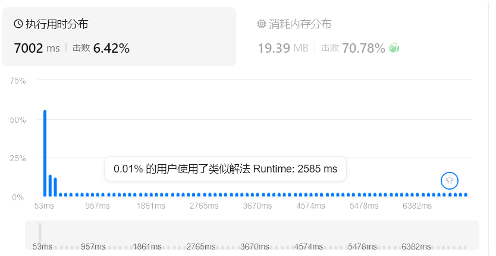

# hot100


## leetcode hot100


### [1. 两数之和](https://leetcode.cn/problems/two-sum/)

我们查找到后面时去看前面的是否符合要求


```

class

Solution
:


def

twoSum
(
self
,

nums
:

List
[
int
],

target
:

int
)

->

List
[
int
]:


mp

=

{}


# 值 -> 下标


for

i

in

range

(
len
(
nums
)):


if

target

-

nums
[
i
]

in

mp
:


return

[
mp
[
target

-

nums
[
i
]],

i
]


mp
[
nums
[
i
]]

=

i

```


### [49. 字母异位词分组](https://leetcode.cn/problems/group-anagrams/)

通过哈希表进行整理，异位词排序后必然相同，映射到一个元素中


```

class

Solution
:


def

groupAnagrams
(
self
,

strs
:

List
[
str
])

->

List
[
List
[
str
]]:


map

=

defaultdict
(
list
)


for

s

in

strs
:


key

=

''
.
join
(
sorted
(
s
))


map
[
key
]
.
append
(
s
)


return

list
(
map
.
values
())

```

- `map = defaultdict(list)`：这段意思是某个键第一次出现的时候，自动给一个空列表。


```


# 于是就不用写

if

key

not

in

map
:


map
[
key
]

=

[]


# 直接写为

map
[
key
]
.
append
(
s
)

```

普通字典版本：


```

class Solution:
    def groupAnagrams(self, strs: List[str]) -> List[List[str]]:
        map = {}
        for s in strs:
            key = ''.join(sorted(s))
            if key not in map:
                map[key] = []
            map[key].append(s)

        return list(map.values())

```


### [128. 最长连续序列](https://leetcode.cn/problems/longest-consecutive-sequence/)

哈希表


```

class

Solution
:


def

longestConsecutive
(
self
,

nums
:

List
[
int
])

->

int
:


st

=

set
(
nums
)


ans

=

0


n

=

len
(
st
)


for

x

in

st
:


if

x
-
1

in

st
:


continue


y

=

x

+

1


while

y

in

st
:


y

+=

1


ans

=

max
(
ans
,

y
-
x
)


return

ans

```


### [283. 移动零](https://leetcode.cn/problems/move-zeroes/)

双指针


```

class

Solution
:


def

moveZeroes
(
self
,

nums
:

List
[
int
])

->

None
:


"""

        Do not return anything, modify nums in-place instead.

        """


i0

=

0


for

i

in

range
(
len
(
nums
)):


if

nums
[
i
]:


nums
[
i
],

nums
[
i0
]

=

nums
[
i0
],

nums
[
i
]


i0

+=

1

```


### [11. 盛最多水的容器](https://leetcode.cn/problems/container-with-most-water/)

双指针


```

class

Solution
:


def

maxArea
(
self
,

height
:

List
[
int
])

->

int
:


l

=

0


r

=

len
(
height
)

-

1


ans

=

0


while

l

<=

r
:


if

height
[
l
]

<=

height
[
r
]:


reg

=

height
[
l
]

*

(
r
-
l
)


l

+=

1


elif

height
[
l
]

>

height
[
r
]:


reg

=

height
[
r
]

*

(
r
-
l
)


r

-=

1


ans

=

max
(
reg
,

ans
)


return

ans

```


### [15. 三数之和](https://leetcode.cn/problems/3sum/)

双指针，不过本题优化比较多


```

class

Solution
:


def

threeSum
(
self
,

nums
:

list
[
int
])

->

list
[
list
[
int
]]:


nums
.
sort
()


n

=

len
(
nums
)


ans

=

[]


for

i

in

range
(
n
-
2
):


x

=

nums
[
i
]


if

i

>

0

and

x

==

nums
[
i

-

1
]:


continue


if

x

+

nums
[
i
+
1
]

+

nums
[
i
+
2
]

>

0
:


break


if

x

+

nums
[
-
1
]

+

nums
[
-
2
]

<

0
:


continue


j

=

i

+

1


k

=

n

-

1


while

j

<

k
:


s

=

x

+

nums
[
j
]

+

nums
[
k
]


if

s

>

0
:


k

-=

1


elif

s

<

0
:


j

+=

1


else
:


ans
.
append
([
x
,

nums
[
j
],

nums
[
k
]])


j

+=

1


while

j

<

k

and

nums
[
j
]

==

nums
[
j

-

1
]:


j

+=

1


k

-=

1


while

k

>

j

and

nums
[
k
]

==

nums
[
k

+

1
]:


k

-=

1


return

ans

```


### [42. 接雨水](https://leetcode.cn/problems/trapping-rain-water/)

依旧双指针，这里我们给左右指针都留下一个锚点一类的存在，用来辅助计算


```

class

Solution
:


def

trap
(
self
,

height
:

List
[
int
])

->

int
:


ans

=

pre_max

=

suf_max

=

0


l

=

0


r

=

len
(
height
)

-

1


while

l

<

r
:


pre_max

=

max
(
pre_max
,

height
[
l
])


suf_max

=

max
(
suf_max
,

height
[
r
])


if

pre_max

<

suf_max
:


ans

+=

pre_max

-

height
[
l
]


l

+=

1


else
:


ans

+=

suf_max

-

height
[
r
]


r

-=

1


return

ans

```


### [3. 无重复字符的最长子串](https://leetcode.cn/problems/longest-substring-without-repeating-characters/)

哈希表（不对顺序做要求）+双指针


```

class

Solution
:


def

lengthOfLongestSubstring
(
self
,

s
:

str
)

->

int
:


dic
,

res
,

i

=

{},

0
,

-
1


for

j

in

range
(
len
(
s
)):


if

s
[
j
]

in

dic
:


i

=

max
(
dic
[
s
[
j
]],

i
)


dic
[
s
[
j
]]

=

j


# 记录每个字符最近一次出现的位置


res

=

max
(
res
,

j

-

i
)


return

res

```

- 这里列表直接拿来当哈希表来用了，之前从来没想过


### [438. 找到字符串中所有字母异位词](https://leetcode.cn/problems/find-all-anagrams-in-a-string/)

最初思路，切片与排序


```

class

Solution
:


def

findAnagrams
(
self
,

s
:

str
,

p
:

str
)

->

List
[
int
]:


res

=

sorted
(
p
)


np

=

len
(
p
)


ans

=

[]


for

i

in

range
(
len
(
s
)

-

np

+

1
):


reg

=

sorted
(
s
[
i
:
i
+
np
])


if

reg

==

res
:


ans
.
append
(
i
)


return

ans

```



外层窗口个数为 `len(s)`，每次排序需要 `O(np log np)` 时间，这个时间复杂度还是很大的

**滑动窗口+哈希**


```

class

Solution
:


def

findAnagrams
(
self
,

s
:

str
,

p
:

str
)

->

List
[
int
]:


'''

        哪些长度等于len(p)的子串，恰好由和p同一批字符组成

        顺序并不重要，所以统计每个字符出现的数量就可以

        滑动窗口+哈希表的话

        左边出去一个，右边进来一个，维护一次哈希表，判断一次结果

        '''


n

=

len
(
p
)


cnt_p

=

Counter
(
p
)


cnt_s

=

Counter
()


ans

=

[]


for

right
,

c

in

enumerate
(
s
):


# 用于遍历时拿到元素下标和元素本身两个内容


cnt_s
[
c
]

+=

1


# 右端点字母进入窗口


left

=

right

-

len
(
p
)

+

1


if

left

<

0
:


continue


if

cnt_s

==

cnt_p
:


ans
.
append
(
left
)


cnt_s
[
s
[
left
]]

-=

1


# 左端点字母离开窗口


return

ans

```

- `Counter(str)`：自动统计每个字符出现的次数
- `enumerate(list)`：遍历时返回两个内容：元素下标、元素本身


### [560. 和为 K 的子数组](https://leetcode.cn/problems/subarray-sum-equals-k/)


```


# @leet start

class

Solution
:


def

subarraySum
(
self
,

nums
:

List
[
int
],

k
:

int
)

->

int
:


'''

        如果直接暴力枚举的话，会造成很多的重复计算，nums[0-4]的和在nums[0-3]已经被计算过了

        但是这里只增加了一个数，所以把区间和转为前缀和，或者说，两个前缀的差

        pre[i]表示前i个元素的和：

        - pre[0] = 0

        - pre[1] = nums[0]

        - pre[2] = nums[0] + nums[1]

        下标l到r的子数组和就可以表示为pre[r+1]-pre[l]

        本题要求的这个子数组和为[k]，所以条件就变为了pre[r+1]-pre[l]=k

        即，pre[l] = pre[r+1]-k，换句话说，当前缀和已经确定的时候，前面有没有某个前缀和等于 “当前值-k”

        接下来再优化，我们之前其实已经扫描过pre[l]了，在当前位置之前，pre[r+1]-k出现过多少次

        某个数字与次数的映射，可以用哈希表来解决

        - 键：某个前缀和的值

        - 值：这个前缀和出现了多少次

        '''


dic

=

defaultdict
(
int
)


dic
[
0
]

=

1


s

=

0


ans

=

0


for

x

in

nums
:


s

+=

x


#1.ans += max(s - dic[s],0)，这里不对，我应该找的是s-k的前缀和，也就是dic[s-k]


ans

+=

max
(
dic
[
s
-
k
],

0
)


#1. 这里当前的前缀和没有记录到字典中


dic
[
s
]

+=

1


return

ans


# @leet end

```


### [239. 滑动窗口最大值](https://leetcode.cn/problems/sliding-window-maximum/)


```


# @leet start

class

Solution
:


def

maxSlidingWindow
(
self
,

nums
:

List
[
int
],

k
:

int
)

->

List
[
int
]:


'''

       窗口右移一次，左边的数会移出去，右边的数会移进来

       我们维护一个结构，在删除一个旧元素、增加一个新元素后立刻得到最大值

       我们可以维护一个优先队列

       当新进来的元素大于队尾元素时，队尾这些元素必然不会成为最大值，直接删除就可以了

       左边元素离开的时候，检查队头的下标是不是在窗口之外，如果出界了就删除掉

       '''


q

=

deque
()


# 双端队列，支持两头操作


res

=

[]


for

i
,

x

in

enumerate
(
nums
):


if

q

and

q
[
0
]

<=

i
-
k
:

#去掉过期元素


q
.
popleft
()


while

q

and

nums
[
q
[
-
1
]]

<

x
:

#去掉队尾更小元素


q
.
pop
()


q
.
append
(
i
)


if

i

>=

k

-

1
:

#记录答案


res
.
append
(
nums
[
q
[
0
]])


return

res


# @leet end

```


### [76. 最小覆盖子串](https://leetcode.cn/problems/minimum-window-substring/)


```

class

Solution
:


def

minWindow
(
self
,

s
:

str
,

t
:

str
)

->

str
:


'''

        类似上一题的思路，我们只需要维护进出即可，但现在的问题在于如何才能无序比较

        利用Counter设置哈希表

        如果加入进来的right在cnt_t中，且数量还符合要求，那么可以将count++

        窗口满足条件后，开始收缩left，直到满足条件

        '''


window

=

defaultdict
(
int
)


cnt_t

=

Counter
(
t
)


left
,

right

=

0
,

0


ans

=

""


valid

=

0


while

right

<

len
(
s
):


#扩张窗口


c

=

s
[
right
]


window
[
c
]

+=

1


if

c

in

cnt_t

and

window
[
c
]

==

cnt_t
[
c
]:


valid

+=

1


while

valid

==

len
(
cnt_t
):

#满足条件


if

ans

==

""

or

len
(
s
[
left
:

right
+
1
])

<

len
(
ans
):


ans

=

s
[
left
:

right
+
1
]


d

=

s
[
left
]


if

d

in

cnt_t

and

window
[
d
]

==

cnt_t
[
d
]:


valid

-=

1


window
[
d
]

-=

1


left

+=

1


right

+=

1


return

ans

```


### [53. 最大子数组和](https://leetcode.cn/problems/maximum-subarray/)


```

class

Solution
:


def

maxSubArray
(
self
,

nums
:

List
[
int
])

->

int
:


'''

        滑动窗口的维护

        假设算出来了一个区段的和，以i-1结尾的某个最优子数组，到了位置i有两个选择：

        - 把nums[i]接在前面的子数组后面

        - 从nums[i]再开一个子数组

        我们真正关心的是以i结尾，和最大的那个子数组

        设：dp[i]=以i结尾的最大子数组和

        状态转移方程为：dp[i]=max(dp[i-1]+nums[i],nums[i])

        接下来是dp压缩的通用思路，每一步都只用到了dp[i-1]，将之压缩为cur,维护一个全局最大值res

        '''


res

=

nums
[
0
]


cur

=

nums
[
0
]


for

x

in

nums
[
1
:]:


cur

=

max
(
cur

+

x
,

x
)


res

=

max
(
cur
,

res
)


return

res

```


### [56. 合并区间](https://leetcode.cn/problems/merge-intervals/)


```

class

Solution
:


def

merge
(
self
,

intervals
:

List
[
List
[
int
]])

->

List
[
List
[
int
]]:


'''

        我们先把区间按照起点进行一下排序,后面就好思考了

        [a,b] [c,d]，如果 a < c <= b，那么可以合并，右端点变为max(b, d)

        '''


intervals
.
sort
(
key
=
lambda

x
:

x
[
0
])

#按照x[0]的大小排序


res

=

[]


for

start
,

end

in

intervals
:


if

not

res

or

start

>

res
[
-
1
][
1
]:


res
.
append
([
start
,

end
])


else
:


res
[
-
1
][
1
]

=

max
(
res
[
-
1
][
1
],

end
)


return

res

```


### [189. 轮转数组](https://leetcode.cn/problems/rotate-array/)


```

class

Solution
:


def

rotate
(
self
,

nums
:

List
[
int
],

k
:

int
)

->

None
:


"""

        Do not return anything, modify nums in-place instead.

        """


'''

        1. 循环链表

        2. 将数组拆为nums[0:n-k]和nums[n-k:n] 然后变为 nums[n-k:n] + nums[0:n-k]

        3. 结合题目要求，原地算法，我们可以将数组翻转，然后再翻转前k个，再翻转n-k个

        '''


nums
.
reverse
()


k

%=

len
(
nums
)


l

=

0


r

=

k

-

1


while

l

<

r
:


nums
[
l
],

nums
[
r
]

=

nums
[
r
],

nums
[
l
]


l

+=

1


r

-=

1


l

=

k


r

=

len
(
nums
)
-
1


while

l

<

r
:


nums
[
l
],

nums
[
r
]

=

nums
[
r
],

nums
[
l
]


l

+=

1


r

-=

1

```


### [238. 除了自身以外数组的乘积](https://leetcode.cn/problems/product-of-array-except-self/)


```

class

Solution
:


def

productExceptSelf
(
self
,

nums
:

List
[
int
])

->

List
[
int
]:


'''

        不让用除法，我们可以将要得到的结果分为两部分

        ans[i] = i左边元素的乘积 * i右边元素的乘积，即ans[i] = left[i] * right[i]

        对于left[i]，我们有 left[i] = left[i-1]*nums[i-1]

        对于right[i]，我们有 right[i] = right[i+1]*nums[i+1]

        '''


n

=

len
(
nums
)


ans

=

[
1
]
*
n


p

=

1


for

i

in

range
(
n
):


ans
[
i
]

=

p


p

=

p
*
nums
[
i
]


p

=

1


for

i

in

range
(
n
-
1
,

-
1
,

-
1
):


ans
[
i
]

*=

p


p

=

p
*
nums
[
i
]


return

ans

```


### [41. 缺失的第一个正数](https://leetcode.cn/problems/first-missing-positive/)


```

class

Solution
:


def

firstMissingPositive
(
self
,

nums
:

List
[
int
])

->

int
:


'''

        不能使用排序，也不能用哈希去统计哪些数字出现过，能够利用的只有数组本身的位置

        对于一个长度为n的数组，答案只可能在n+1

        如果我们采用破坏数组的方式，将x放在x-1的地方，那么只需要再遍历一次就可以找到答案

        '''


n

=

len
(
nums
)


for

i

in

range
(
n
):


while

1

<=

nums
[
i
]

<=

n

and

nums
[
i
]

!=

nums
[
nums
[
i
]

-

1
]:


j

=

nums
[
i
]
-
1


nums
[
i
],

nums
[
j
]

=

nums
[
j
],

nums
[
i
]
#尽量避免嵌套


for

i

in

range
(
n
):


if

nums
[
i
]

!=

i

+

1
:


return

i
+
1


return

n
+
1

```


### [73. 矩阵置零](https://leetcode.cn/problems/set-matrix-zeroes/)


```

class

Solution
:


def

setZeroes
(
self
,

matrix
:

List
[
List
[
int
]])

->

None
:


"""

        Do not return anything, modify matrix in-place instead.

        """


'''

        要避免新修改的零改变新的内容，所以需要一些标记

        直观的解决方案就是直接创建一个mn矩阵来标记每一个，简单的标记方法为记录需要清零的行和列为m+n

        但我们也可以直接在原矩阵的行列直接改为0，然后再扫描一次

        matrix[i][j] = 0 -> matrix[i][0] = 0,matrix[0][j] = 0

        '''


m
,

n

=

len
(
matrix
),

len
(
matrix
[
0
])


cal0

=

1


row0

=

1


for

i

in

range
(
m
):


for

j

in

range
(
n
):


if

matrix
[
i
][
j
]

==

0
:


matrix
[
i
][
0
]

=

0


matrix
[
0
][
j
]

=

0


if

i

==

0
:


row0

=

0


if

j

==

0
:


cal0

=

0


for

i

in

range
(
1
,
m
):


for

j

in

range
(
1
,

n
):


if

matrix
[
i
][
0
]

==

0

or

matrix
[
0
][
j
]

==

0
:


matrix
[
i
][
j
]

=

0


if

row0

==

0
:


for

j

in

range
(
n
):


matrix
[
0
][
j
]

=

0


if

cal0

==

0
:


for

i

in

range
(
m
):


matrix
[
i
][
0
]

=

0

```


### [54. 螺旋矩阵](https://leetcode.cn/problems/spiral-matrix/)


```

class

Solution
:


def

spiralOrder
(
self
,

matrix
:

List
[
List
[
int
]])

->

List
[
int
]:


top
,

bottom

=

0
,

len
(
matrix
)

-

1


left
,

right

=

0
,

len
(
matrix
[
0
])

-

1


res

=

[]


while

top

<=

bottom

and

left

<=

right
:


for

j

in

range
(
left
,

right

+

1
):


res
.
append
(
matrix
[
top
][
j
])


top

+=

1


for

i

in

range
(
top
,

bottom

+

1
):


res
.
append
(
matrix
[
i
][
right
])


right

-=

1


if

top

<=

bottom
:


for

j

in

range
(
right
,

left

-

1
,

-
1
):


res
.
append
(
matrix
[
bottom
][
j
])


bottom

-=

1


if

left

<=

right
:


for

i

in

range
(
bottom
,

top

-

1
,

-
1
):


res
.
append
(
matrix
[
i
][
left
])


left

+=

1


return

res

```


### [48. 旋转图像](https://leetcode.cn/problems/rotate-image/)
