# 汇编语言与接口设计


## 一、基础知识

本章实际上回答了三个问题：

1. 为什么有汇编语言
2. CPU是怎么和存储器交互的
3. 地址总线、数据总线、控制总线在做什么

---

**机器语言** 就是机器指令的集合，它的一串二进制0和1，对应着 CPU 能识别并执行的电平信息

> 机器语言的缺点也很明显，不直观、不好记、容易写错、错了难以排查

**汇编语言** 本质上是机器指令的助记符形式。它并没有改变机器的本质，只是把难记的二进制换成了人类更容易理解的符号表示

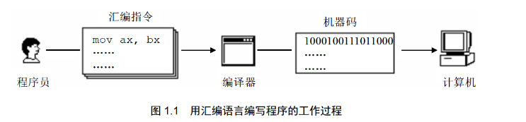

汇编语言由 3 部分组成：

- **汇编指令**：有对应机器码，最终会被 CPU 执行
- **伪指令**：没有对应的机器码，主要写给编译器，由编译器执行
- **其他符号**：由编译器识别，是编写源程序的时候用来组织表达式的，不是 CPU 直接执行的机器指令

Note

汇编语言的核心是 **汇编指令**，它决定了汇编语言的特性

---


### 存储器、指令与数据

CPU是计算机的核心，工作时必须有两样内容：**指令**、**数据**

指令和数据在存储器中没有本质区别，都是二进制信息。它们的区别在于CPU把它们当作什么解释

> `89D8H` 可以看作十六进制数据，也可以看为 `mov ax, bx`

存储器会被划分为多个存储单元，每个存储单元都有编号，如下图的 0~127 编号

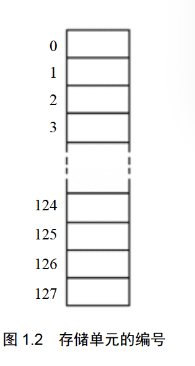

这里需要明确以下容量单位：

- `1 bit`：一个二进制位
- `1 Byte = 1 bit`：一个存储单元通常存放 `1 Byte`(一般用 `B` 来简称 `Byte`)
- `1KB = 1024B`、`1MB = 1024KB`、`1GB = 1024MB`、`1TB = 1024GB`

---


### CPU 对存储器读写

CPU想从存储器里面读写数据，需要完成 3 类信息的交互

- **地址信息**，告诉存储器：我要操作哪个存储单元
- **控制信息**，告诉存储器：我要读还是要写；我要选中哪个器件
- **数据信息**，真正传输的内容，也就是读出的数据或写入的数据

为了传递这 3 类信息，计算机中有 3 类总线，这三条线合起来构成了CPU和外部器件沟通的主干道

- **地址总线**：传递地址信息
- **数据总线**：传递数据信息
- **控制总线**：传递控制命令

读操作过程

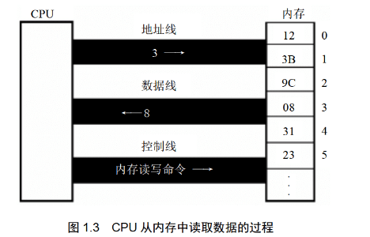

1. CPU通过 **地址总线** 发出地址 `3`
2. CPU通过 **控制总线** 发出 `读命令`
3. 存储器把 3 号单元中的数据，通过 **数据总线** 送回CPU

写操作过程

- CPU 通过 **地址总线** 发出地址 `3`
- CPU 通过 **控制总线** 发出 `写命令`
- CPU 通过 **数据总线** 把数据 `8` 送到该单元

汇编视角下的读写操作

按照课本意思，我们可以总结为这些内容：

- 机器码负责驱动 CPU 完成这些读写动作
- 汇编指令只是机器码的便于理解的写法

例如 `MOV AX,[3]` 的含义就是 **把内存中 3 号单元的内容送入寄存器 AX**

---


### 三种总线

地址总线 负责传递地址信息。

如果有一个CPU有 `N` 根地址线，那么它最多能表示 $2^N$ 个不同地址

Note

地址总线宽度决定CPU寻址能力

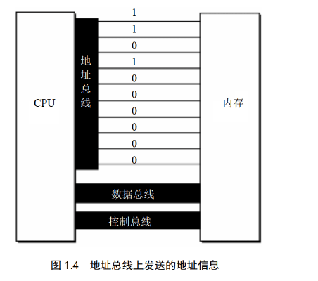

数据总线 负责传递数据

如果有一个CPU有 `N` 根数据线，那么它一次传递 `n bit` 数据(注意是位，不是字节)

Note

- 8088系列CPU：8位数据总线
- 8086系列CPU：16位数据总线

那么对于数据 `89D8H`，8088CPU需要传2次（由于小端序，所以先传 `D8`）；8086只需要传1次

| image-20260313155044716 | image-20260313155038957 |
| --- | --- |
|  |  |

控制总线 负责传递控制命令

如果有一个CPU有 `N` 根控制总线，那么它能有 `n` 种控制提供

Note

控制总线宽度决定了CPU对外部器件的控制能力

---


### 主板、接口卡与各类存储器芯片

主板

在一台 PC 种，主板上连接着很多部件，这些不见通过总线互相连接

- CPU
- 存储器
- 外围芯片
- 扩展插槽
- 各类接口卡

接口卡

像显示器、音箱、打印机这些外设，CPU 一般\*\*不会直接控制\*\*，而是通过接口卡去控制。即


```

CPU -> 总线 -> 接口卡 -> 外设

```

各类存储芯片

- RAM：随机存储器
- 可读可写，断电后内容丢失
- 主要用于存放CPU正在使用的程序和数据
- ROM：只读存储器
- 只能读不能随意写，断电后内容不丢失
- 常用来存放BIOS
- 接口卡上的RAM
- 例如显卡的显存
- 用于暂存需要高速输入/输出的数据

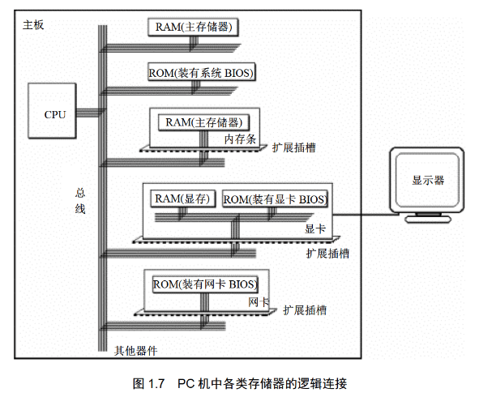

---


### 内存地址空间

虽然 RAM、显存、ROM 这些东西在物理上是不同的芯片，但是从CPU的角度来看，它们都挂在总线上，并且都能通过地址访问。于是 CPU 就会把它们统一看成一个逻辑上的大存储器。这个逻辑上的大空间就叫做 **内存地址空间**

Note

可以这样理解：在物理层面上，这是很多不同的芯片；但是从逻辑层面（也就是数据规定），这是一个统一的地址世界，各个芯片间的地址是紧邻的。如下图所示

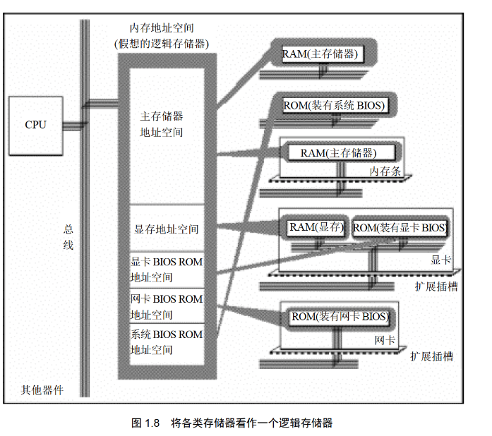

地址空间本质

对于每一块物理存储器，在这个逻辑空间里会占用一段地址范围，如下图所示

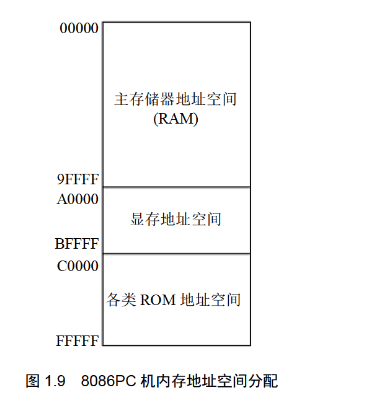

- 我们往 `1000H` 写数据，实际写入了主存 RAM
- 往 `B0000H` 写数据，实际写入了 显存空间
- 往 `D0000H` 写数据，实际写入了各类 ROM

地址空间大小控制

地址空间大小受 **地址总线宽度** 限制。若地址总线宽度为 `N` ，则最多可以表示 $2^N$ 个地址

Note

8086系列CPU：20位地址总线，那么最大地址空间为 $2^{20}=1 \text{MB}$

80386系列CPU：32位地址总线，最大地址空间为 $2^{32}=4\text{GB}$

---


### 小结

- **机器语言是机器指令的集合，本质是二进制信息**
- **汇编语言是机器指令的助记符表示**
- **汇编语言由汇编指令、伪指令和其他符号组成**
- **CPU 工作离不开存储器**
- **指令和数据在存储器里没有本质区别，都是二进制**
- **存储单元从 0 开始编号**
- **1Byte = 8bit**
- **地址总线决定寻址能力**
- **数据总线决定一次传送的数据量**
- **控制总线决定控制能力**
- **内存地址空间是 CPU 视角下的逻辑存储空间**
- **不同物理器件可以映射到统一地址空间中的不同地址段**


## 二、寄存器

本章主要介绍了这样一个主线：**程序员通过指令修改寄存器，CPU通过寄存器中的地址信息去访问内存**

一个典型CPU中有：

- 运算器：负责信息处理
- 控制器：负责控制工作流程，控制各种器件进行工作
- 寄存器：负责信息存储
- 内部总线：负责部件之间传数据


### 寄存器介绍

8086的寄存器都是 **16位** 的，即一次可以存放 16个二进制位，等于 2 个字节

`AX、BX、CX、DX` 这四个寄存器最常被当作普通数据存储单元使用，因此叫做 **通用寄存器**

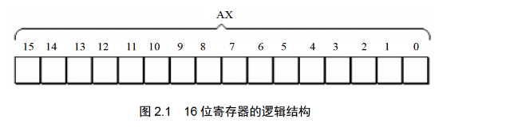

为了兼容早期 8 位CPU程序设计习惯，8086的四个16位寄存器都支持拆分使用

| 原寄存器 | 高8位 | 低8位 |
| --- | --- | --- |
| `AX` | `AH` | `AL` |
| `BX` | `BH` | `BL` |
| `CX` | `CH` | `CL` |
| `DX` | `DH` | `DL` |

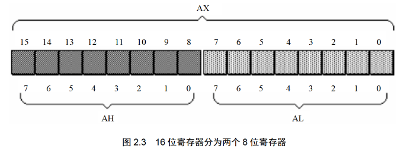

数据在存储器中的存储

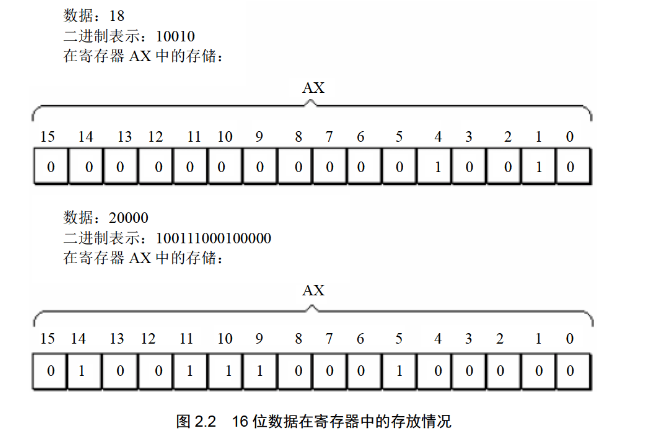

如图所示，这个字型数据的大小是 20000，但如果将它看作两个独立的字节型数据，它们的大小分别是 `78` 和 `32`

字节与字

8086一次可以处理两种尺度的数据

- **字节**：8 bit，可以放入 8 位寄存器
- **字**：16 bit，由两个字节组成

对于8086来说，一个字放在 `AX` 中，`AH` 和 `AL` 既可以看作两个独立的 8 位数据，也可以看作一个 16 位数据的高低两部分

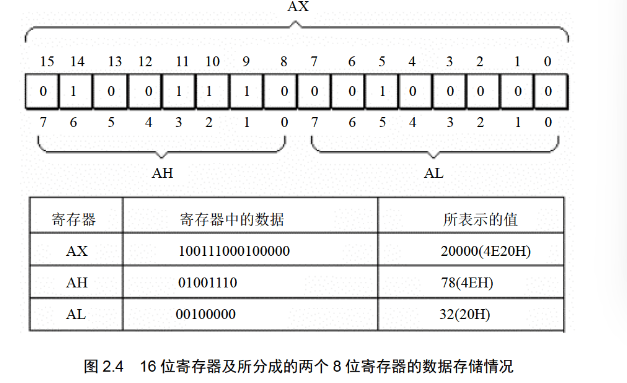

---


### 汇编指令

课本这里介绍了 `mov` 和 `add`

mov

其含义为将右边的值送到左边去，直接覆盖写入

| 汇编指令 | CPU完成的操作 | 高级语言描述 |
| --- | --- | --- |
| mov ax, 18 | 将 18 送入寄存器 AX | AX=18 |
| mov ah, 78 | 将78 送入寄存器 AH | AH=78 |
| mov ax, bx | 将bx中的数据送入寄存器AX | AX=BX |

add

左边=左边+右边，结果一般存回左操作数

| 汇编指令 | CPU完成的操作 | 高级语言描述 |
| --- | --- | --- |
| add ax, 8 | 将ax的值加8 | AX=AX+8 |
| add ax, bx | 将bx的值加到ax上 | AX=AX+BX |

指令执行过程中，寄存器的变化

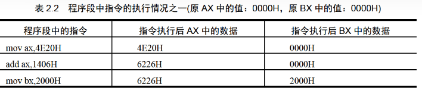

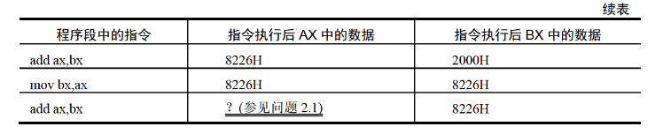

其中问题2.1强调了一个地方：**16位寄存器只能保留低4位十六进制数，会发生截断**

---


### 8086与物理地址

物理地址

CPU访问内存单元的时候，必须给出内存单元地址。而在内存这个一维线性空间中，每个单元都有唯一编号，这个唯一编号就叫 **物理地址**

> 可以理解为内存单元的门牌号

8086

8086被称为16位结构的CPU是有如下原因

- 运算器一次最多处理 16 位数据
- 寄存器最大宽度是 16 位
- 寄存器和运算器之间的通路是 16 位

或者换句话来说：**8086内部一次最擅长处理的是16位数据**

> 不过8086的物理结构上，它的 **物理总线是 20 位**，但 **内部寄存器只有 16 位**，要怎么操作呢？可以看下一节

8086给出物理地址的方法

8086采用的方法是 $物理地址=段地址\times 16 + 偏移地址$

> 这一部分更详细的介绍可以看笔者的OS笔记的 [段地址部分](https://oldmaple.top/mysys/02/#02)

Note

我们用一个例子作为演示下图

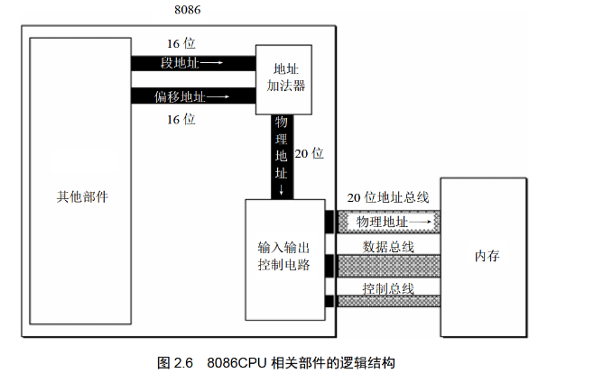

现有16位段地址 `1230H`；16位偏移地址 `00C8H`

两者同时加入到地址加法器中

段地址：$1230\text H \times 10\text H=12300\text H$

加上偏移地址得到物理地址为 $12300\text H+00C8\text H=123C8 \text H$

---


### 段

> 内存本身是不会自动分段的，段的概念的提出是为了方便CPU管理

段的简单理解

`10000~100FFH` 可以看作是一个段

- 它的起始地址是 `10000H`
- 对应的段地址是 `1000H`
- 长度为 `100H`

段的关键属性

- **段起始地址**：由 `段地址 × 16` 得到
- 段内偏移：由偏移地址指出段内具体单元

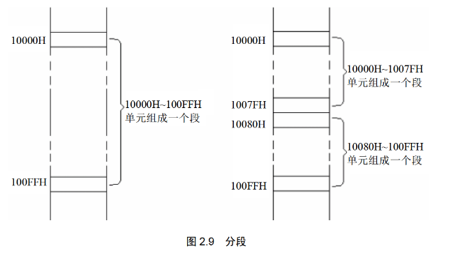

段寄存器

我们刚刚谈到了 **段地址** 和 **偏移地址**，现在需要了解段地址存放的地方——**段寄存器**

8086有 4 个段寄存器，分别为：`CS、DS、SS、ES`，当CPU访问内存的时候，相关段寄存器会提供段地址。其中，各个段寄存器的一般用途如下：

- CS：管理代码
- DS：常管理数据
- SS：和栈有关
- ES：常作为附加段

---


### CS寄存器与IP寄存器

CS寄存器和IP寄存器主要的作用是用来控制 **CPU下一条要执行的指令**。先详细介绍一下这两个寄存器

- `CS`：代码段寄存器，用于保存当前代码段的段地址
- `IP`：指令指针寄存器，保存当前执行指令的偏移地址

Note

在8086中，CPU会将 `CS:IP` 所指向的内容作为下一条指令来读取、执行

CPU取指的基本过程

我们假设 `CS=M`，`IP=N`，那么CPU读取指令时会从内存地址 $M\times 16 + N$ 中取得（*换句话说，CS就是基地址，IP就是偏移地址*），取得后会进行如下过程：

- 从 `CS:IP` 指向的内存单元读取指令
- 把 `IP` 改成下一条指令的偏移地址
- 执行刚才读出的指令
- 循环以上过程

> 这个就是我们上面说的，被CPU如何读取的意思。如果某个地址的内容是被 `CS:IP` 读取到的，那么他就是指令

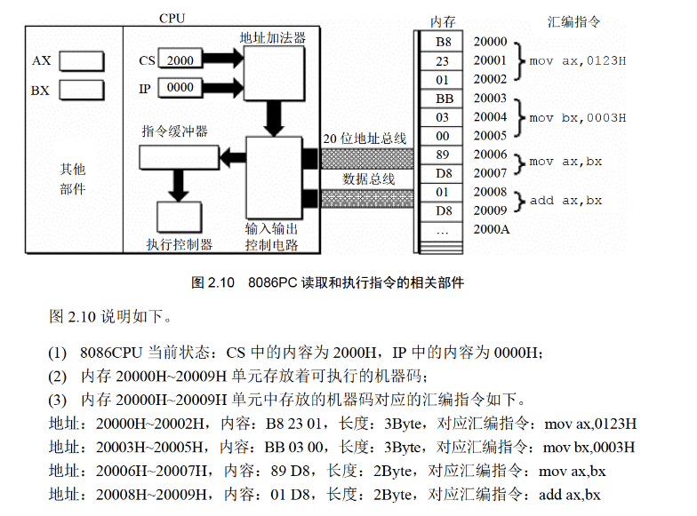

CS、IP指令的修改

要记得：我们常见的 `mov` 指令是不可以用来修改 `CS` 和 `IP` 的。修改方式只有 **转移指令**，即 `jmp` 系指令，使用方式如下

`jmp 段地址:偏移地址`

> 举例：`jmp 2AE3:3`
>
> 执行后，会使 `CS=2AE3H`、`IP=0003H`

`jmp 合法寄存器`

> 举例：`jmp ax`
>
> 用寄存器中的值修改 `IP`，这里的 `CS` 是不变的，可以认为是 `mov IP, ax`

---


### 代码段

如果我们把一段 **连续内存单元** 定义为专门存放代码，我们可以称它为 **代码段**。一般满足这些特性：

- 地址连续
- 起始地址是 16 的倍数
- 长度不超过 64KB

由于CPU指把 `CS:IP` 所指向的内容认为是指令/代码，所以代码段就是为了规范 `CS:IP` 的范围

---


### 小结

**一、本章主线**

第二章从寄存器出发，先讲了寄存器中如何存数据、如何用指令修改数据；随后过渡到 8086 的寻址方式，说明物理地址如何由段地址和偏移地址形成；最后引出 `CS` 和 `IP`，解释 CPU 如何取指、执行，以及如何通过跳转修改执行位置。

**二、本章最重要的结论**

1. **寄存器部分**

   - 8086 的通用寄存器 `AX、BX、CX、DX` 都是 16 位
   - `AX` 可以拆成 `AH` 和 `AL`
   - `AH` 是高 8 位，`AL` 是低 8 位
   - 一个字节是 8 位，一个字是 16 位
   - 十六进制特别适合观察寄存器中数据的字节结构
2. **指令部分**

   - `mov` 表示传送
   - `add` 表示加法
   - 指令是一条一条执行的
   - 8 位运算只在 8 位范围内进行
   - 16 位运算只在 16 位范围内进行
   - 操作对象位数必须一致
3. **寻址部分**

   - 物理地址是内存单元的唯一地址
   - 8086 的物理地址由“段地址×16+偏移地址”形成
   - “段地址×16”的本质是左移 4 位
   - 这个公式的本质是“基础地址 + 偏移地址”
4. **段与取指部分**

   - 段不是内存天然自带的划分，而是基于寻址方式形成的管理视角
   - 一个段最大长度为 64KB
   - 段地址放在段寄存器中
   - `CS` 存代码段地址，`IP` 存当前指令偏移地址
   - CPU 总是从 `CS:IP` 指向的位置读取下一条指令
   - `jmp` 这类转移指令可以修改 `CS`、`IP`
   - 让代码段被执行，本质上是让 `CS:IP` 指向它

---


## 三、寄存器(内存访问)

在第二章中，我们已经知道：

- 8086访问内存时，要靠 **段地址×16+偏移地址=物理地址**
- `CS:IP` 负责找指令
- 段寄存器里面存放段地址

接下来的第三章中，重点从“CPU怎么取指令”转为了：**程序员怎么样用寄存器去访问内存中的数据**


### 内存中字的存储

Note

本节重点在于：

- 内存的基本单元是 **字节单元**
- 一个字是 16 位，所以放进内存的时候要占 **2 个连续字节单元**（8086CPU）
- 在 8086 中，低字节放低地址，高位字节放高地址（小端序）

字节单元和字单元

内存里一个地址对应一个 **字节单元**，每个单元只能放 8 位，即 1 `字节`。但一个 `字` 有 16 位，所以一个`字` 必须拆开，放到两个连续的 `字节单元` 里

> 例如某个字放在地址 `0` 开始的地方，那么它会占掉：`0` 号单元；`1` 号单元。于是我们可以把这两个连续单元一起看成一个 **字单元**
>
> 如果这个字单元的起始地址是 `N` ，那就叫 **N地址字单元**，表示由 `N` 号字节单元和 `N+1` 号字节单元共同组成
>
> 注意注意，这里的N可以是任意整数，也就是说奇数开头是允许的

8086中字的存放顺序

8086规定 **低字节放在低地址单元；高位字节放高地址单元**

> 例如数据 `4E20H`。高位字节为 `4EH`，低位字节为 `20H`。如果从地址0开始放到内存中，那么：
>
> - 0号单元存 `20H`
> - 1号单元存 `4EH`

---


### DS和[address]

之前代码段访问的方式是 `CS:IP`，本节介绍数据段的访问方式，即 `[0]` 这种形式如何访问

DS的作用：提供基地址。

DS是一个段寄存器，用来存放 **要访问的数据所在段的段地址**。或者说，当访问普通数据的时候，经常默认：

- 段地址在 `DS` 中
- 指令中只写偏移地址

[address]的作用：提供偏移地址。

课本中 `[......]` 表示一个内存单元。例如 `[0]` 表示偏移地址为 0 的那个内存单元。

> `[0]` 实际上表示的是 `DS:0`
>
> `[1]` 实际上表示的是 `DS:1`

由于 **8086不支持把立即数送入段寄存器**，所以我们想要修改 `DS` 的值需要经过一系列操作


```

mov

bx
,

1000
H

; 1000H -> bx

mov

ds
,

bx

; bx -> ds

mov

al
,

[
0
]

; [ds:0] -> al，即 [1000:0] -> al

mov

[
0
],

al

; al -> [1000:0]

```

---


### 字的传送

上一节介绍了如何访问字节，这一节介绍如何扩展到 **字** 的访问。

16位寄存器传“字”

如果 `mov` 的目标或源就是 16 位寄存器，那么这条指令传送就是 16 位传递，也就是传一个字


```

mov ax,[0]

```

上面这个指令在执行时，CPU会从 `DS:0` 开始取一个字，也就是取两个连续字节，假设：

- 低地址 `0` 中的字节 `23H`
- 高地址 `1` 中的字节 `11H`

按照小端序，即低字节在低地址，高字节在高地址 $\Rightarrow$ `AX=1123H`，或者 `AL=23H`,`AH=11H`

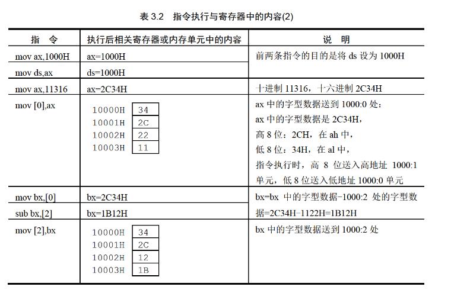


### mov/add/sub 指令

mov 可以有如下这些形式


```

mov ax, 8       ;mov 寄存器，数据
mov ax, bx      ;mov 寄存器，寄存器
mov ax, [0]     ;mov 寄存器，内存单元
mov [0],ax      ;mov 内存单元，寄存器
mov ds, ax      ;mov 段寄存器，寄存器
mov ax, ds      ;mov 寄存器， 段寄存器
mov [0],cs      ;mov 内存单元，段寄存器
mov ds,[0]      ;mov 段寄存器，内存单元

```

**只要位数匹配，语法允许，它能在寄存器、段寄存器、内存之间随意做传送**

add/sub 可以有这些形式


```

add ax,8        ;add 寄存器, 数据
add ax,bx       ;add 寄存器, 寄存器
add ax,[0]      ;add 寄存器, 内存单元
add [0],ax      ;add 内存单元, 寄存器

sub ax,9        ;sub 寄存器, 数据
sub ax,bx       ;sub 寄存器, 寄存器
sub ax,[0]      ;sub 寄存器, 内存单元
sub [0],ax      ;sub 内存单元, 寄存器

```

Note

需要注意的是，转移指令的位数一定要匹配，一定要看清楚


```

mov al, [0] ;传送一个字节
mov ax, [0] ;传送一个字

```


### 数据段

本节总结了一下上述的内容。前面我们知道了：

- 一段内存可以被人为的定义为“段”
- `DS` 可以存放段地址
- `[address]` 表示偏移地址

那么就可以得到：**如果把一段内存专门拿来存放数据，那它就可以叫做数据段**

数据段 应当满足这些条件：

- 一组地址连续的内存单元
- 起始地址是 16 的倍数
- 长度不超过 64KB
- 我们规定用它来存放数据

数据段数据的访问

即刚刚的 `DS` 与 `[address]` 章节的内容

1. 先把数据段的段地址送入 `DS`
2. 通过 `[偏移地址]` 访问这段中的具体单元

Note

这里需要注意一下，我们如果连续访问的单元是字的话，需要跳着连续


```

mov ax,123BH
mov ds,ax

mov ax,0    ;因为是ax存储字的形式，而一个字是两个字节，所以后面都是跳着连续
add ax,[0]
add ax,[2]
add ax,[4]

```

第二点要注意的是 `DS` 为多少，当访问的时候一定要注意 `DS` 目前指向何处


### 栈

个人认为课本上的栈讲的过于繁琐，可以直接看 [这里](https://ctf-wiki.org/pwn/linux/user-mode/stackoverflow/x86/stack-intro/) 和 [这里](https://oldmaple.top/pwn/Stack/%E6%B1%87%E7%BC%96%E9%80%9F%E9%80%9A/#_19)
